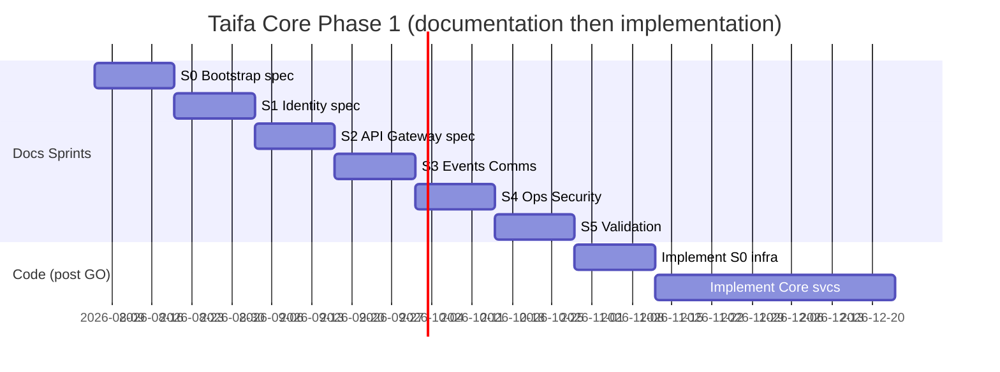
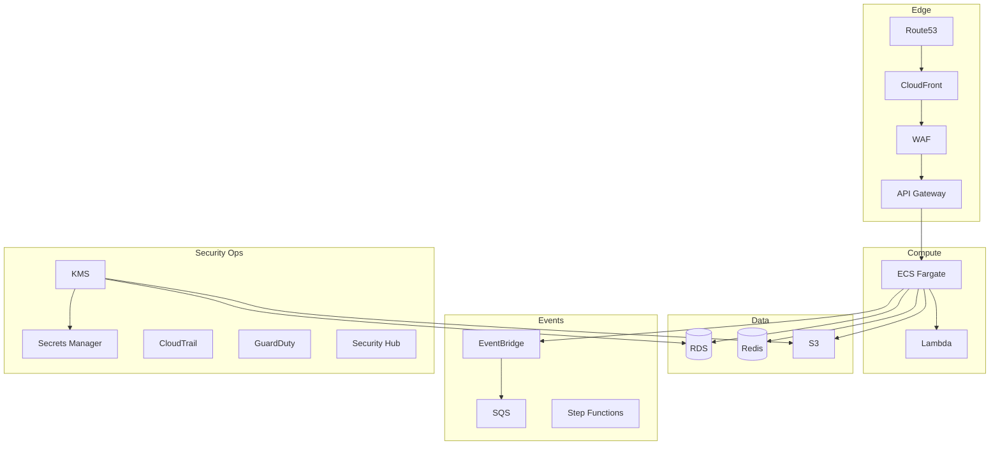

# 14 — Platform Implementation Guide

**Status:** Implementation-ready engineering blueprint — **no production code in this document**  
**Phase:** Taifa Core Foundation  
**Authority:** [00_PLATFORM_OVERVIEW.md](00_PLATFORM_OVERVIEW.md) · [architecture/00_ARCHITECTURE_CONSTITUTION.md](../architecture/00_ARCHITECTURE_CONSTITUTION.md)

---

## Executive summary

This guide is the **single execution handbook** for Phase 1: Sprint 0 (foundation) through Sprint 5 (validation), platform engineering standards, milestone contracts, and the **Platform Readiness Checklist** for Sprint 0 go/no-go.

**Rule:** Build **Taifa Core** only. No Tourism, Commerce, Trade, Health, Edu, or Gov **product** work.

---

## Platform engineering standards (Objective 15)

| Standard | Source / application |
| --- | --- |
| DDD | Bounded context per `01–13` docs; no domain logic in `taifa_kernel` |
| Clean / Hexagonal | `domain` → `application` → `ports` → `adapters` in `taifa_platform/` |
| Events | [02_EVENT_CATALOG](../architecture/02_EVENT_CATALOG.md) + [ADR-0002](../architecture/adr/0002-event-catalog-prefix-policy.md) |
| API first | OpenAPI before implementation; Spectral in CI |
| IaC / GitOps | All AWS in `infra/`; no prod click-ops |
| Zero trust | [11_SECURITY_PLATFORM.md](11_SECURITY_PLATFORM.md) |
| Observability | Correlation ID, structured logs, metrics, traces — [10_MONITORING_PLATFORM.md](10_MONITORING_PLATFORM.md) |
| DoD | [architecture/09](../architecture/09_DEFINITION_OF_DONE.md) + PR template |

**Repository packages (target):**

```
apps/backend/taifa_kernel/      # EventEnvelope, Money, shared VOs
apps/backend/taifa_platform/    # identity, events, audit, flags, api middleware
packages/taifa-python/
apps/mobile/lib/platform/
infra/envs/{staging,prod}/
```

---

## Implementation milestone catalog

Each milestone includes: objective, deliverables, dependencies, acceptance criteria, DoD, risks, complexity, AWS, repo changes, testing, rollback.

### MS-0 — Governance & audit (complete)

| Field | Content |
| --- | --- |
| **Objective** | Align law, ADRs, tourism boundary audit |
| **Deliverables** | ADR-0002/0003, M0 audit report, DoD PR template |
| **Dependencies** | None |
| **Acceptance** | Evidence in [evidence/](evidence/README.md) |
| **DoD** | EARB docs in `earb/`; links updated |
| **Risks** | Low |
| **Complexity** | S |
| **AWS** | — |
| **Repo** | `docs/`, `.github/PULL_REQUEST_TEMPLATE.md` |
| **Testing** | — |
| **Rollback** | N/A |

---

### MS-S0 — Sprint 0: Platform bootstrap

| Field | Content |
| --- | --- |
| **Objective** | Repo layout, AWS accounts, IaC skeleton, CI/CD, envs, security baseline |
| **Deliverables** | `infra/` modules stub; `taifa_kernel/` + `taifa_platform/` packages (empty `__init__` + README only); `deploy-staging.yml` draft; AWS org/account doc; staging secrets pattern |
| **Dependencies** | MS-0 |
| **Acceptance** | `terraform validate` passes; CI green; platform checklists 80% S0 items |
| **DoD** | See § Platform Readiness Checklist — **Sprint 0 = GO** |
| **Risks** | AWS account delay (M) |
| **Complexity** | L |
| **AWS** | Organizations, IAM OIDC, S3 state, VPC stub, ECR |
| **Repo** | `infra/`, `.github/workflows/`, package dirs |
| **Testing** | IaC validate; CI lint |
| **Rollback** | Remove infra branch; no prod |

**Sprint 0 workstreams:** Repository · AWS Accounts · IaC · CI/CD · Environments · Security Baseline

---

### MS-S1 — Sprint 1: Identity platform

| Field | Content |
| --- | --- |
| **Objective** | Identity blueprint → implementable design for authN/Z |
| **Deliverables** | [01_IDENTITY_PLATFORM.md](01_IDENTITY_PLATFORM.md) implementation spec signed; OIDC sequence diagrams; device→JWT bridge RFC; RBAC role catalog; org model ERD |
| **Dependencies** | MS-S0 |
| **Acceptance** | Security review of identity threat model; OpenAPI draft for `/platform/identity/*` |
| **DoD** | No code required in doc phase; **implementation** = next increment after S0 GO |
| **Risks** | NIDA adapter scope (M) |
| **Complexity** | XL |
| **AWS** | Cognito optional; RDS identity schema; Redis sessions |
| **Repo** | `taifa_platform/identity/` design doc in package README |
| **Testing** | Test plan: login, refresh, revoke, ABAC deny |
| **Rollback** | Feature flag `core.identity.oidc` off |

---

### MS-S2 — Sprint 2: API Gateway platform

| Field | Content |
| --- | --- |
| **Objective** | Unified edge: routing, rate limits, tracing, versioning, OpenAPI |
| **Deliverables** | [02_API_GATEWAY_PLATFORM.md](02_API_GATEWAY_PLATFORM.md) + spectral ruleset; correlation middleware spec; API version policy |
| **Dependencies** | MS-S1 design |
| **Acceptance** | Spectral CI job defined; ALB/API GW diagram approved |
| **DoD** | Gateway standards merged to architecture/03 |
| **Risks** | Low |
| **Complexity** | L |
| **AWS** | ALB, WAF, CloudFront, API Gateway (phase 2) |
| **Repo** | `.spectral.yaml`, `docs/platform/openapi/` (aggregated spec folder) |
| **Testing** | Contract test plan for gateway headers |
| **Rollback** | Revert middleware PR |

---

### MS-S3 — Sprint 3: Events, notifications, media, configuration

| Field | Content |
| --- | --- |
| **Objective** | Async and comms platform designs implementation-ready |
| **Deliverables** | Docs [03](03_EVENT_PLATFORM.md)–[07](07_CONFIGURATION_PLATFORM.md) + [08](08_FEATURE_FLAGS_PLATFORM.md) updated with deployment diagrams; outbox schema; notification template model |
| **Dependencies** | MS-S2 |
| **Acceptance** | Event envelope JSON schema committed to `docs/platform/schemas/event-envelope-v1.json` |
| **DoD** | EventBridge bus naming `taifa-platform` in IaC spec |
| **Risks** | Provider adapter quotas (M) |
| **Complexity** | XL |
| **AWS** | EventBridge, SQS, SNS, S3, SES |
| **Repo** | `docs/platform/schemas/` |
| **Testing** | Integration test matrix (outbox → bus) |
| **Rollback** | Disable publisher flag |

---

### MS-S4 — Sprint 4: Monitoring, audit, security hardening

| Field | Content |
| --- | --- |
| **Objective** | Operate and comply: logs, metrics, traces, audit, security |
| **Deliverables** | [09](09_AUDIT_PLATFORM.md)–[11](11_SECURITY_PLATFORM.md); dashboard JSON; alert rules; CloudTrail/GuardDuty checklist |
| **Dependencies** | MS-S3 |
| **Acceptance** | Runbook index in `docs/platform/runbooks/` |
| **DoD** | Security checkpoint sign-off template filled for staging |
| **Risks** | Alert noise (M) |
| **Complexity** | L |
| **AWS** | CloudWatch, X-Ray, GuardDuty, Security Hub, KMS |
| **Repo** | `docs/platform/runbooks/*.md` |
| **Testing** | Fire drill: DLQ depth alert |
| **Rollback** | Silence alerts; revert dashboard |

---

### MS-S5 — Sprint 5: Platform validation

| Field | Content |
| --- | --- |
| **Objective** | Prove Core ready for **implementation sprints** (code) |
| **Deliverables** | Integration test plan; load test plan; security test plan; architecture review record; readiness review |
| **Dependencies** | MS-S0–S4 docs + S0 infra if available |
| **Acceptance** | Platform Readiness Checklist ≥ 90% for **Sprint 0 implementation** |
| **DoD** | Sign-off in [17_PLATFORM_DECISION_LOG.md](17_PLATFORM_DECISION_LOG.md) |
| **Risks** | Scope creep into domains (H) — reject PRs |
| **Complexity** | M |
| **AWS** | Staging soak |
| **Repo** | `docs/platform/evidence/S5-validation-report.md` (create at S5) |
| **Testing** | k6 smoke; OWASP ZAP baseline |
| **Rollback** | N/A |

---

## Sprint roadmap (engineering)



| Sprint | Focus | Platform services |
| --- | --- | --- |
| **0** | Repo, AWS, IaC, CI/CD, envs, security baseline | All (foundation) |
| **1** | Identity: OAuth2, OIDC, JWT, RBAC, orgs, devices | 01 |
| **2** | Gateway: routing, rate limit, trace, version, OpenAPI | 02 |
| **3** | Events, notifications, media, config, flags | 03–08 |
| **4** | Monitoring, audit, security hardening | 09–11 |
| **5** | Integration, load, security tests; ARB readiness | All |

*Prior detailed 2-week plan (S2–S14 code) remains in [earb/10_PLATFORM_FOUNDATION_IMPLEMENTATION_PLAN.md](earb/10_PLATFORM_FOUNDATION_IMPLEMENTATION_PLAN.md) for post-blueprint **implementation** phase.*

---

## AWS reference architecture (production-ready target)

See [13_INFRASTRUCTURE_PLATFORM.md](13_INFRASTRUCTURE_PLATFORM.md). Core services: API Gateway, CloudFront, Route53, ECS Fargate, Lambda, RDS PostgreSQL, ElastiCache Redis, S3, EventBridge, SQS, SNS, Step Functions (sagas later), CloudWatch, CloudTrail, AWS Backup, IAM, KMS, Secrets Manager, GuardDuty, Security Hub, WAF, Shield, Config, Organizations.



---

## Shared SDK platform (Objective 11)

| SDK | Scope | Sprint |
| --- | --- | --- |
| `taifa-python` | Auth, correlation, events | Post S2 |
| `taifa-dart` (`lib/platform`) | Mobile headers, token refresh | Post S2 |
| OpenAPI codegen | `/api/v1/platform/*` | Post S3 |

---

## Platform Readiness Checklist — Sprint 0 implementation GO

**Instructions:** Platform Lead + Security + DevOps sign each item before **writing production platform code** (infra apply allowed when marked).

### Documentation & governance

| # | Item | Status |
| --- | --- | --- |
| D1 | Architecture Constitution adopted | ✅ |
| D2 | Platform docs `00–17` indexed in [README](README.md) | ✅ |
| D3 | ADR-0002 / ADR-0003 accepted | ✅ |
| D4 | [16_PLATFORM_BACKLOG.md](16_PLATFORM_BACKLOG.md) prioritized | ✅ |
| D5 | [17_PLATFORM_DECISION_LOG.md](17_PLATFORM_DECISION_LOG.md) started | ✅ |

### Repository & standards

| # | Item | Status |
| --- | --- | --- |
| R1 | `taifa_kernel/` + `taifa_platform/` paths defined (README in package) | ✅ (scaffold; sign at S0 exit) |
| R2 | `infra/` layout per [13](13_INFRASTRUCTURE_PLATFORM.md) | ✅ (scaffold; modules stub) |
| R3 | Spectral / OpenAPI CI plan in [12](12_CICD_PLATFORM.md) | ⬜ |
| R4 | PR template DoD enforced | ✅ |
| R5 | CODEOWNERS for `infra/`, `taifa_platform/` | ✅ |

### AWS & security baseline

| # | Item | Status |
| --- | --- | --- |
| A1 | AWS account(s) + Organizations OU documented | ⬜ |
| A2 | GitHub OIDC → IAM role for CI | ⬜ |
| A3 | Terraform state bucket + lock | ⬜ |
| A4 | KMS CMK strategy documented | ⬜ |
| A5 | Secrets Manager pattern (no secrets in git) | ⬜ |
| A6 | CloudTrail org trail planned | ⬜ |

### CI/CD & environments

| # | Item | Status |
| --- | --- | --- |
| C1 | `ci.yml` green on `main` | ✅ (existing) |
| C2 | `iac.yml` validate job specified | ✅ |
| C3 | Staging environment naming + DNS plan | ⬜ |
| C4 | Rollback procedure in runbook | ✅ ([runbooks/ROLLBACK.md](runbooks/ROLLBACK.md); deploy workflow draft pending) |

### Domain freeze

| # | Item | Status |
| --- | --- | --- |
| F1 | Tourism/commerce **feature** PRs blocked by policy | ✅ (process) |
| F2 | Tourism boundary audit on file | ✅ |

---

## Readiness verdict

| Question | Answer |
| --- | --- |
| **Is the engineering blueprint complete?** | **Yes** — documentation pack `00–17` + this guide |
| **Is Taifa Core ready to begin Sprint 0 *implementation*?** | **Conditional GO** — begin Sprint 0 **documentation-to-code** tasks (R1–R5, A1–A6, C2–C4) immediately; **full GO** when checklist items marked ⬜ are signed (target: end of Sprint 0 timebox) |
| **Can domain teams implement Tourism features?** | **No** — until MS-S5 + Phase 1 code exit ([15_PLATFORM_ROADMAP.md](15_PLATFORM_ROADMAP.md)) |

**Chief Platform Engineering recommendation:** **Proceed with Sprint 0 implementation** on repository structure, IaC skeleton, and CI jobs—**not** domain features.

---

## Cross-references

- [15_PLATFORM_ROADMAP.md](15_PLATFORM_ROADMAP.md) · [16_PLATFORM_BACKLOG.md](16_PLATFORM_BACKLOG.md) · [17_PLATFORM_DECISION_LOG.md](17_PLATFORM_DECISION_LOG.md)  
- Legacy code sprint map: [earb/10_PLATFORM_FOUNDATION_IMPLEMENTATION_PLAN.md](earb/10_PLATFORM_FOUNDATION_IMPLEMENTATION_PLAN.md)
