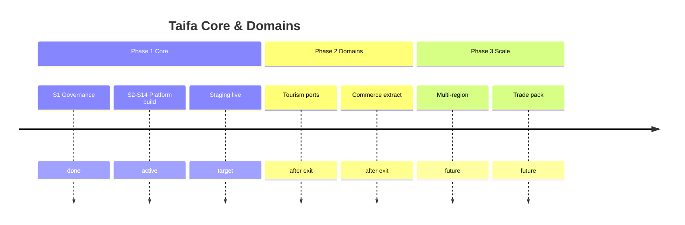

# 15 — Taifa Core Platform Roadmap

**Horizon:** Phase 1 (Core) → Phase 2 (Domain integration) → Phase 3 (Scale & extract)

---

## Phase 1 — Taifa Core (current)

**Goal:** Production-ready platform foundation in staging; exit criteria [13](14_PLATFORM_IMPLEMENTATION_GUIDE.md) § Exit.

| Quarter (indicative) | Theme |
| --- | --- |
| Q1 | Observability, API standards, Identity bridge, Events |
| Q2 | Notifications, Media, Maps, Audit, IaC staging, CI/CD |

**Deliverable:** Documented services `01–12` implemented as facades/packages + AWS staging.

---

## Phase 2 — Domain integration (after Core exit)

**Goal:** Domains consume Core only; remediate boundary violations.

| Initiative | Domain |
| --- | --- |
| BookingPort / ProtectionPort (tourism audit R-001–R-004) | Tourism |
| `tourism/booking` facade | Tourism + Commerce |
| Commerce vertical extraction E1–E3 | Commerce |
| Mobility ticket events on bus | Mobility |
| Health/Edu logical APIs | Health, Education |

**No Phase 2 start** until Phase 1 exit E1–E9.

---

## Phase 3 — National scale

| Initiative | Notes |
| --- | --- |
| API Gateway custom domain + WAF prod | Edge |
| Service extraction (identity, events) | ECS services |
| Multi-region DR | ADR required |
| Trade domain pack | New bounded context |
| OpenSearch (Search platform) | Discovery/Tourism |
| AI Gateway hardening | Tool contracts, guardrails |

---

## Roadmap diagram

---

## Capability maturity targets

| Capability | Phase 1 end | Phase 2 | Phase 3 |
| --- | --- | --- | --- |
| Identity | OIDC + device bridge | Full citizen KYC | EAC federation |
| Events | EventBridge staging | All domains publish | Schema registry CI |
| Notifications | SMS/push/email | WhatsApp | National broadcast |
| Media | S3 presign + scan | CDN prod | WORM compliance |
| Pay | Spine + events | Split on bus | Multi-currency regions |

---

## Future considerations

- Taifa Core as managed offering for other ministries  
- Private cloud hybrid for sensitive gov workloads  
- Continuous compliance dashboard (ISO, PCI)

---

## Cross-references

- [00_PLATFORM_OVERVIEW.md](00_PLATFORM_OVERVIEW.md)  
- [14_PLATFORM_IMPLEMENTATION_GUIDE.md](14_PLATFORM_IMPLEMENTATION_GUIDE.md)  
- [earb/09_ENTERPRISE_ROADMAP.md](earb/09_ENTERPRISE_ROADMAP.md)
