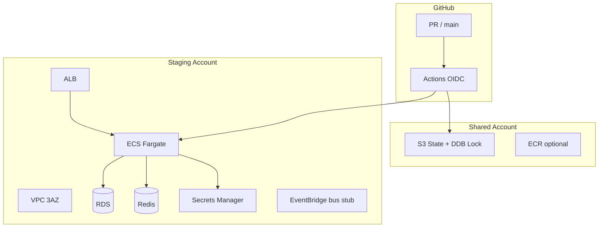

# Sprint 0 — Engineering Plan (Taifa Core)

**Status:** Approved engineering contract — implementation in progress  
**Authority:** [Architecture Constitution](../architecture/00_ARCHITECTURE_CONSTITUTION.md) · [14_PLATFORM_IMPLEMENTATION_GUIDE.md](14_PLATFORM_IMPLEMENTATION_GUIDE.md) · EARB governance complete  
**Scope:** Platform foundation only — **no** Identity, Tourism, Payments, or domain product code

---

## 1. Mission

Sprint 0 establishes the **reusable engineering foundation** for every Taifa module (Tourism, Pay, Trade, Commerce, Health, Education, Government, Mobility, AI, and future verticals). Deliver **infrastructure, repo standards, environments, IaC, CI/CD, and security baselines**—not business features.

---

## 2. Sprint objectives (25 pillars)

| # | Pillar | Sprint 0 outcome | Primary artifact |
| --- | --- | --- | --- |
| 1 | Repository structure | Enterprise layout documented; legacy apps preserved | [REPOSITORY_STRUCTURE.md](REPOSITORY_STRUCTURE.md) |
| 2 | Monorepo strategy | Single repo; apps + packages + infra; path-based CI | §3 below |
| 3 | Package management | Python (`apps/backend`), Dart (`apps/mobile`), shared `packages/` | §4 |
| 4 | Development environment | Local Django + Flutter + Docker compose (existing) | `apps/backend/README.md` |
| 5 | Dev environment (cloud) | `dev` AWS account + minimal VPC stub (IaC) | `infra/envs/dev/` |
| 6 | Testing environment | `test` account for automated integration | `infra/envs/test/` |
| 7 | Staging environment | `staging` — Core integration target | `infra/envs/staging/` |
| 8 | Production environment | `prod` — scaffold only; no citizen traffic in S0 | `infra/envs/prod/` |
| 9 | IaC strategy | Terraform modules; no prod click-ops | [13_INFRASTRUCTURE_PLATFORM.md](13_INFRASTRUCTURE_PLATFORM.md) |
| 10 | Terraform folder structure | `infra/modules/*`, `infra/envs/*`, `infra/global/*` | `infra/README.md` |
| 11 | AWS account strategy | OU + 4 accounts (dev/test/staging/prod) | §6 |
| 12 | IAM strategy | Least privilege; OIDC for CI; no long-lived keys | §7 |
| 13 | Secrets management | Secrets Manager + SSM params; git-free secrets | §8 |
| 14 | GitHub repository standards | CODEOWNERS, PR template, Dependabot | `.github/` |
| 15 | Branch strategy | Trunk `main`; `feature/*`; `release/core-v*` tags | §9 |
| 16 | CI/CD pipeline | `ci.yml`, `iac.yml`, deploy drafts | [12_CICD_PLATFORM.md](12_CICD_PLATFORM.md) |
| 17 | Docker strategy | Multi-stage API image; ECR per env | §10 |
| 18 | Environment variables | `.env.example` pattern; SSM/Secrets in cloud | §11 |
| 19 | Logging strategy | Structured JSON; correlation ID contract | [10_MONITORING_PLATFORM.md](10_MONITORING_PLATFORM.md) |
| 20 | Monitoring strategy | CloudWatch + alarms; X-Ray later | §12 |
| 21 | Coding standards | Constitution `07` + `08` | `docs/architecture/` |
| 22 | Pull request workflow | DoD checklist; required reviews | `.github/PULL_REQUEST_TEMPLATE.md` |
| 23 | Release workflow | Tag `core-v*`, changelog, staging then prod | §13 |
| 24 | Rollback strategy | ECS task definition revert; DB forward-fix | §14 |
| 25 | Versioning strategy | SemVer for platform packages; API `/api/v1` | §15 |

---

## 3. Monorepo strategy

| Principle | Decision |
| --- | --- |
| **Single source of truth** | One GitHub repo; all Taifa Core and shared contracts |
| **Boundary** | `taifa_kernel` (pure types/VOs) · `taifa_platform` (platform services) · `apps/backend/*` (legacy + future domain Django apps) · `apps/mobile` (Flutter shell + `lib/platform`) |
| **Change isolation** | Path filters in GitHub Actions; CODEOWNERS per sensitive path |
| **Future extraction** | Domains may become separate deployables; event contracts and OpenAPI remain in `packages/` and `docs/` |
| **Forbidden in S0** | New Tourism/Commerce/Pay **features**; Identity **implementation** |

---

## 4. Package management

| Stack | Tool | Lockfile | Notes |
| --- | --- | --- | --- |
| Backend | pip + `requirements.txt` | Pin in requirements | Migrate to `pyproject.toml` optional in S1 |
| Mobile | pub | `pubspec.lock` | SDK path deps to `packages/sdk-flutter` when promoted |
| Shared Python SDK | `packages/sdk-python` | — | Becomes `taifa-python` on PyPI internal later |
| IaC | Terraform ≥ 1.6 | `.terraform.lock.hcl` | Committed per env after first init |
| Containers | Docker BuildKit | Dockerfile in `apps/backend` | ECR tags: `git sha` + `core-v*` |

---

## 5. Updated repository structure (summary)

Full tree: **[REPOSITORY_STRUCTURE.md](REPOSITORY_STRUCTURE.md)**.

```
TAIFA APP REMAKE/
├── apps/                    # Deployable applications
│   ├── backend/             # Django monolith (domains + taifa_* platform packages)
│   └── mobile/              # Flutter super-app shell
├── packages/                # Shared libraries & contracts (language SDKs)
├── infra/                   # Terraform — modules, envs, global
├── docs/                    # Architecture, platform, domain packs (read-only law)
├── scripts/                 # Repo-wide automation (target; migrate from apps/backend/scripts)
├── templates/               # Scaffolding templates
└── .github/                 # CI/CD, CODEOWNERS, PR policy
```

**Reorganization rule:** Add new platform code under `taifa_kernel/` and `taifa_platform/`; **do not move** existing domain apps in S0 unless required for CI—document target state in REPOSITORY_STRUCTURE.

---

## 6. AWS environment strategy

### 6.1 Account & OU model

| OU | Account alias | Account ID (fill at provisioning) | Purpose |
| --- | --- | --- | --- |
| `taifa-workloads-dev` | `taifa-dev` | _TBD_ | Engineer sandboxes, ephemeral stacks |
| `taifa-workloads-test` | `taifa-test` | _TBD_ | CI integration tests, contract tests |
| `taifa-workloads-staging` | `taifa-staging` | _TBD_ | Pre-prod Core validation |
| `taifa-workloads-prod` | `taifa-prod` | _TBD_ | Production (no cutover in S0) |
| `taifa-security` | `taifa-audit` | _TBD_ | Org CloudTrail, log archive, Security Hub admin |
| `taifa-shared` | `taifa-shared` | _TBD_ | Terraform state, ECR (optional central) |

**Region:** Primary `af-south-1` (Cape Town); DR design documented, not built in S0.

### 6.2 Networking (per workload account)

| Layer | Design |
| --- | --- |
| VPC | `/16` per env; 3 AZs; public (ALB/NAT), private (ECS/RDS), isolated (data) |
| Endpoints | S3, ECR, Secrets Manager, CloudWatch Logs (gateway endpoints where cost-effective) |
| Egress | NAT gateway per AZ in staging/prod; single NAT acceptable in dev/test |
| DNS | `*.staging.taifa.example` (replace with real zone in provisioning ticket) |

### 6.3 Edge & API

| Component | S0 | Later |
| --- | --- | --- |
| CloudFront | Module stub + OAI pattern doc | Static assets, API caching |
| API Gateway | Module README (HTTP API v2) | Phase 2 unified edge |
| ALB | Target for ECS services | Primary API ingress in S0 staging plan |
| WAF | Attached to ALB in staging (S4 backlog PB-014) | — |

### 6.4 State management

| Item | Location |
| --- | --- |
| State bucket | `taifa-shared` account — `s3://taifa-terraform-state-<account-id>/` |
| Lock | DynamoDB `terraform-locks` |
| Key prefix | `env/<env>/<component>/terraform.tfstate` |
| Bootstrap | `infra/global/state-backend/` (apply once per org) |

---

## 7. IAM strategy

| Actor | Pattern |
| --- | --- |
| **Humans** | AWS SSO (IAM Identity Center); no IAM users with console passwords |
| **GitHub Actions** | OIDC → `sts:AssumeRoleWithWebIdentity`; role per env (`TaifaGitHubDeployStaging`) |
| **ECS tasks** | Task execution role (ECR, logs, secrets) + task role (app AWS API access) |
| **CI read-only** | `TaifaGitHubTerraformPlan` — `plan` only on PR |
| **Break-glass** | Documented in security runbook; MFA + ticket |

**Module:** `infra/modules/iam/` — OIDC provider, deploy roles, boundary policies.

---

## 8. Secrets & KMS

| Secret type | Store | Encryption |
| --- | --- | --- |
| DB credentials | Secrets Manager | KMS CMK `alias/taifa/<env>/data` |
| API keys (providers) | Secrets Manager | Same CMK |
| Non-rotating config | SSM Parameter Store (SecureString) | KMS |
| **Git** | **Never** — gitleaks in CI (S0: document; enable scan job S1) |

**KMS:** One CMK per env for data plane; separate CMK for Terraform state bucket (AWS-managed acceptable for state).

---

## 9. Git strategy

| Element | Rule |
| --- | --- |
| Default branch | `main` |
| Feature branches | `feature/<ticket>-<slug>` |
| Release tags | `core-vMAJOR.MINOR.PATCH` |
| Hotfix | `hotfix/<slug>` from tag; merge to `main` |
| Protection | Require PR, 1+ review, status checks (`ci`, `iac` when paths change) |
| Domain freeze | No Tourism/Commerce **feature** PRs without Platform Lead exception |

---

## 10. Docker strategy

| Image | Context | Registry |
| --- | --- | --- |
| `taifa-api` | `apps/backend/Dockerfile` | ECR `taifa-api` per account or shared |
| Tags | `sha-<git>` immutable; `staging-latest` mutable for deploy | — |
| Local | `docker-compose.yml` (existing) | — |
| Scan | ECR scan on push (enable in staging account) | — |

---

## 11. Environment variables

| Layer | Convention |
| --- | --- |
| Local | `apps/backend/.env` from `.env.example` (never commit `.env`) |
| ECS | Secrets Manager ARNs → task definition `secrets` block |
| Flutter | `--dart-define` / flavor files; no secrets in repo |
| Naming | `TAIFA_<SERVICE>_<KEY>` for platform; domain prefixes for apps |

---

## 12. Logging & monitoring (S0 baseline)

| Concern | S0 deliverable |
| --- | --- |
| Logs | Stdout JSON schema doc; `request_id` / `correlation_id` fields |
| Metrics | ECS → CloudWatch container insights (enable in staging IaC) |
| Traces | X-Ray sidecar deferred to S2 |
| Alarms | SNS topic `taifa-ops-<env>` stub |
| Dashboards | Placeholder in runbook; Grafana in S4 (PB-013) |

---

## 13. Release workflow

1. Merge to `main` → auto deploy **staging** (after `deploy-staging.yml` enabled post-OIDC).
2. Smoke tests + Platform Readiness regression.
3. Tag `core-vX.Y.Z` → manual approval → **prod** deploy workflow (disabled until MS-S5).
4. Release notes from `docs/platform/evidence/release-notes/` template.

---

## 14. Rollback strategy

| Layer | Action |
| --- | --- |
| Application | Revert ECS service to previous task definition revision (image digest) |
| Database | Prefer forward migration; snapshot before deploy |
| IaC | `terraform apply` previous git tag; state is versioned in S3 |
| Feature flags | `core.*` flags off (platform service S3—design only in S0) |

**Runbook:** `docs/platform/runbooks/ROLLBACK.md` (create in S0 execution task C4).

---

## 15. Versioning strategy

| Artifact | Scheme |
| --- | --- |
| Platform packages | SemVer `0.x` until Core GA |
| HTTP API | `/api/v1/platform/*` — breaking changes → v2 |
| Events | `event-envelope-v1` — new major envelope only via ADR |
| Terraform modules | Git ref tags `module/<name>/vX.Y.Z` when published |

---

## 16. Infrastructure blueprint



**Terraform modules (S0 = stub + validate):** vpc, iam, kms, secrets, s3, ecs, rds, redis, eventbridge, cloudfront, api-gateway — see `infra/modules/*/README.md`.

---

## 17. CI/CD blueprint

| Workflow | File | S0 status |
| --- | --- | --- |
| Lint / test / OpenAPI | `.github/workflows/ci.yml` | **Active** |
| IaC validate | `.github/workflows/iac.yml` | **Added** |
| Security scan | `.github/workflows/security.yml` | Draft (pip-audit, gitleaks) — S0 doc only |
| Build & push ECR | `docker-build.yml` | Draft after OIDC |
| Deploy staging | `deploy-staging.yml` | Draft after A2/A3 |
| Rollback | `rollback-staging.yml` | Manual dispatch draft |
| Promote prod | `deploy-prod.yml` | Disabled until gate |

**Environment promotion:** `dev` → automatic from feature branches (optional) · `test` ← CI · `staging` ← `main` · `prod` ← tagged release + approval.

---

## 18. Security checklist (Sprint 0)

| # | Control | Owner | S0 |
| --- | --- | --- | --- |
| S1 | No secrets in git | All | Enforce `.gitignore`; gitleaks planned |
| S2 | OIDC not access keys in CI | DevOps | A2 |
| S3 | MFA on AWS SSO | Security | A1 |
| S4 | Least-privilege IAM policies | DevOps | Module stub |
| S5 | KMS for data at rest | DevOps | A4 doc |
| S6 | TLS 1.2+ everywhere | DevOps | ALB policy in module |
| S7 | CloudTrail org trail | Security | A6 plan |
| S8 | Dependabot enabled | Platform | ✅ |
| S9 | CODEOWNERS on `infra/`, payments | Platform | R5 |
| S10 | PR DoD + security review for IAM | All | ✅ template |

Full matrix: [11_SECURITY_PLATFORM.md](11_SECURITY_PLATFORM.md).

---

## 19. Sprint backlog (S0)

| ID | Story | Points | Depends |
| --- | --- | --- | --- |
| S0-01 | Publish REPOSITORY_STRUCTURE + Sprint 0 plan | 2 | — |
| S0-02 | Create `taifa_kernel/` + `taifa_platform/` package roots | 1 | S0-01 |
| S0-03 | Scaffold `infra/` modules + envs | 5 | S0-01 |
| S0-04 | Add `iac.yml` validate on PR | 2 | S0-03 |
| S0-05 | Document AWS accounts + OU (A1) | 3 | — |
| S0-06 | Bootstrap state backend (A3) | 5 | S0-05 |
| S0-07 | GitHub OIDC roles (A2) | 5 | S0-05, S0-06 |
| S0-08 | KMS + Secrets patterns (A4, A5) | 3 | S0-05 |
| S0-09 | Staging VPC module apply (PB-002 partial) | 8 | S0-06, S0-07 |
| S0-10 | ECR repo + docker-build workflow | 5 | S0-07 |
| S0-11 | `deploy-staging.yml` draft + smoke | 5 | S0-09, S0-10 |
| S0-12 | Rollback runbook (C4) | 2 | S0-11 |
| S0-13 | DNS + naming plan (C3) | 2 | S0-05 |
| S0-14 | Update CODEOWNERS R5 | 1 | S0-02, S0-03 |
| S0-15 | Spectral / OpenAPI CI plan (R3) | 3 | — |
| S0-16 | Sign Platform Readiness Checklist (14) | 2 | S0-04–S0-14 |

**Note:** PB-001 (kernel envelope spec) is **documentation/spec** in S0—implementation code waits until post–full GO.

---

## 20. Sprint deliverables

| Deliverable | Location |
| --- | --- |
| Sprint 0 Engineering Plan (this document) | `docs/platform/SPRINT_0_ENGINEERING_PLAN.md` |
| Repository structure guide | `docs/platform/REPOSITORY_STRUCTURE.md` |
| IaC root + module stubs | `infra/` |
| Platform package placeholders | `apps/backend/taifa_kernel/`, `taifa_platform/` |
| IaC CI workflow | `.github/workflows/iac.yml` |
| AWS account strategy (IDs filled) | `docs/platform/evidence/aws-account-register.md` |
| Rollback runbook | `docs/platform/runbooks/ROLLBACK.md` |
| Updated CODEOWNERS | `.github/CODEOWNERS` |

---

## 21. Sprint exit criteria

| # | Criterion |
| --- | --- |
| E1 | All S0 stories S0-01–S0-16 **Done** or explicitly deferred with ADR |
| E2 | `terraform validate` green in `infra/envs/{dev,test,staging,prod}` via CI |
| E3 | `ci.yml` green on `main` |
| E4 | Platform Readiness Checklist (14) items R1–R5, A1–A6, C2–C4 signed |
| E5 | Staging VPC exists OR documented exception with date |
| E6 | No Identity/Tourism/Payments **feature** code merged |
| E7 | PDL entry for Sprint 0 completion in [17](17_PLATFORM_DECISION_LOG.md) |

---

## 22. Definition of Done (Sprint 0)

A Sprint 0 task is **Done** when:

1. Artifact merged to `main` with PR review per CODEOWNERS.  
2. Documentation or IaC linked from this plan or `14` checklist.  
3. CI applicable jobs pass.  
4. No secrets committed; IAM changes reviewed by security path owner.  
5. Does not violate domain freeze (F1).

Platform-wide DoD remains [09_DEFINITION_OF_DONE.md](../architecture/09_DEFINITION_OF_DONE.md).

---

## 23. Sprint 0 execution checklist (ordered)

Execute top-to-bottom. **Depends** lists prerequisite task IDs.

| Order | ID | Task | Depends |
| --- | --- | --- | --- |
| 1 | S0-01 | Merge Sprint 0 plan + REPOSITORY_STRUCTURE | — |
| 2 | S0-02 | Add `taifa_kernel/` + `taifa_platform/` README + package roots | 1 |
| 3 | S0-14 | Update CODEOWNERS for `infra/`, `taifa_platform/`, `taifa_kernel/` | 2 |
| 4 | S0-03 | Scaffold `infra/modules` + `infra/envs` + `infra/global` | 1 |
| 5 | S0-04 | Enable `iac.yml` (fmt + validate) on `infra/**` changes | 4 |
| 6 | S0-05 | Write AWS OU/account register (`evidence/aws-account-register.md`) | 1 |
| 7 | S0-08 | Document KMS + Secrets Manager naming (`infra/modules/kms`, `secrets` README) | 6 |
| 8 | S0-06 | Apply global state backend (shared account) | 6 |
| 9 | S0-07 | Configure GitHub OIDC + plan/deploy roles | 8 |
| 10 | S0-13 | Approve DNS/naming (`staging` hostnames, Route 53 zone) | 6 |
| 11 | S0-09 | `terraform apply` staging VPC (+ subnets, endpoints doc) | 8, 9 |
| 12 | S0-10 | Create ECR + `docker-build.yml` (push on main) | 9 |
| 13 | S0-15 | Add Spectral/OpenAPI job spec to `12` + optional CI job | 1 |
| 14 | S0-11 | Draft `deploy-staging.yml` + health smoke (`/healthz`) | 11, 12 |
| 15 | S0-12 | Publish `runbooks/ROLLBACK.md` | 14 |
| 16 | S0-16 | Platform Lead + Security + DevOps sign checklist §14 | 5, 7, 11, 14, 15 |

**Parallel tracks after step 4:** Track A (6→8→9→11→14) AWS · Track B (5, 13, 15) docs · Track C (2→3) repo.

---

## 24. Cross-references

- [14_PLATFORM_IMPLEMENTATION_GUIDE.md](14_PLATFORM_IMPLEMENTATION_GUIDE.md) — MS-S0 milestone  
- [13_INFRASTRUCTURE_PLATFORM.md](13_INFRASTRUCTURE_PLATFORM.md) · [12_CICD_PLATFORM.md](12_CICD_PLATFORM.md)  
- [16_PLATFORM_BACKLOG.md](16_PLATFORM_BACKLOG.md) — PB-001–PB-003  
- [REPOSITORY_STRUCTURE.md](REPOSITORY_STRUCTURE.md)

---

*This document is the Sprint 0 engineering contract for the Taifa platform.*
