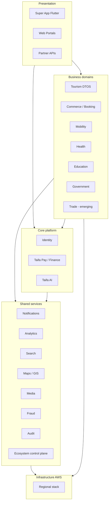

# 00 — Taifa Enterprise Blueprint

**Purpose:** Single executive view of the national Taifa digital platform.  
**Scope:** Identity, Pay, Commerce, Trade, Tourism, Mobility, Health, Education, Government, AI, and shared services.  
**Principles:** One account, shared spine, domain-owned truth, integrate by contract.

---

## Mission

Enable **every citizen, visitor, business, and government agency** in Tanzania to transact, move, learn, heal, trade, and explore through **one trusted digital ecosystem**—built on sovereign infrastructure, inclusive design, and regulatory accountability.

## Vision

Taifa is the **Digital Operating System of Tanzania**: modular industry domains on a **core platform** (Identity, Pay, Notifications, Audit, AI invoke)—scalable to East Africa without re-architecting money or identity.

---

## Architecture philosophy

| Pillar | Statement |
| --- | --- |
| **Platform first** | Verticals consume horizontal services; no second wallet or login per module ([`DIGITAL_ECOSYSTEM.md`](../DIGITAL_ECOSYSTEM.md)). |
| **Domain ownership** | One system of record per capability ([`architecture/01_DOMAIN_GOVERNANCE.md`](../architecture/01_DOMAIN_GOVERNANCE.md)). |
| **Constitution** | [`architecture/00_ARCHITECTURE_CONSTITUTION.md`](../architecture/00_ARCHITECTURE_CONSTITUTION.md) is technical law. |
| **Certification** | Production launch follows [`platform_governance/`](../platform_governance/00_INDEX.md) Stages 0–9. |
| **Evolution** | Modular monolith → extract microservices by metric ([ADR process](../architecture/08_ADR_GUIDELINES.md)). |

---

## Layer model

---

## Enterprise principles (summary)

1. **DDD** — Bounded contexts with published language.  
2. **Hexagonal / clean** — Ports for Pay, Identity, Booking, Government adapters.  
3. **Event-driven** — EventBridge target; outbox from monolith ([`architecture/02_EVENT_CATALOG.md`](../architecture/02_EVENT_CATALOG.md)).  
4. **API-first** — `/api/v1`, OpenAPI CI ([`architecture/03_API_STANDARDS.md`](../architecture/03_API_STANDARDS.md)).  
5. **Security by design** — Zero trust, PCI scope containment ([`architecture/05_SECURITY_STANDARDS.md`](../architecture/05_SECURITY_STANDARDS.md)).  
6. **Observability** — Health, metrics, traces ([`OBSERVABILITY.md`](../OBSERVABILITY.md)).

---

## Domain portfolio (review scope)

| Domain | Maturity (docs) | Primary doc anchor |
| --- | --- | --- |
| **Taifa Identity** | Amber | Device auth + federation adapters; full OIDC pack thin |
| **Taifa Pay** | Green (spine) | [`PAYMENTS.md`](../PAYMENTS.md), [`SYSTEM_ARCHITECTURE.md`](../SYSTEM_ARCHITECTURE.md) |
| **Taifa Commerce** | Amber | [`DIGITAL_ECOSYSTEM.md`](../DIGITAL_ECOSYSTEM.md), `/commerce/*` |
| **Taifa Trade** | Red (pack) | No dedicated domain pack; treat as Commerce + future B2B |
| **Taifa Tourism** | Green (architecture) | [`tourism/`](../tourism/00_INDEX.md) |
| **Taifa Mobility** | Amber | [`NATIONAL_API.md`](../NATIONAL_API.md), `trips` |
| **Taifa Health / Education** | Amber | Commerce-backed verticals + lifecycle wave 3 |
| **Taifa Government** | Amber | Adapters + commerce gov-requests |
| **Taifa AI** | Amber | [`ecosystem/ai`](../DIGITAL_ECOSYSTEM.md), advisory-only to ledger |
| **Shared platform** | Green–Amber | Ecosystem, integrations, enterprise workflow |

---

## Non-functional requirements (enterprise)

| NFR | Target |
| --- | --- |
| Availability (tier-1: Identity, Pay) | 99.95% |
| Payment integrity | Double-entry, idempotent, append-only ledger |
| Data residency | Tanzania primary (`af-south-1`); cross-border via ADR |
| Inclusion | Kiswahili, offline-tolerant mobile, low bandwidth |
| Audit | Financial & government actions immutable |

---

## Architecture lifecycle

Aligns with [`platform_governance/01_LIFECYCLE_FRAMEWORK.md`](../platform_governance/01_LIFECYCLE_FRAMEWORK.md): Vision → Architecture → Engineering → … → Continuous Improvement.

**EARB role:** Stage 1 (Architecture) certification input before Stage 2 engineering at national scale.

---

## Cross-references

- [01_PLATFORM_CAPABILITY_MAP.md](01_PLATFORM_CAPABILITY_MAP.md)  
- [02_ENTERPRISE_CONTEXT_MAP.md](02_ENTERPRISE_CONTEXT_MAP.md)  
- [06_ARCHITECTURE_REVIEW_REPORT.md](06_ARCHITECTURE_REVIEW_REPORT.md)  
- [07_IMPLEMENTATION_READINESS_REPORT.md](07_IMPLEMENTATION_READINESS_REPORT.md)

---

## Future considerations

- EAC federated identity and settlement  
- National data mesh for statistics (TTB, LATRA, BoT reporting)  
- Single partner developer portal atop Open Platform + platform service catalog
