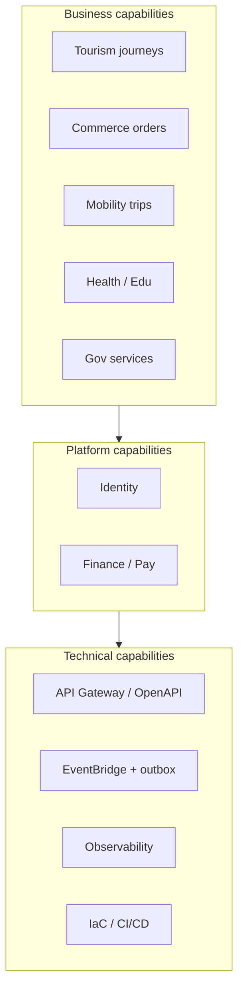

# 01 — Platform Capability Map

**Purpose:** Canonical map of what Taifa **is** and **does**—separating platform, business, and technical capabilities.  
**Scope:** Entire ecosystem; Tourism detailed in domain pack.  
**Principles:** No duplicate ownership; capabilities roll up to one domain.

---

## Legend

| Type | Meaning |
| --- | --- |
| **Platform** | Horizontal, multi-tenant, mandatory adapters |
| **Business** | Industry or citizen journey capabilities |
| **Technical** | Enabling IT capabilities (not user-facing products) |

---

## Core platform (horizontal)

| Capability | Type | Owner | Consumers |
| --- | --- | --- | --- |
| Citizen & device identity | Platform | **Identity** | All domains |
| Authentication & session | Platform | **Identity** | All |
| Authorization (RBAC/ABAC) | Platform | **Identity** + Enterprise | Portals, ops |
| Wallet & ledger | Platform | **Taifa Pay / Finance** | All paid flows |
| Payment capture & refund | Platform | **Finance** | Commerce, Tourism, Mobility, MAP |
| Payment rails (M-Pesa, etc.) | Platform | **Finance** (adapters) | — |
| Split settlement execution | Platform | **Finance** | Tourism, Commerce, partners |
| Fraud advisory | Platform | **Fraud** | Finance, checkout |
| Immutable audit | Platform | **Audit** | Regulators, ops |
| Ecosystem module registry | Platform | **Ecosystem** | Super App |
| Partner onboarding | Platform | **Ecosystem** + Identity | External gov/biz |

---

## Shared services

| Capability | Type | Owner | Notes |
| --- | --- | --- | --- |
| Push / SMS / email | Shared | **Notifications** | No business state |
| Analytics & telemetry | Shared | **Analytics** | Event consumers |
| Search | Shared | **Search** | Super App, Discovery |
| Maps / geocoding / routing | Shared | **Maps** (GIS adapter) | Mobility, Tourism, Express |
| Media storage & CDN | Shared | **Media** (S3 + docs) | Passes, KYC docs |
| Workflow engine | Shared | **Enterprise** | Permits, merchant approval |
| Webhooks / outbox delivery | Shared | **Enterprise** | Partners |
| Document scan / malware | Shared | **Platform security** | Mobility KYC |
| AI inference invoke | Shared | **Taifa AI** | Tools; no ledger writes |

---

## Business domains

### Taifa Pay (product surface)

| Capability | Owner | Notes |
| --- | --- | --- |
| P2P transfer | Finance | Live spine |
| Merchant capture (MAP) | Finance + MAP UX | [`map/`](../map/00_INDEX.md) |
| Tap & Pay (NFC) | Interaction layer → Finance | [`tap_pay/`](../tap_pay/00_INDEX.md) |
| Invoicing / payment links | MAP / Commerce | Not a second ledger |

### Taifa Commerce & Trade

| Capability | Owner | Notes |
| --- | --- | --- |
| Product catalog & orders | **Commerce** | Food, retail, merchant |
| Stay / flight / tour bookings | **Commerce (Booking)** | Tourism delegates here |
| Health appointments | **Health** (logical) / Commerce (phase-1 SoR) | Extract per ADR |
| Education fee payments | **Education** (logical) / Commerce (phase-1) | Same |
| Gov service requests | **Government** (logical) / Commerce (phase-1) | Same |
| B2B / cross-border trade | **Trade** (future) | **Missing pack**—do not duplicate Commerce order engine |

### Taifa Tourism (DTOS)

| Capability | Owner |
| --- | --- |
| Trip orchestration, cart, checkout session | **Travel Orchestration** |
| Destination & reviews | **Discovery** |
| Travel insurance & SOS | **Protection** |
| eSIM | **Connectivity** |
| Permits / visa refs | **Government** + Booking holds |

See [`tourism/CANONICAL_ENTERPRISE_ARCHITECTURE.md`](../tourism/CANONICAL_ENTERPRISE_ARCHITECTURE.md) §3.

### Taifa Mobility

| Capability | Owner |
| --- | --- |
| National trips / AVL / BRT | **Mobility** (`trips`) |
| Intercity / transit tickets | **Mobility** |
| Ride / logistics shipments | **Mobility** + Logistics |
| Safety incident SoR | **Mobility** |

### Health & Education

| Capability | Owner (target) | Phase-1 |
| --- | --- | --- |
| Facility / school catalog | Health / Education | Flutter seed + commerce APIs |
| Appointments / fee invoices | Health / Education | `commerce/*` tables |

### Government services

| Capability | Owner |
| --- | --- |
| Authority adapters (LATRA, etc.) | **Government** integrations |
| Permit / visa application state | **Government** |
| Citizen-facing huduma flows | **Government** UX → Commerce/Gov APIs |

### Taifa AI

| Capability | Owner |
| --- | --- |
| Model invoke, tools, sessions | **AI Experience** |
| Recommendations generation | **AI** |
| Committed bookings / trips | **Never AI**—Orchestration / Commerce |

---

## Support & administration

| Capability | Type | Owner |
| --- | --- | --- |
| Admin / ops consoles | Support | Enterprise + domain ops packs |
| Merchant / driver portals | Support | Commerce, Mobility |
| Certification & scorecard | Administration | [`platform_governance`](../platform_governance/00_INDEX.md) |
| ARB / API review | Administration | [`GOVERNANCE.md`](../GOVERNANCE.md) |

---

## Capability layering diagram

---

## Duplication watchlist (EARB)

| Risk | Resolution |
| --- | --- |
| Commerce hosts Health/Edu/Gov/Tourism bookings | **Logical** domains with **physical** commerce SoR until ADR extraction |
| MAP vs Pay vs Tap | **One ledger**; MAP/Tap are interaction layers |
| AI recommendations in Discovery vs AI | Tourism canonical: AI generates, Discovery hosts |
| Winga vs Commerce housing | Winga property pack; commerce housing inquiries—clarify in Trade/Housing ADR |

---

## Cross-references

- [02_ENTERPRISE_CONTEXT_MAP.md](02_ENTERPRISE_CONTEXT_MAP.md)  
- [03_CANONICAL_DATA_MODEL.md](03_CANONICAL_DATA_MODEL.md)  
- [06_ARCHITECTURE_REVIEW_REPORT.md](06_ARCHITECTURE_REVIEW_REPORT.md)

---

## Future considerations

- Formal **Trade** domain pack (export, standards, customs) separate from retail Commerce  
- **Health** FHIR boundary and separate deployable for clinical data
