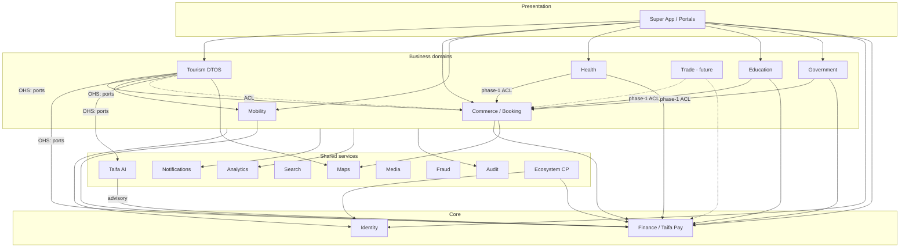

# 02 — Enterprise Context Map

**Purpose:** Show relationships between Taifa bounded contexts—integration style, ACL, APIs, and events.  
**Scope:** Identity, Pay, Tourism, Trade, Commerce, Mobility, Health, Education, Government, AI, and shared services.  
**Principles:** Downstream depends on upstream contracts; no cyclic SoR writes.

---

## Context map (strategic)

**Legend:** Solid = primary dependency; dashed = ACL / legacy coupling.

---

## Integration styles

| Relationship | Pattern | Example |
| --- | --- | --- |
| Tourism → Booking | **Customer-Supplier** (sync API + events) | Reserve tour/stay |
| Tourism → Finance | **Conformist** to Pay API | `capture_merchant_payment` |
| Health → Commerce | **ACL** (phase-1) | Health facade over `health-appointments` |
| Commerce → Finance | **Customer-Supplier** | Order pay |
| Mobility → Finance | **Customer-Supplier** | Ticket purchase |
| AI → All | **Published language** via tools; **no SoR** | Plan trip proposal |
| Analytics → All | **Event subscriber** | Firehose |
| Identity → All | **Shared kernel** (tokens only) | JWT/device session |

---

## Anti-corruption layers (mandatory)

| Boundary | ACL location | Translates |
| --- | --- | --- |
| Tourism ↔ Commerce bookings | `tourism` BookingPort adapter | Commerce DTO → `BookingRef` |
| Tourism ↔ Protection/Connectivity | Ports + ADR-0001 physical deploy | Assist/eSIM paths |
| Super App ↔ multiple domains | `data/` repositories per feature | REST DTOs → domain models |
| Government adapters | `integrations.government` | Authority JSON → `PermitRef` |
| Payment rails | `payments.gateways.*` | M-Pesa → ledger commands |
| AI providers | `integrations.ai` | LLM response → tool calls |

---

## Published APIs (enterprise index)

| Context | Base path | Auth |
| --- | --- | --- |
| Identity | Device session + enterprise RBAC | Bearer + `X-Device-Id` |
| Finance / Pay | `/api/v1/payments/`, wallet, transfers | Device + owner scope |
| MAP / merchant pay | `/api/v1/map/` | Merchant + device |
| Commerce | `/api/v1/commerce/` | Device / merchant |
| Tourism orchestration | `/api/v1/tourism/` | Device |
| Tourism protection (target) | `/api/v1/tourism/protection/` | Device |
| Mobility | `/api/v1/trips/` | Device + RBAC |
| Ecosystem | `/api/v1/ecosystem/` | Partner + device |
| AI invoke | `/api/v1/ecosystem/ai/{capability}/invoke` | Scoped |
| Integrations | `/api/v1/integrations/` | Ops |
| Governance | `/api/v1/governance/` | Executive |

National mobility detail: [`NATIONAL_API.md`](../NATIONAL_API.md). Open platform: [`OPEN_PLATFORM.md`](../OPEN_PLATFORM.md).

---

## Event consumers (platform bus)

| Publisher prefix | Primary consumers |
| --- | --- |
| `finance.*` | Commerce, Tourism orchestration, Fraud, Analytics |
| `tourism.*` | Booking, Protection, Connectivity, Notifications, Analytics |
| `booking.*` | Tourism orchestration, Analytics |
| `mobility.*` | Tourism, Protection, Notifications |
| `protection.*` | Tourism, Mobility, Ops |
| `connectivity.*` | Tourism, Notifications |
| `government.*` | Tourism, Booking, Gov workflows |
| `ai.*` | Tourism orchestration |
| `notification.*` | Analytics |

Full catalog: [`architecture/02_EVENT_CATALOG.md`](../architecture/02_EVENT_CATALOG.md).

---

## Dependency rules (no cycles)

**Forbidden:** Finance → Commerce ORM; Tourism → Commerce direct table updates; Mobility → Tourism checkout tables.

---

## Tourism integration summary (validation)

| Partner context | Direction | Mechanism | EARB status |
| --- | --- | --- | --- |
| Discovery | Inbound read | API / seed → future Discovery API | Amber (backend pending) |
| Booking | Outbound commands | BookingPort + `booking.reservation.*` | Green (documented) |
| Finance | Outbound capture | FinancePort + `finance.payment.captured` | Green |
| Mobility | Outbound schedule / inbound AVL | API + `mobility.*` events | Green |
| Protection | Outbound issue / SOS | API + `protection.*` | Amber (URL namespace) |
| Connectivity | Outbound provision | API + `connectivity.*` | Amber (ADR-0001 deploy) |
| Government | Outbound checklist | GovernmentPort | Amber (adapters config) |
| AI | Outbound plan | AIPlannerPort + `ai.*` | Green (advisory) |
| Identity | Inbound auth | All tourism APIs | Green (device auth) |
| Notifications | Outbound intents | Platform | Amber (event-driven target) |

---

## Cross-references

- [05_INTEGRATION_CATALOG.md](05_INTEGRATION_CATALOG.md)  
- [03_CANONICAL_DATA_MODEL.md](03_CANONICAL_DATA_MODEL.md)  
- [`tourism/02_TRAVEL_ORCHESTRATION_DOMAIN.md`](../tourism/02_TRAVEL_ORCHESTRATION_DOMAIN.md)

---

## Future considerations

- Context map as machine-readable artifact in repo CI  
- Trade domain as **Supplier** to Commerce fulfillment, not duplicate orders
