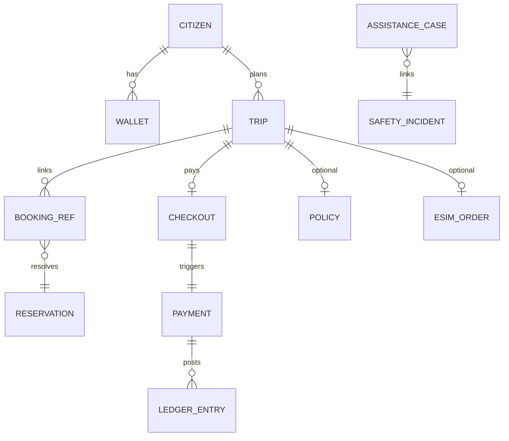

# 03 — Canonical Data Model (Enterprise Concepts)

**Purpose:** Enterprise-wide business concepts—definition, owner, consumers, relationships, lifecycle.  
**Scope:** Cross-domain glossary; physical schemas remain in domain packs and [`DATA_MODEL.md`](../DATA_MODEL.md).  
**Principles:** One owning domain per concept; others hold **references** only.

---

## Concept specification template

Each entry: **Definition** · **Owner** · **Consumers** · **Relationships** · **Lifecycle**

---

## Party & identity

### Citizen

| Attribute | Value |
| --- | --- |
| **Definition** | Registered national user (person) using Taifa with verified or progressive identity. |
| **Owner** | **Identity** |
| **Consumers** | All domains (subject id) |
| **Relationships** | 1:N Wallet, 1:N Trips, 1:N Orders |
| **Lifecycle** | `registered` → `verified` → `suspended` → `closed` |

### Traveler

| Attribute | Value |
| --- | --- |
| **Definition** | A **Citizen** or **Visitor** acting in Tourism context for a journey. |
| **Owner** | **Identity** (person); **Tourism** (trip party profile snapshot) |
| **Consumers** | Tourism, Protection, Connectivity, Government |
| **Relationships** | Party on **Trip**; may link **Visa** / **Permit** refs |
| **Lifecycle** | Contextual to **Trip** |

### Merchant / Business

| Attribute | Value |
| --- | --- |
| **Definition** | Legal entity accepting pay or listing inventory. |
| **Owner** | **Enterprise** / Commerce merchant registry |
| **Consumers** | Finance (settlement), Commerce, MAP, Mobility (fleet) |
| **Relationships** | N employees (Identity roles), N locations |
| **Lifecycle** | `applied` → `verified` → `active` → `suspended` |

---

## Tourism & mobility

### Trip

| Attribute | Value |
| --- | --- |
| **Definition** | Coherent travel journey from intent through completion. |
| **Owner** | **Travel Orchestration** (Tourism) |
| **Consumers** | Booking (attach), Protection, Connectivity, Mobility, AI, Analytics |
| **Relationships** | 1 selected **Itinerary**; N **Booking** refs; 0–1 **Checkout**; 0–1 **Travel Pass** |
| **Lifecycle** | `DRAFT` → `PLANNING` → `READY_TO_BOOK` → `CHECKOUT` → `ACTIVE` → `COMPLETED` / `CANCELLED` |

### Booking / Reservation

| Attribute | Value |
| --- | --- |
| **Definition** | Supplier-confirmed obligation (tour, stay, flight, ticket, etc.). |
| **Owner** | **Commerce / Booking** |
| **Consumers** | Tourism orchestration, Finance, Notifications |
| **Relationships** | Links to **Payment**; optional **Trip** |
| **Lifecycle** | `hold` → `confirmed` → `paid` → `fulfilled` → `cancelled` |

### Guide / Vehicle / Hotel / Tour

| Attribute | Value |
| --- | --- |
| **Definition** | Supplier inventory or resource types exposed via Booking catalog. |
| **Owner** | **Booking** (inventory) + partner systems |
| **Consumers** | Tourism planning, Commerce search |
| **Lifecycle** | Catalog-managed per supplier |

### Emergency incident

| Attribute | Value |
| --- | --- |
| **Definition** | Safety/geolocation incident record on national mobility graph. |
| **Owner** | **Mobility** (`SafetyIncident` SoR) |
| **Consumers** | **Protection** (assistance case link), Ops |
| **Relationships** | Linked from **AssistanceCase** |
| **Lifecycle** | `open` → `responding` → `resolved` |

---

## Money

### Payment

| Attribute | Value |
| --- | --- |
| **Definition** | Authorization/capture/settlement unit against rails. |
| **Owner** | **Finance / Taifa Pay** |
| **Consumers** | All paid domains |
| **Relationships** | N **Ledger** entries; links **Order** / **Checkout** |
| **Lifecycle** | `initiated` → `authorized` → `captured` → `refunded` / `failed` |

### Wallet

| Attribute | Value |
| --- | --- |
| **Definition** | Stored-value balance view for a subject. |
| **Owner** | **Finance** |
| **Consumers** | Super App, Commerce, Mobility tickets |
| **Lifecycle** | Tied to **Citizen**; frozen/suspended with Identity |

### Invoice

| Attribute | Value |
| --- | --- |
| **Definition** | Payable document (merchant, school fee, gov fee). |
| **Owner** | **Finance** (settlement) + issuing domain (Education, MAP, Government) |
| **Consumers** | Payer apps |
| **Lifecycle** | `issued` → `paid` → `void` |

---

## Protection & connectivity

### Insurance policy

| Attribute | Value |
| --- | --- |
| **Definition** | Risk transfer contract for a trip or person. |
| **Owner** | **Protection** (phase-1 table in commerce—logical owner Protection) |
| **Consumers** | Tourism checkout, Finance (premium), Claims |
| **Lifecycle** | `quoted` → `issued` → `active` → `expired` / `claimed` |

### eSIM

| Attribute | Value |
| --- | --- |
| **Definition** | Connectivity order and provisioning state (ICCID, QR). |
| **Owner** | **Connectivity** |
| **Consumers** | Tourism orchestration, Notifications |
| **Lifecycle** | `quoted` → `ordered` → `provisioned` → `expired` |

---

## Government

### Permit / Visa

| Attribute | Value |
| --- | --- |
| **Definition** | Government-issued or application reference (park, visa, business permit). |
| **Owner** | **Government** (application state); authority systems (issuance) |
| **Consumers** | Tourism, Booking (holds), Mobility |
| **Lifecycle** | `draft` → `submitted` → `approved` / `rejected` → `issued` |

---

## Content & engagement

### Review

| Attribute | Value |
| --- | --- |
| **Definition** | UGC rating after experience. |
| **Owner** | **Discovery** (Tourism) |
| **Consumers** | Analytics, AI ranking |
| **Lifecycle** | `submitted` → `published` / `moderated` |

---

## Enterprise ER (conceptual)

---

## Cross-references

- [`architecture/04_DATABASE_STANDARDS.md`](../architecture/04_DATABASE_STANDARDS.md)  
- [`tourism/CANONICAL_ENTERPRISE_ARCHITECTURE.md`](../tourism/CANONICAL_ENTERPRISE_ARCHITECTURE.md) §7  
- [`DATA_MODEL.md`](../DATA_MODEL.md) (physical payment schema)

---

## Future considerations

- Sync this glossary with `DATA_MODEL.md` section headers  
- Health **Patient** / **Encounter** as separate regulated concepts (FHIR IDs)
