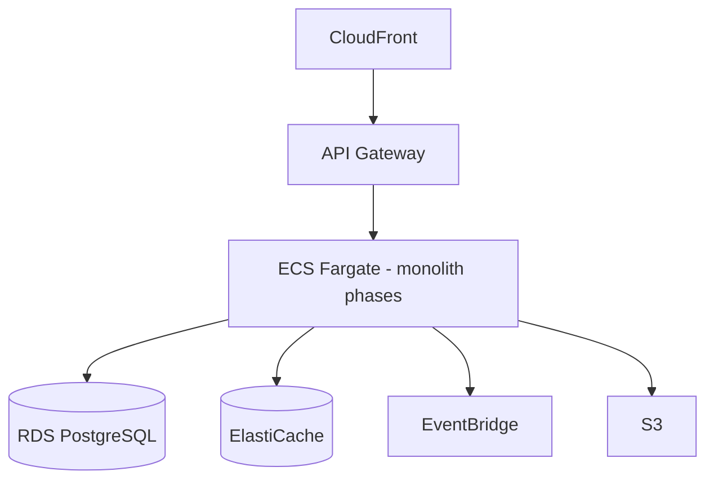

# 04 — Platform Service Catalog

**Purpose:** Inventory of logical and physical services, APIs, and ownership.  
**Scope:** Deployed and planned Taifa services.  
**Principles:** One service owner; documented API base; alignment with monorepo apps.

---

## Service catalog

| Service ID | Name | Owner team | Deploy unit (phase-1) | API base | Status |
| --- | --- | --- | --- | --- | --- |
| `identity` | Taifa Identity | identity-platform | `enterprise` + device auth | Session/RBAC via enterprise | Amber |
| `payments` | Taifa Pay Core | payments-platform | `payments` Django app | `/api/v1/payments/` | Green |
| `map` | Merchant Acceptance (MAP) | payments-platform | MAP routes | `/api/v1/map/` | Green |
| `tap` | Tap & Pay UX | payments-platform | tap routes + Flutter | `/api/v1/map/tap/` | Green |
| `commerce` | Commerce & Booking | commerce-platform | `commerce` app | `/api/v1/commerce/` | Amber |
| `tourism-orch` | Travel Orchestration | tourism-platform | `tourism` app | `/api/v1/tourism/` | Amber |
| `trips` | National Mobility | mobility-platform | `trips` app | `/api/v1/trips/` | Amber |
| `ecosystem` | Control plane | platform | `ecosystem` | `/api/v1/ecosystem/` | Green |
| `enterprise` | Workflow, RBAC, outbox | platform | `enterprise` | `/api/v1/enterprise/` | Green |
| `integrations` | Adapter registry | platform | `integrations` | `/api/v1/integrations/` | Green |
| `governance` | Scorecard API | platform | governance app | `/api/v1/governance/` | Green |
| `winga` | Property marketplace | winga | winga modules | commerce + winga APIs | Amber |
| `express` | Delivery | logistics | express docs + commerce | TBD | Amber |
| `ai` | Taifa AI invoke | ai-platform | ecosystem AI | `/api/v1/ecosystem/ai/` | Amber |

**Not separate services (by design):** Notifications, Fraud, Audit—capabilities inside enterprise/integrations until extracted.

---

## Shared platform services (logical)

| Service | Capability | Integration |
| --- | --- | --- |
| Notifications | SMS, email, push | HTTP adapters [`INTEGRATION_CATALOG.md`](../INTEGRATION_CATALOG.md) |
| Maps | Geocode, route | `TAIFA_MAPS_PROVIDER_JSON` |
| Media / Documents | S3 + scan | Object storage adapter |
| Search | Super App search | Flutter + future OpenSearch |
| Analytics | Event sink | EventBridge → Firehose (target) |
| Fraud | Advisory scoring | AI + rules; no ledger write |

---

## Tourism service decomposition (logical → physical)

| Logical microservice | Phase-1 home | Extract trigger |
| --- | --- | --- |
| orchestration-trip | `tourism` | Trip volume SLO |
| orchestration-checkout | `tourism` | Checkout queue depth |
| protection-assist | `tourism` (ADR-0001) | EventBridge mandatory |
| connectivity-esim | `tourism` (ADR-0001) | MNO isolation |
| discovery | Mobile seed | OpenSearch CMS |

---

## API surface summary

| Domain | OpenAPI tag pattern | Contract owner |
| --- | --- | --- |
| Pay | `payments-*` | payments-platform |
| Commerce | `commerce-*` | commerce-platform |
| Tourism | `Tourism - *` (target) | tourism-platform |
| Mobility | `mobility-*` | mobility-platform |

CI: committed `openapi.yaml`, spectral rules per [`architecture/03_API_STANDARDS.md`](../architecture/03_API_STANDARDS.md).

---

## Deployment topology (target AWS)

Phase-1: Docker compose / single-region ECS; see [`architecture/07_DEPLOYMENT_STANDARDS.md`](../architecture/07_DEPLOYMENT_STANDARDS.md).

---

## Cross-references

- [05_INTEGRATION_CATALOG.md](05_INTEGRATION_CATALOG.md)  
- [`SYSTEM_ARCHITECTURE.md`](../SYSTEM_ARCHITECTURE.md)  
- [04_PLATFORM_SERVICE_CATALOG.md](04_PLATFORM_SERVICE_CATALOG.md) *(this doc)*

---

## Future considerations

- Service catalog YAML generated from OpenAPI + `apps/backend` MODULES registry  
- Separate **Trade** service entry when B2B pack exists
