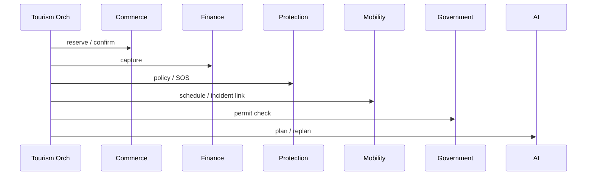

# 05 — Integration Catalog (Enterprise View)

**Purpose:** Cross-domain integration matrix—how domains connect, without duplicating runtime adapter inventory.  
**Scope:** Business-domain integrations; adapter config remains in [`INTEGRATION_CATALOG.md`](../INTEGRATION_CATALOG.md).  
**Principles:** APIs + events only; ACL at legacy boundaries.

---

## Integration matrix

| From → To | Mechanism | Sync/Async | ACL |
| --- | --- | --- | --- |
| Super App → Identity | REST + device token | Sync | Client `data/` layer |
| Super App → Finance | Wallet, transfers, pay | Sync | WalletRepository |
| Super App → Commerce | Order/booking APIs | Sync | Per-feature repository |
| Super App → Tourism | Trip, checkout APIs | Sync | TourismController |
| Super App → Mobility | Trips, transit | Sync | Mobility repos |
| Tourism → Commerce | BookingPort | Sync | **Yes** — Booking adapter |
| Tourism → Finance | FinancePort capture/refund | Sync | Pay client |
| Tourism → Protection | ProtectionPort | Sync | Assist path |
| Tourism → Connectivity | ConnectivityPort | Sync | eSIM path |
| Tourism → Mobility | MobilityPort | Sync + events | Trip bridge |
| Tourism → Government | GovernmentPort | Sync | Authority adapter |
| Tourism → AI | AIPlannerPort | Sync | ecosystem AI invoke |
| Commerce → Finance | Pay on order | Sync | Commerce payment service |
| Mobility → Finance | Ticket purchase | Sync | Idempotent capture |
| Health/Edu/Gov → Commerce | Vertical APIs | Sync | **Yes** — vertical facade |
| Health/Edu/Gov → Finance | Pay invoice/appointment | Sync | Shared pay |
| MAP/Tap → Finance | pay_intent → capture | Sync | MAP ACL |
| Enterprise → Notifications | Outbox webhooks | Async | Event outbox |
| Any → Analytics | Domain events | Async | None |
| Partners → Ecosystem | Webhooks, OAuth | Async | Partner ACL |

---

## Event integration (selected flows)

| Flow | Events | Consistency |
| --- | --- | --- |
| Tourism checkout | `tourism.checkout.*`, `finance.payment.captured`, `booking.reservation.paid` | Saga |
| Mobility ticket | `finance.payment.captured`, mobility ticket events (to formalize) | Sync pay + async notify |
| Commerce order | Order paid → ledger (in-process today) | Strong in monolith |
| SOS | `protection.sos.opened`, `mobility.incident.recorded` | Sync create + event |

---

## Published API dependencies (Tourism validation)

---

## External integrations (national)

See runtime catalog: M-Pesa, Airtel, Selcom, NIDA identity, government HTTP, SMS, push, maps, S3, AI provider.

**Production rule:** No stub adapters (`TAIFA_ALLOW_STUB_ADAPTERS=false`).

---

## Cross-references

- [02_ENTERPRISE_CONTEXT_MAP.md](02_ENTERPRISE_CONTEXT_MAP.md)  
- [`architecture/02_EVENT_CATALOG.md`](../architecture/02_EVENT_CATALOG.md)  
- [`OPEN_PLATFORM.md`](../OPEN_PLATFORM.md)

---

## Future considerations

- Integration test suite per matrix row (contract tests)  
- Service mesh (mTLS) when services extract from monolith
