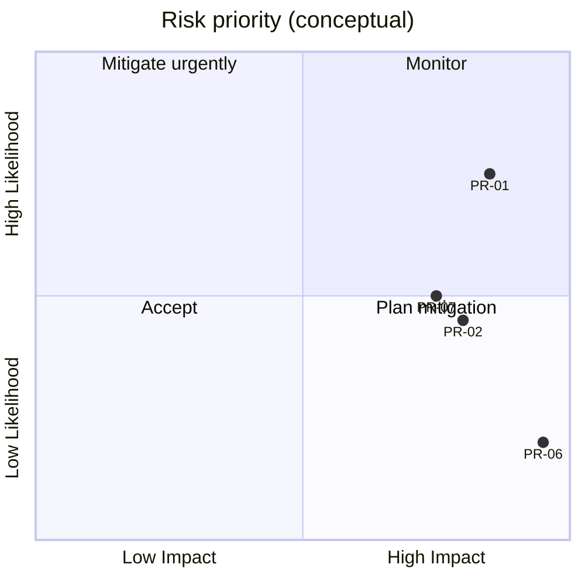

# 08 — Platform Risks

**Purpose:** Enterprise risk register for Taifa architecture and integration.  
**Scope:** Platform-wide; complements [`program_closure/05_RISK_REGISTER.md`](../program_closure/05_RISK_REGISTER.md).  
**Principles:** Identify early; assign owner; link to mitigations in architecture docs.

---

## Risk register

| ID | Risk | Likelihood | Impact | Rating | Owner | Mitigation |
| --- | --- | --- | --- | --- | --- | --- |
| PR-01 | Commerce monolith absorbs unlimited verticals | High | High | **Critical** | commerce-platform | ADR extraction roadmap; facade APIs |
| PR-02 | Cross-domain ORM writes bypass ports | Medium | High | **High** | ARB | Code audit; import linter; DoD |
| PR-03 | Event schema drift / duplicate names | Medium | Medium | **Medium** | platform | `architecture/02` registry; CI |
| PR-04 | EventBridge/outbox not universal | High | Medium | **High** | platform | Mandate in ADR; staging proof |
| PR-05 | Identity model insufficient for national KYC | Medium | High | **High** | identity-platform | OIDC pack; NIDA adapter prod |
| PR-06 | PCI scope creep (PAN in vertical apps) | Low | Critical | **High** | payments-platform | Pay-only capture; reviews |
| PR-07 | AI hallucination affects bookings/prices | Medium | High | **High** | ai-platform | Ground on Booking quotes; human commit |
| PR-08 | Tourism assist URL confusion with AI | Low | Medium | **Low** | tourism-platform | protection/* migration |
| PR-09 | Trade domain undefined → duplicate Commerce | Medium | Medium | **Medium** | ARB | Trade 00_INDEX + ADR |
| PR-10 | Health/Edu data in commerce without compliance ADR | Medium | High | **High** | health/edu leads | Separate SoR ADR; RLS future |
| PR-11 | Single-region outage | Medium | High | **High** | DevOps | DR runbook; Multi-AZ RDS |
| PR-12 | Partner adapter outage blocks checkout | Medium | Medium | **Medium** | integrations | Circuit breakers; async activation |
| PR-13 | Stub adapters enabled in production | Low | Critical | **High** | platform | `platform.E005` fail-closed |
| PR-14 | Documentation–code divergence | High | Medium | **Medium** | All domains | DoD; OpenAPI CI |
| PR-15 | Pen-test not done before public launch | Medium | High | **High** | Security | Schedule audit |
| PR-16 | East Africa expansion without market ADR | Low | Medium | **Low** | ARB | `market_code` in events/API |

---

## Tourism-specific risks (integrated)

| ID | Risk | Mitigation doc |
| --- | --- | --- |
| TR-01 | God-service orchestration | `tourism/02` ports |
| TR-02 | Checkout partial failure | Saga + compensation |
| TR-03 | ADR-0001 packaging drift | ADR-0001 freeze |

---

## Heat map

---

## Cross-references

- [06_ARCHITECTURE_REVIEW_REPORT.md](06_ARCHITECTURE_REVIEW_REPORT.md)  
- [07_IMPLEMENTATION_READINESS_REPORT.md](07_IMPLEMENTATION_READINESS_REPORT.md)  
- [`architecture/08_ADR_GUIDELINES.md`](../architecture/08_ADR_GUIDELINES.md)

---

## Future considerations

- Sync PR-* IDs with governance scorecard API  
- Quarterly risk review in ARB minutes
