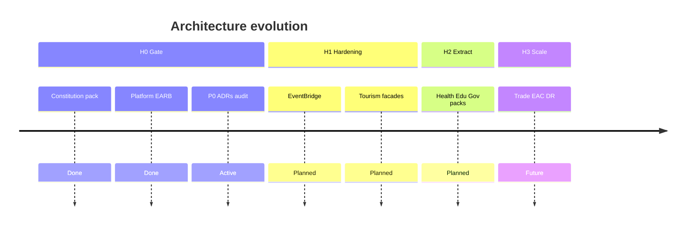

# 09 — Enterprise Roadmap

**Purpose:** Sequenced evolution of Taifa platform architecture (not feature backlog).  
**Scope:** Cross-domain initiatives through East Africa expansion.  
**Principles:** Align with [`platform_governance/19_LIFECYCLE_ROADMAP.md`](../platform_governance/19_LIFECYCLE_ROADMAP.md); no skip of lifecycle gates.

---

## Horizon 0 — Gate closure (current)

**Goal:** Satisfy [07_IMPLEMENTATION_READINESS_REPORT.md](07_IMPLEMENTATION_READINESS_REPORT.md) P0.

| Initiative | Outcome |
| --- | --- |
| **Platform foundation plan** | [10_PLATFORM_FOUNDATION_IMPLEMENTATION_PLAN.md](10_PLATFORM_FOUNDATION_IMPLEMENTATION_PLAN.md) M0–M9 |
| ADR-0002 event prefixes | Catalog consistency |
| Commerce extraction ADR | Vertical SoR path |
| Tourism code boundary audit | Evidence report |
| DATA_MODEL ↔ canonical concepts | Linked glossary |
| OpenAPI Tourism tags plan | API governance |
| DoD enforcement | All PRs |

**Exit:** EARB re-review → conditional gate open for governed implementation.

---

## Horizon 1 — Integration hardening (0–6 months)

| Initiative | Domains |
| --- | --- |
| Outbox → EventBridge in staging/prod | Platform, Tourism, Commerce |
| `tourism/booking` facade over commerce | Tourism, Commerce |
| Protection/Connectivity URL migration | Tourism |
| Contract tests Orchestration ↔ Booking ↔ Finance | Tourism, Pay |
| Identity OIDC architecture pack | Identity |
| Mobility ticket events in catalog | Mobility |

---

## Horizon 2 — Domain extraction (6–18 months)

| Initiative | Domains |
| --- | --- |
| Health / Education logical services (schema migration) | Health, Edu, Commerce |
| Government domain pack + permit APIs | Government |
| Discovery backend (OpenSearch) | Tourism |
| AI Experience service extraction | AI, Tourism |
| Step Functions checkout (Tourism) | Tourism, AWS |
| Pen-test remediation | Security |

---

## Horizon 3 — National scale (18–36 months)

| Initiative | Domains |
| --- | --- |
| Trade domain pack (B2B, customs) | Trade, Commerce |
| Multi-region DR active-passive | Platform |
| Service extraction: payments read replica, orchestration | Pay, Tourism |
| National statistics event mesh (TTB, regulators) | Analytics, Government |
| EAC market_code federation | All |

---

## Wave alignment (platform governance)

| Wave | Domains (from lifecycle doc) |
| --- | --- |
| Wave 1 | Payments, Identity, Wallet |
| Wave 2 | Mobility, Commerce, MAP |
| Wave 3 | Government, Health, Education, Agriculture, **Tourism**, Housing, Employment, AI |

Tourism architecture is **Wave 3-ready**; implementation waits on **Horizon 0**.

---

## Roadmap diagram

---

## Tourism on the roadmap

| Phase | Architecture deliverable | Engineering (when gate opens) |
| --- | --- | --- |
| T0 | Canonical + orchestration v2 + ADR-0001 | **Done (docs)** |
| T1 | Facade APIs, event outbox | Strangler commerce |
| T2 | Discovery service, replan saga | Step Functions |
| T3 | Extract connectivity/protection packages | Separate deployables |

Detail: [`tourism/16_ROADMAP.md`](../tourism/16_ROADMAP.md), [`tourism/02_TRAVEL_ORCHESTRATION_DOMAIN.md`](../tourism/02_TRAVEL_ORCHESTRATION_DOMAIN.md).

---

## Cross-references

- [00_ENTERPRISE_BLUEPRINT.md](00_ENTERPRISE_BLUEPRINT.md)  
- [06_ARCHITECTURE_REVIEW_REPORT.md](06_ARCHITECTURE_REVIEW_REPORT.md)  
- [`ROADMAP.md`](../ROADMAP.md) (engineering delivery phases)

---

## Future considerations

- OKR linkage from enterprise roadmap to team backlogs  
- Public transparency report for national digital infrastructure milestones
