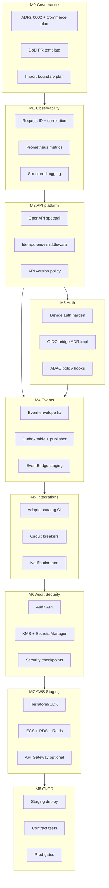
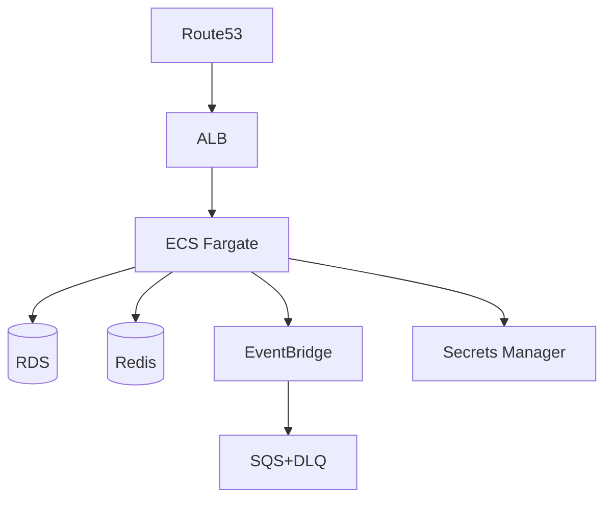

# 10 — Platform Foundation Implementation Plan

**Purpose:** Engineering execution plan to build **reusable platform capabilities** that every Taifa domain depends on—before new business-domain features ship.  
**Authority:** Implements Horizon 0–1 from [09_ENTERPRISE_ROADMAP.md](09_ENTERPRISE_ROADMAP.md) under [07_IMPLEMENTATION_READINESS_REPORT.md](07_IMPLEMENTATION_READINESS_REPORT.md) and [architecture/00_ARCHITECTURE_CONSTITUTION.md](../architecture/00_ARCHITECTURE_CONSTITUTION.md).  
**Scope:** Identity spine, Pay spine hardening, API/event/audit/integration/observability, AWS staging, CI/CD, testing, security—**not** Tourism/Commerce/Health product features.  
**Out of scope:** New vertical workflows, new `commerce/*` endpoints, Tourism checkout features, Trade pack.

---

## Executive summary

Taifa already has a **working Pay ledger**, **device auth**, **ecosystem control plane**, **integrations registry**, and **enterprise outbox**. The foundation plan **hardens and generalizes** these into constitution-compliant platform services so domains integrate via **ports, events, and APIs**—not shared tables.

**Duration (estimate):** 8–10 two-week sprints (~4–5 months) to **Foundation Complete (M8)** + EARB gate re-review (M9).  
**Team shape (reference):** 1 platform lead, 2 backend, 1 DevOps, 1 security delegate, 0.5 mobile (SDK/contracts only).

---

## Foundation capabilities (priority order)

| Priority | Capability | Owner module (today) | Consumers |
| --- | --- | --- | --- |
| P0 | **Configuration & production gates** | `config`, `governance` | All |
| P0 | **Request identity** — correlation, request-id, tracing hooks | `config.middleware` | All |
| P0 | **API contract platform** — OpenAPI, versioning, problem+json, idempotency store | DRF + `payments` patterns | All |
| P0 | **Device authentication** (bridge to OIDC) | `payments` / devices, `enterprise` | All |
| P1 | **Identity platform v2** — OIDC-ready session model, ABAC hooks | new `identity` facade or `enterprise` | All |
| P1 | **Finance event emission** — ledger changes → outbox → bus | `payments`, `enterprise` | Commerce, Tourism, Mobility |
| P1 | **Domain event envelope & outbox** | `enterprise.event_bus` | All publishers |
| P1 | **EventBridge staging** — bus, rules, DLQ | IaC + worker | All |
| P2 | **Audit log API** — append-only evidence | `enterprise` / new `audit` | Regulated domains |
| P2 | **Integration framework** — circuit breaker, metrics, stub prohibition | `integrations` | Adapters |
| P2 | **Notifications port** — single send API | `integrations` notify | All |
| P2 | **Secrets & KMS** — no env secrets in prod | AWS SM + settings | All |
| P3 | **Fraud advisory port** (no ledger write) | `ai_os` / risk | Pay, checkout |
| P3 | **Maps/Media ports** (thin) | `integrations` | Mobility, Tourism later |
| P3 | **Mobile platform SDK** — auth, correlation, OpenAPI client gen | `packages/`, `apps/mobile/lib/data` | Super App |

**Explicitly later (business domains):** Tourism orchestration features, Commerce verticals, Health/Edu SoR extraction—**after M8 + gate open**.

---

## Dependency graph



**Critical path:** M0 → M1 → M2 → M4 (events) → M7 → M8. M3 (Identity) parallel to M4 after M2.

---

## Implementation sequence (milestones)

| Milestone | Name | Outcome |
| --- | --- | --- |
| **M0** | Governance & engineering baseline | ADRs, DoD enforced, boundary audit report, DATA_MODEL links |
| **M1** | Observability spine | Correlation end-to-end, metrics, log schema, dashboards skeleton |
| **M2** | API platform | Idempotency middleware, RFC7807, Spectral CI, deprecation headers |
| **M3** | Identity foundation | Device auth documented; OIDC token validation path; ABAC on one reference resource |
| **M4** | Event platform | Envelope + outbox publisher; `finance.payment.captured` on bus in staging |
| **M5** | Integration & notifications | Adapter health in CI; unified notify port; stub fail-closed verified |
| **M6** | Audit & security baseline | Audit append API; KMS encryption; checkpoint sign-off |
| **M7** | AWS staging | IaC deploys monolith + EventBridge + RDS Multi-AZ + Redis |
| **M8** | CI/CD & contract testing | Auto staging deploy; Pact/OpenAPI contract harness |
| **M9** | EARB gate re-review | Evidence pack → conditional gate open for **governed** domain work |

---

## Sprint roadmap (2-week sprints)

| Sprint | Milestone | Focus | No business features |
| --- | --- | --- | --- |
| S1 | M0 | ADR-0002, Commerce extraction ADR (docs), PR template DoD, Tourism boundary **audit report** | ✓ |
| S2 | M0–M1 | DATA_MODEL ↔ canonical links; correlation middleware audit; log JSON schema | ✓ |
| S3 | M1 | Prometheus dashboards; X-Ray SDK hook (optional flag); mobile `X-Correlation-Id` | ✓ |
| S4 | M2 | Idempotency generic middleware; problem+json handler; Spectral in CI | ✓ |
| S5 | M2–M3 | OpenAPI tag taxonomy doc; version sunset headers; device auth hardening tests | ✓ |
| S6 | M3 | OIDC JWT validator (staging IdP or mock); ABAC `owner_id` policy helper | ✓ |
| S7 | M4 | `taifa_kernel` event envelope module; outbox migration; in-process publisher | ✓ |
| S8 | M4 | Lambda/ECS worker → EventBridge; DLQ + alarm; publish `finance.payment.captured` | ✓ |
| S9 | M5 | Integration catalog contract tests; circuit breaker metrics; notify port facade | ✓ |
| S10 | M6 | Audit event API; CloudTrail alignment doc; KMS for RDS/S3 staging | ✓ |
| S11 | M7 | IaC: VPC, ECS, RDS, Redis, EventBridge, Secrets Manager | ✓ |
| S12 | M7–M8 | Staging smoke; deploy workflow; rollback drill | ✓ |
| S13 | M8 | Contract tests Pay ↔ envelope consumer; OpenAPI breaking-change gate | ✓ |
| S14 | M9 | EARB evidence binder; update [07](07_IMPLEMENTATION_READINESS_REPORT.md) | ✓ |

Buffer: S15–S16 for pen-test prep or Identity NIDA staging adapter (platform only).

---

## Repository structure (target)

**Principle:** `taifa_platform` packages for cross-domain code; Django apps remain deploy units until extraction ([architecture/06](../architecture/06_CODING_STANDARDS.md)).

```
TAIFA APP REMAKE/
├── apps/
│   ├── backend/
│   │   ├── config/                 # settings, middleware, URL router, health
│   │   ├── taifa_kernel/           # NEW: Money VO, EventEnvelope, IdempotencyKey, TenantId
│   │   ├── taifa_platform/         # NEW (optional package name)
│   │   │   ├── api/                # idempotency, problem_json, versioning
│   │   │   ├── events/             # outbox, publisher, envelope validation
│   │   │   ├── identity/           # OIDC bridge, ABAC helpers (facade)
│   │   │   └── audit/              # audit append client
│   │   ├── payments/               # Pay spine (harden, emit events) — no new rails features
│   │   ├── enterprise/             # workflow, outbox, RBAC
│   │   ├── integrations/           # adapters
│   │   ├── ecosystem/              # modules catalog, AI invoke
│   │   ├── governance/             # scorecard
│   │   ├── commerce/               # FREEZE: bugfix only during foundation
│   │   ├── tourism/                # FREEZE: bugfix + port refactor only
│   │   └── ...                     # other apps: freeze or maintenance
│   └── mobile/
│       └── lib/
│           ├── platform/             # NEW: correlation, auth client, api_config
│           └── features/           # no new domain features during M0–M8
├── packages/                       # Python/JS/Dart SDKs (OpenAPI gen)
├── infra/                          # NEW: Terraform or CDK (af-south-1)
│   ├── modules/{vpc,ecs,rds,redis,eventbridge,secrets}
│   └── envs/{staging,prod}
├── docs/
│   ├── architecture/               # constitution (law)
│   └── platform/                 # this plan + EARB
└── .github/workflows/
    ├── ci.yml                      # extend: spectral, contract, IaC validate
    └── deploy-staging.yml          # NEW
```

**Freeze rule (M0–M8):** No new `commerce` or `tourism` **features**; allowed changes: extract calls to platform packages, emit events, fix bugs, tests.

---

## AWS infrastructure plan (staging → prod)

**Region:** `af-south-1` (primary); DR per [architecture/07](../architecture/07_DEPLOYMENT_STANDARDS.md).

| Layer | Service | Foundation use |
| --- | --- | --- |
| Edge | **CloudFront** + **WAF** | Static/mobile API CDN (phase 2 prod) |
| API | **API Gateway** (optional) or **ALB** | TLS termination, throttling; monolith behind ALB in M7 |
| Compute | **ECS Fargate** | `web` + `worker` + `outbox-publisher` task |
| Async | **EventBridge** custom bus `taifa-platform` | Domain events |
| Queue | **SQS** + **DLQ** | Per-rule consumers; failed event replay |
| Functions | **Lambda** | Outbox relay, lightweight projectors (optional M8) |
| Data | **RDS PostgreSQL** Multi-AZ | OLTP; separate schema prefixes per app |
| Cache | **ElastiCache Redis** | Celery, idempotency, rate limits |
| Object | **S3** | Audit exports, OpenAPI artifacts, documents |
| Secrets | **Secrets Manager** + **KMS** | DB creds, M-Pesa, integration JSON |
| Observability | **CloudWatch**, **X-Ray** | Logs, metrics, traces |
| Security | **GuardDuty**, **Security Hub**, **CloudTrail** | Org trail |
| DNS | **Route 53** | `api.staging.taifa.*` |



**IaC:** `infra/` in repo; no manual prod changes. Staging first (M7); prod clone with stricter IAM and approval gate.

---

## CI/CD strategy

| Stage | Trigger | Actions |
| --- | --- | --- |
| **PR** | `pull_request` | `check`, unit tests, OpenAPI diff, Spectral, import-boundary (when added), pip-audit (blocking when baseline clean) |
| **Main** | `push main` | Above + build container image → push ECR |
| **Staging** | `workflow_dispatch` or tag `staging-*` | Terraform plan/apply, ECS deploy, smoke (`/healthz`, `/readyz`, sample event publish) |
| **Prod** | Manual approval + CAB | Blue/green or rolling; migration job; rollback tag |

**Artifacts:** `openapi.yaml`, coverage report, SBOM (future), Terraform plan in PR comment.

**Alignment:** [architecture/07](../architecture/07_DEPLOYMENT_STANDARDS.md), existing [ci.yml](../../.github/workflows/ci.yml).

**New workflows (planned):**

- `deploy-staging.yml` — ECR + ECS + migrate job  
- `contract-tests.yml` — nightly against staging  
- `iac.yml` — `terraform validate` + `tflint` on `infra/`

---

## Testing strategy

| Layer | Foundation focus | Tooling |
| --- | --- | --- |
| **Unit** | Envelope, idempotency, outbox state machine | pytest |
| **Integration** | Outbox → EventBridge (LocalStack or staging) | pytest + testcontainers |
| **Contract** | OpenAPI schemathesis; Pact consumer-driven | schemathesis, pact |
| **Security** | OWASP ZAP baseline on staging API | CI weekly |
| **Load** | Pay capture + event publish p95 | k6 (M8) |
| **Chaos** | DLQ depth, publisher stop | game day M9 |

**Coverage policy:** 100% on `taifa_kernel` event envelope and idempotency; no global % mandate ([architecture/09](../architecture/09_DEFINITION_OF_DONE.md)).

**Mobile:** Platform package tests only; no new feature module tests during foundation.

---

## Security checkpoints (per milestone)

| Milestone | Checkpoint | Owner |
| --- | --- | --- |
| M0 | Threat model update — platform scope only | Security |
| M2 | Idempotency + auth required on reference POST | Backend |
| M3 | OIDC validator fails closed; no long-lived secrets in JWT | Identity |
| M4 | Event payload PII minimization review | Security + Data |
| M6 | KMS encryption at rest verified; audit tamper evidence | Security |
| M7 | IAM least privilege review; no public RDS | DevSecOps |
| M8 | Staging pen-test light (automated); prod gate checklist | Security |
| M9 | EARB security sign-off for gate open | ARB |

**Standing controls:** `TAIFA_ALLOW_STUB_ADAPTERS=false` in prod, `platform.E00x` checks, PCI scope unchanged (Pay only).

---

## Definition of Done — by milestone

### M0 — Governance baseline

- [x] ADR-0002 accepted ([architecture/adr/0002](../architecture/adr/0002-event-catalog-prefix-policy.md))
- [x] Commerce vertical extraction ADR-0003 accepted
- [x] Tourism code boundary audit report in `docs/platform/evidence/M0-tourism-boundary-audit-report.md`
- [x] `DATA_MODEL.md` links to [03_CANONICAL_DATA_MODEL.md](03_CANONICAL_DATA_MODEL.md)
- [x] PR template includes [09_DEFINITION_OF_DONE](../architecture/09_DEFINITION_OF_DONE.md)
- [ ] EARB minutes recorded (pending formal meeting)

### M1 — Observability spine

- [ ] `X-Correlation-Id` documented in [03_API_STANDARDS](../architecture/03_API_STANDARDS.md) and enforced in middleware
- [ ] JSON log schema with `correlation_id`, `service`, `level`
- [ ] `/metrics` scraped; dashboard JSON in repo
- [ ] Mobile platform client sends correlation id

### M2 — API platform

- [ ] Generic idempotency store (Redis or DB) for platform POSTs
- [ ] RFC 7807 errors on all DRF exceptions (platform routes)
- [ ] Spectral CI pass on OpenAPI
- [ ] Deprecation header documented + sample on one route

### M3 — Identity foundation

- [ ] OIDC validation path behind feature flag
- [ ] ABAC helper: `assert_owner(subject, resource)`
- [ ] Identity architecture doc in `docs/platform/` or `docs/identity/`
- [ ] Device auth regression tests green

### M4 — Event platform

- [ ] All new platform publishes use [02_EVENT_CATALOG](../architecture/02_EVENT_CATALOG.md) envelope
- [ ] Outbox polled and published to EventBridge in **staging**
- [ ] DLQ alarm configured
- [ ] At least `finance.payment.captured` emitted on successful capture (staging)

### M5 — Integrations

- [ ] `GET /integrations/health` green in staging for configured adapters
- [ ] Notification port: single internal API used by enterprise outbox
- [ ] Circuit breaker metrics visible

### M6 — Audit & security

- [ ] Audit append API or enterprise audit stream documented
- [ ] RDS + S3 KMS keys in staging
- [ ] Secrets in Secrets Manager (no plaintext in task defs)

### M7 — AWS staging

- [ ] `infra/` applies cleanly; documented in runbook
- [ ] Smoke test post-deploy automated
- [ ] RPO/RTO documented for staging

### M8 — CI/CD & contracts

- [ ] `deploy-staging.yml` successful from main
- [ ] Contract test: payment event consumer
- [ ] Rollback executed once in drill

### M9 — Gate re-review

- [ ] Evidence binder linked from [07_IMPLEMENTATION_READINESS_REPORT.md](07_IMPLEMENTATION_READINESS_REPORT.md)
- [ ] EARB updates gate status (open for governed domain work or remain closed with gaps)

---

## Platform vs business work (enforcement)

| Allowed during M0–M8 | Not allowed |
| --- | --- |
| Pay ledger bugs, idempotency, webhooks | New commerce verticals |
| Refactor tourism to use BookingPort (no new trip features) | Tourism checkout enhancements |
| Event emission from existing flows | New Health/Edu/Gov product flows |
| IaC, CI, observability | Trade module |
| OpenAPI/tag documentation | Marketing-facing domain launches |

---

## Success metrics (foundation)

| Metric | Target (M8) |
| --- | --- |
| Staging availability | 99.5% |
| Event publish lag (outbox → bus) | p95 &lt; 30s |
| Correlation id in 100% platform logs | Yes |
| OpenAPI CI | 0 breaking changes without major version |
| Production gate `manage.py check` | Pass with Postgres+Redis in staging/prod |
| Cross-domain ORM violations (audit) | 0 new; tourism audit remediated or ADR |

---

## Cross-references

- [00_ENTERPRISE_BLUEPRINT.md](00_ENTERPRISE_BLUEPRINT.md)
- [06_ARCHITECTURE_REVIEW_REPORT.md](06_ARCHITECTURE_REVIEW_REPORT.md)
- [07_IMPLEMENTATION_READINESS_REPORT.md](07_IMPLEMENTATION_READINESS_REPORT.md)
- [08_PLATFORM_RISKS.md](08_PLATFORM_RISKS.md)
- [09_ENTERPRISE_ROADMAP.md](09_ENTERPRISE_ROADMAP.md)
- [architecture/README.md](../architecture/README.md)

---

## Future considerations

- Split `taifa_platform` into pip-installable package for extracted services  
- API Gateway usage plans per partner  
- Event schema registry CI with Glue/Schema Registry  
- Foundation Complete certificate in platform_governance Stage 2

**Document owner:** Platform Engineering Lead · **Next review:** end of S4 (mid-plan checkpoint)
