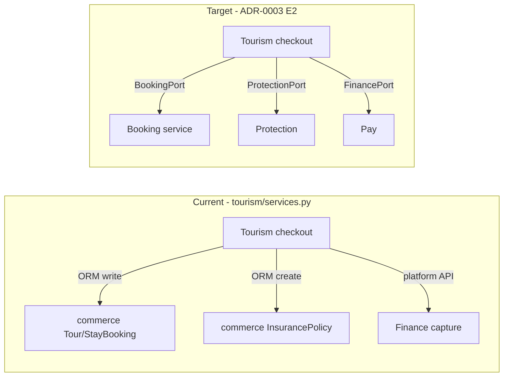

# M0 — Tourism code boundary audit report

**Sprint:** S1 (M0)  
**Date:** 2026-08-05  
**Scope:** `apps/backend/tourism/` — cross-domain writes and imports  
**Method:** Static review (grep + file read); no production code changes in this sprint  
**Authority:** [architecture/01_DOMAIN_GOVERNANCE.md](../../architecture/01_DOMAIN_GOVERNANCE.md), Tourism [CANONICAL_ENTERPRISE_ARCHITECTURE.md](../../tourism/CANONICAL_ENTERPRISE_ARCHITECTURE.md), [ADR-0003](../../architecture/adr/0003-commerce-vertical-extraction.md)

---

## Executive summary

Tourism **correctly owns** `TourismTrip`, `TourismItineraryVersion`, `TourismCheckout`, `TourismAssistanceCase`, and `TourismEsimOrder` (ADR-0001). **Boundary violations exist** in `services.py` and `assist_services.py`: direct ORM access to **Commerce** booking/insurance tables and **Mobility** `SafetyIncident` creation without ports.

| Severity | Count | Gate impact |
| --- | --- | --- |
| **High** | 2 areas | Remediation required before Tourism feature gate opens |
| **Medium** | 2 areas | Schedule in E2 / foundation M4+ |
| **Low** | 1 area | Acceptable short-term (Finance via platform orchestrator) |

**Verdict:** Architecture **docs** are Green; **code** is Amber — align with ADR-0003 E2 remediation backlog.

---

## Files reviewed

| File | Role |
| --- | --- |
| `tourism/models.py` | Orchestration + ADR-0001 tables |
| `tourism/services.py` | Cart, checkout, pay saga |
| `tourism/assist_services.py` | SOS, nearby |
| `tourism/views.py` | HTTP; uses `payments.auth.IsDevice` only |
| `tourism/tests.py` | API tests via commerce tour-bookings |

---

## Findings

### R-001 — Direct Commerce booking updates (High)

**Location:** `tourism/services.py` — `pay_trip_checkout` (approx. lines 600–620)

**Behavior:** After `capture_merchant_payment`, updates `TourBooking` and `StayBooking` via Django ORM (`status = "paid"`, `payment_ref`).

**Owner domain:** **03 Booking** (Commerce app today)

**Constitution rule violated:** Cross-domain **writes** must go through owning API/port ([01_DOMAIN_GOVERNANCE.md](../../architecture/01_DOMAIN_GOVERNANCE.md) § Non-negotiable #1).

**Remediation (ADR-0003 E2):**

- Introduce `BookingPort.mark_reservations_paid(booking_refs, payment_id)` implemented in `adapters/out/booking/` calling commerce service layer or internal API.  
- Emit `booking.reservation.paid` from Booking publisher (E3).

---

### R-002 — Insurance policy created in Tourism (High)

**Location:** `tourism/services.py` — `pay_trip_checkout` (approx. lines 622–635)

**Behavior:** `InsurancePolicy.objects.create(...)` in commerce schema.

**Owner domain:** **06 Protection**

**Violation:** Protection SoR; phase-1 table in commerce is legacy adapter only—creation should be **ProtectionPort.issue_policy**.

**Remediation:** Move create to protection adapter; tourism checkout stores returned `policy_id` only.

---

### R-003 — Commerce ORM reads in cart build (Medium)

**Location:** `tourism/services.py` — `build_trip_cart` (approx. lines 386–431)

**Behavior:** `TourBooking.objects.get`, `StayBooking.objects.get` for line composition.

**Assessment:** Read-only; still couples orchestration to Commerce ORM. Acceptable **temporarily** for monolith; replace with `BookingPort.get_reservations_for_trip(refs)` in E2.

---

### R-004 — SafetyIncident created from Tourism (Medium)

**Location:** `tourism/assist_services.py` — `open_tourism_sos` (lines 64–75)

**Behavior:** `SafetyIncident.objects.create(...)` on `trips.models`.

**Owner domain:** **04 Mobility** (SoR); **06 Protection** owns assistance workflow.

**Assessment:** Documented in canonical RACI (Protection opens case + links incident). **Pattern violation:** should use `MobilityPort.create_incident` + keep `TourismAssistanceCase` in Protection/tourism ADR-0001 table.

**Remediation:** Mobility port + optional sync event `mobility.incident.recorded`.

---

### R-005 — Finance capture via enterprise platform (Low / compliant pattern)

**Location:** `tourism/services.py` — `default_platform().capture_merchant_payment(...)`

**Assessment:** Correct direction—money via platform Pay path, not tourism ledger logic. Future: formal `FinancePort` in `taifa_platform` and `finance.payment.captured` event (foundation M4).

---

### R-006 — eSIM provision in tourism module (Accepted exception)

**Location:** `tourism/services.py` — `provision_esim_order`, checkout fields

**Assessment:** **ADR-0001** — logical owner **05 Connectivity**; physical table in `tourism` allowed. Extract package later.

---

### R-007 — Auth dependency (Compliant)

**Location:** `tourism/views.py` — `payments.auth.IsDevice`

**Assessment:** Shared Identity/device pattern used platform-wide; no violation.

---

## Dependency graph (current vs target)

---

## Remediation backlog (ordered)

| ID | Item | Priority | Target milestone |
| --- | --- | --- | --- |
| R-001 | BookingPort for mark paid | P0 | Foundation E2 / post-M4 |
| R-002 | ProtectionPort for policy issue | P0 | Foundation E2 |
| R-004 | MobilityPort for SOS incident | P1 | Foundation E2 |
| R-003 | BookingPort for cart reads | P1 | E2 |
| R-005 | Emit `finance.payment.captured` | P1 | M4 |

**No code changes in Sprint S1** — backlog only.

---

## Tests observed

- `tourism/tests.py` exercises HTTP flows including commerce tour-bookings — appropriate integration level; add contract tests when ports exist.

---

## Sign-off

| Role | Status |
| --- | --- |
| M0 audit complete | **Yes** |
| Blocks S2+ platform work | **No** |
| Blocks Tourism **feature** gate | **Yes** until R-001/R-002 remediated or time-bound ADR exception |

---

## Cross-references

- [ADR-0003](../../architecture/adr/0003-commerce-vertical-extraction.md)  
- [GOVERNANCE_COMPLIANCE_REPORT.md](../../architecture/GOVERNANCE_COMPLIANCE_REPORT.md)  
- [10_PLATFORM_FOUNDATION_IMPLEMENTATION_PLAN.md](../earb/10_PLATFORM_FOUNDATION_IMPLEMENTATION_PLAN.md) M0 DoD
