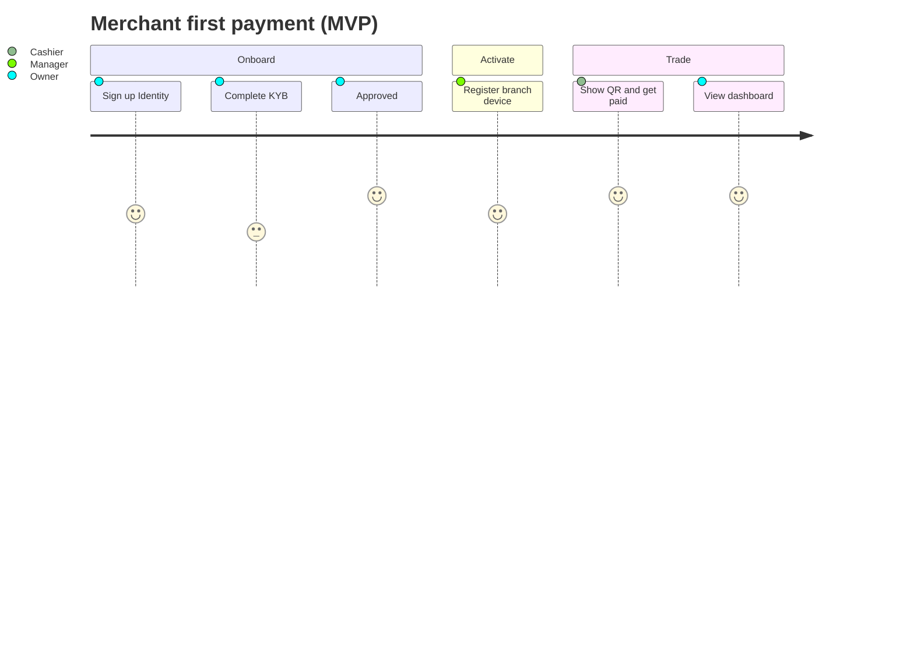
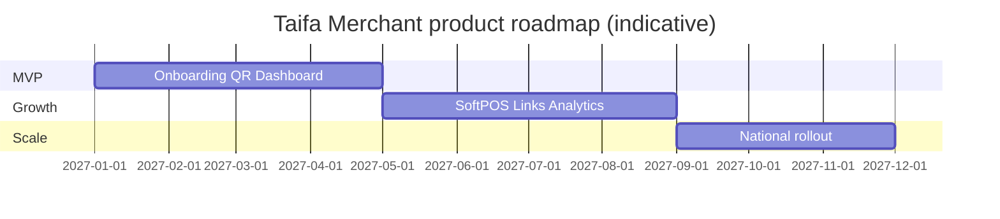

# Taifa Merchant — Product Requirements Document (PRD)

| Field | Value |
| --- | --- |
| **Product** | Taifa Merchant |
| **Version** | 1.0 |
| **Status** | Approved for planning & build |
| **Owner** | Chief Product Officer — Taifa Merchant |
| **Last updated** | 2026-08-06 |
| **Audience** | Product, Design, Engineering, QA, Security, Operations, Business, Partners |
| **Related** | [Taifa Merchant architecture pack](../../taifa-merchant/00_INDEX.md) · [TPOS](../../tpos/00_TPOS_CHARTER.md) · PDL-024 |

**Authority:** This PRD is the **single source of truth** for *what* Taifa Merchant must deliver. *How* is defined in the architecture pack (`docs/taifa-merchant/`). Platform payment, merchant master, and orchestration behavior is owned by **TNPI**—this product **consumes** those capabilities only ([ADR-TM-001](../../taifa-merchant/07_PLATFORM_INTEGRATION.md)).

---

## 1. Executive Summary

Taifa Merchant is Tanzania’s **Digital Operating System for Businesses**—the first commercial product on the Taifa Platform. It enables merchants from sole proprietors to multi-outlet SMEs to **register, verify, operate staff and locations, accept digital payments, manage transactions and refunds, and understand performance** through a unified web and mobile experience.

The product does **not** rebuild national payment rails. It orchestrates **user journeys, permissions, dashboards, notifications, and business insights** on top of **Taifa Identity**, **TNPI** (merchant registry, MAP, orchestration, settlement visibility), **TIP**, and core services (notifications, analytics, audit, media, maps, search, AI).

**MVP outcome:** An approved Tanzanian merchant can complete KYB, accept **dynamic QR** payments, view transactions and a same-day dashboard, issue refunds (authorized roles), share digital receipts, and receive payment alerts—within **48 hours median** of KYB approval, in **Dar es Salaam pilot**, **English and Swahili**.

**Strategic role:** Prove TPOS at scale, drive TNPI adoption and TPV, and establish the reference pattern for all future Taifa vertical products (tourism, mobility, government services).

---

## 2. Product Vision

**Become Tanzania’s Digital Operating System for Businesses.**

Every business—market stall, shop, restaurant, service provider, and growing chain—runs day-to-day commerce on Taifa: trusted identity, instant digital acceptance, clear money visibility, and intelligent guidance, without assembling separate fintech, POS, and reporting tools.

**Vision statement (customer-facing):** *Your business, one operating system—trusted, paid, and intelligent.*

---

## 3. Product Mission

**Mission:** Reduce cash friction and informal commerce barriers by giving every Tanzanian merchant a **national-grade, mobile-first** tool to get paid, stay compliant, and grow—with **zero duplicate payment infrastructure** and **world-class reliability** inherited from TNPI.

**Mission pillars:**

1. **Access** — Fast, guided onboarding tied to national KYB.  
2. **Accept** — QR-first MVP; SoftPOS and payment links in phased rollout.  
3. **Operate** — Branches, staff, devices, and roles aligned to real shop floor behavior.  
4. **Understand** — Dashboards, reports, and (post-MVP) AI-assisted insights.  
5. **Trust** — Security, auditability, and transparent platform boundaries.

---

## 4. Problem Statement

### 4.1 Merchant pain

| Pain | Description |
| --- | --- |
| **Cash dependency** | Theft risk, reconciliation burden, limited digital customer reach. |
| **Fragmented tools** | Separate MNO menus, spreadsheets, and informal ledgers. |
| **Onboarding friction** | Opaque KYC/KYB, unclear settlement, fear of fraud and fees. |
| **No single view** | Owners cannot see sales, staff activity, and payment status in one place. |
| **Scale ceiling** | Adding branches or cashiers multiplies chaos without role-based control. |

### 4.2 Ecosystem pain

| Pain | Description |
| --- | --- |
| **Low formalization** | Tax and financial inclusion goals need verifiable merchant identity. |
| **Platform duplication risk** | Every vertical app rebuilding payments increases fraud and cost. |
| **Partner complexity** | Banks and acquirers need consistent merchant records (TNPI SoR). |

### 4.3 Problem statement (concise)

Tanzanian SMEs lack a **unified, trustworthy, nationally integrated** merchant operating layer that connects identity, acceptance, operations, and insight—while national infrastructure (TNPI) remains invisible and reliable behind the experience.

---

## 5. Business Opportunity

| Opportunity | Rationale |
| --- | --- |
| **Digital payment acceleration** | Mobile money penetration + government digitization agenda. |
| **Super-app anchor** | Merchant product drives B2B adoption and consumer pay-at-merchant flows. |
| **TNPI monetization** | TPV, interchange, and value-added services scale with merchant base. |
| **Data & AI (consented)** | Aggregated insights improve credit, inventory partners (future), and national analytics. |
| **Regional expansion** | Playbook replicable in EAC once Tanzania core is proven. |

**Revenue hypotheses (business-owned; not engineering scope):** subscription tiers (future), payment margin share via TNPI, partner referrals, premium analytics/AI—validated in commercial model outside this PRD.

---

## 6. Target Market

### 6.1 Primary segments (MVP → 18 months)

| Segment | Description | MVP fit |
| --- | --- | --- |
| **Micro-merchant** | Single owner, market/shop, low ticket | High — QR, simple dashboard |
| **SME retail & services** | 1–5 staff, fixed location | High — roles, refunds, receipts |
| **Food & beverage (counter)** | Quick turnover, cashier-heavy | Medium — QR MVP; SoftPOS phase 2 |
| **Mobile / itinerant** | Low fixed location | Post-MVP — links, SoftPOS |

### 6.2 Secondary segments (roadmap)

Multi-outlet retailers, transport operators (TNMP linkage), franchise chains, agent networks.

### 6.3 Excluded initially

Large enterprise ERP replacement, full inventory/ERP, payroll, lending origination (partner marketplace only).

### 6.4 Geography

**Phase 1:** Dar es Salaam pilot.  
**Phase 2:** Major urban centers (Arusha, Mwanza, Dodoma).  
**Phase 3:** National availability subject to TNPI MAP and settlement coverage.

---

## 7. Market Size

*Indicative planning figures—Business Intelligence to refine with national statistics.*

| Metric | Estimate (planning) | Source / note |
| --- | --- | --- |
| MSMEs in Tanzania | ~3M+ (formal + informal) | National MSME surveys |
| Addressable (smartphone + digital pay intent) | ~500k–800k (3–5 year) | Segmentation model |
| Year-1 active merchant target (product) | **10,000** | Aligned to vision KPI |
| Year-1 pilot TPV stretch | TZS 50B+ monthly (ecosystem) | Portfolio stretch goal |

**Serviceable obtainable market (SOM) for MVP pilot:** 500–1,000 merchants in Dar es Salaam with MAP QR live and TNPI merchant staging/production parity.

---

## 8. Business Objectives

| ID | Objective | Horizon |
| --- | --- | --- |
| BO-1 | Launch MVP with **zero TNPI boundary violations** in production | MVP |
| BO-2 | Achieve **10,000** active merchants (≥1 txn / 30d) | 12 mo post-MVP |
| BO-3 | Median **onboarding → first payment < 48h** after KYB approval | MVP + 6 mo |
| BO-4 | Merchant **NPS ≥ 40** | 12 mo post-MVP |
| BO-5 | Establish Taifa Merchant as **reference TPOS product** for next verticals | 18 mo |
| BO-6 | Support portfolio milestone **500 live merchants** (R1 alignment) | Per roadmap |

---

## 9. Success Metrics

| Category | Metric | Target | Owner |
| --- | --- | --- | --- |
| Adoption | Registered merchants (KYB submitted) | Per rollout plan | Product |
| Activation | % approved → first payment within 7d | ≥ 60% | Product |
| Engagement | WAU / MAU (owner or manager) | ≥ 0.45 | Product |
| Payments | Monthly TPV via merchant acceptance | Portfolio-defined | TNPI + Product |
| Reliability | Payment success rate (orchestration) | ≥ 95% | Engineering + TNPI |
| Quality | Crash-free sessions (mobile) | ≥ 99% | Engineering |
| Support | CSAT on onboarding | ≥ 4.0/5 | Operations |
| Trust | Critical security incidents | 0 | Security |
| Platform | TNPI duplicate logic in app | 0 (CI gate) | Architecture |

---

## 10. Stakeholders

| Stakeholder | Interest | Engagement |
| --- | --- | --- |
| **Merchant owner** | Revenue, compliance, simplicity | Primary user |
| **Store manager** | Staff, devices, refunds | Primary user |
| **Cashier / staff** | Fast accept, minimal training | Primary user |
| **Taifa CPO / Product** | Roadmap, KPIs | Accountable |
| **TNPI / Payments platform** | TPV, merchant SoR, MAP | Critical dependency |
| **Identity platform** | SSO, MFA, org users | Critical dependency |
| **TIP / Integration** | APIs, webhooks, partners | Critical dependency |
| **Banks / acquirers / MNOs** | Settlement, rails | Via TNPI |
| **Regulators (BOT, TCRA)** | Compliance, reporting | Via Legal / Compliance |
| **Taifa Support & Ops** | Runbooks, incidents | Operations |
| **Sales & partnerships** | Pilots, co-marketing | Business |
| **Consumers (payers)** | Pay experience at QR | Indirect—TNPI/consumer apps |

**Governance:** Product Review Board (PRB) for scope; ARB for cross-platform changes; Security Board for go-live.

---

## 11. User Personas

### 11.1 Amina — Micro-retail owner (Primary)

- **Profile:** 34, owns a cosmetics stall in Kariakoo; smartphone Android; uses M-Pesa personally.  
- **Goals:** Accept phone payments, see daily sales, avoid reconciliation mistakes.  
- **Frustrations:** Customers ask for “lipa namba”; fears complex forms and hidden fees.  
- **Behaviors:** Runs shop alone; delegates to sister occasionally.  
- **Success:** First QR payment same week as approval.

### 11.2 Joseph — Restaurant manager (Primary)

- **Profile:** 41, manages 8 staff, two shifts; moderate digital literacy.  
- **Goals:** Control who can refund, see shift totals, register one shared tablet.  
- **Frustrations:** Staff sharing personal M-Pesa; no audit trail.  
- **Behaviors:** Checks dashboard end of day; calls owner for exceptions.  
- **Success:** Role-based access and refund audit.

### 11.3 Neema — Cashier (Primary)

- **Profile:** 22, counter staff; high mobile fluency, low patience for multi-step flows.  
- **Goals:** Enter amount, show QR, confirm paid in seconds.  
- **Frustrations:** Slow networks, unclear failure messages.  
- **Behaviors:** 50+ transactions per shift peak.  
- **Success:** ≤ 3 taps to present QR; clear success/fail state.

### 11.4 David — Taifa onboarding agent (Secondary)

- **Profile:** Field agent helping merchants in pilot.  
- **Goals:** Complete KYB with merchant present; reduce abandonment.  
- **Success:** Resume onboarding; status visible from TNPI.

### 11.5 Internal — Risk analyst (Secondary)

- **Profile:** TNPI fraud/risk team.  
- **Goals:** No merchant app bypass of FRP; suspicious refund patterns visible in TNPI.  
- **Success:** All money movement via orchestration APIs only.

---

## 12. User Stories

Epics use **TM-** prefix. Priority: **M** MVP, **P2** phase 2, **P3** later.

### 12.1 Onboarding & identity

| ID | Story | Priority |
| --- | --- | --- |
| TM-US-01 | As an **owner**, I want to sign up with national identity login so that my account is secure and reusable across Taifa. | M |
| TM-US-02 | As an **owner**, I want a guided KYB wizard so that I understand required documents and status. | M |
| TM-US-03 | As an **owner**, I want KYB status to reflect TNPI in real time so that I trust the process. | M |
| TM-US-04 | As an **owner**, I want to save and resume onboarding so that I can finish when I have documents ready. | M |
| TM-US-05 | As an **owner**, I want a go-live checklist (branch, device, first payment) so that I know I am ready. | M |

### 12.2 Organization & access

| ID | Story | Priority |
| --- | --- | --- |
| TM-US-10 | As an **owner**, I want to invite a manager and cashier with different permissions. | M |
| TM-US-11 | As a **manager**, I want to deactivate a staff login without deleting history. | M |
| TM-US-12 | As **staff**, I want to see only actions my role allows (e.g. no refunds for cashier). | M |

### 12.3 Branches & devices

| ID | Story | Priority |
| --- | --- | --- |
| TM-US-20 | As an **owner**, I want one branch with address and hours for MVP. | M |
| TM-US-21 | As a **manager**, I want to register a device for acceptance tied to TNPI. | M |
| TM-US-22 | As an **owner**, I want multiple branches with rolled-up reporting. | P2 |

### 12.4 Acceptance

| ID | Story | Priority |
| --- | --- | --- |
| TM-US-30 | As a **cashier**, I want to enter an amount and show a dynamic QR so the customer can pay. | M |
| TM-US-31 | As a **cashier**, I want confirmation when payment succeeds or fails within 30 seconds. | M |
| TM-US-32 | As a **cashier**, I want SoftPOS tap-to-pay on a certified device. | P2 |
| TM-US-33 | As an **owner**, I want to create a payment link to share on WhatsApp. | P2 |

### 12.5 Money management

| ID | Story | Priority |
| --- | --- | --- |
| TM-US-40 | As an **owner**, I want to see today’s sales total and transaction count. | M |
| TM-US-41 | As a **manager**, I want transaction history for the last 7 days with search. | M |
| TM-US-42 | As a **manager**, I want full or partial refund with reason captured. | M |
| TM-US-43 | As **staff**, I want to share a digital receipt with the customer. | M |
| TM-US-44 | As an **owner**, I want to view settlement/payout status (read-only). | P2 |

### 12.6 Engagement & insight

| ID | Story | Priority |
| --- | --- | --- |
| TM-US-50 | As an **owner**, I want a push notification when a payment is received. | M |
| TM-US-51 | As an **owner**, I want weekly sales comparison charts. | P2 |
| TM-US-52 | As an **owner**, I want to ask an AI assistant questions about my sales trends (aggregated only). | P3 |
| TM-US-53 | As an **owner**, I want to export a daily report PDF/CSV. | P2 |

### 12.7 Customers (CRM)

| ID | Story | Priority |
| --- | --- | --- |
| TM-US-60 | As an **owner**, I want to attach notes to repeat customers. | P3 |

---

## 13. User Journeys

### 13.1 Journey: First-time go-live (MVP)

| Step | Actor | Touchpoint | Outcome | Platform |
| --- | --- | --- | --- | --- |
| 1 | Owner | Download / open web | Account created | Identity |
| 2 | Owner | KYB wizard | `merchant_id` pending | TNPI Merchant |
| 3 | Owner | Await approval | Status = approved | TNPI Merchant |
| 4 | Owner | Add branch + hours | Branch registered | TNPI + Maps |
| 5 | Manager | Register device | Device active | TNPI + MAP |
| 6 | Cashier | Create QR payment | QR displayed | MAP |
| 7 | Customer | Pays via wallet | Payment completed | TNPI Orchestration |
| 8 | Cashier | Sees confirmation | Tx in list | Webhook + UI |
| 9 | Owner | Dashboard | Today’s total updated | TNPI read + Analytics |

### 13.2 Journey: Refund exception

| Step | Actor | Outcome |
| --- | --- | --- |
| 1 | Customer | Requests refund at counter |
| 2 | Manager | Opens transaction, initiates partial/full refund |
| 3 | System | TNPI orchestration processes refund |
| 4 | Manager | UI shows refund completed; audit event emitted |
| 5 | Owner | Optional notification |

### 13.3 Journey: Staff invite

| Step | Actor | Outcome |
| --- | --- | --- |
| 1 | Owner | Invites cashier email/phone |
| 2 | Staff | Accepts via Identity; scoped to merchant |
| 3 | Staff | Logs in; QR only, no settings |

---

## 14. Customer Experience

### 14.1 Experience principles

| Principle | Implication |
| --- | --- |
| **Clarity over density** | Plain Swahili/English; no fintech jargon on critical paths. |
| **Speed at the counter** | Acceptance flows optimized for &lt; 30s confirmation. |
| **Trust through status** | KYB, settlement, and payment states always sourced from platforms. |
| **Forgiving onboarding** | Save progress; explain rejections with next steps. |
| **Accessible** | WCAG 2.1 AA on critical paths (registration, pay, refund). |

### 14.2 Emotional goals

| Moment | Desired feeling |
| --- | --- |
| Post-signup | “This is official and safe.” |
| First payment | “I am a real digital business.” |
| Failed payment | “I know what to do next.” |
| End of day | “I understand my day’s money.” |

### 14.3 Support experience

- In-app help center links (MVP: FAQ + contact).  
- Ops playbook for KYB pending &gt; 48h, payment stuck, refund failed.  
- Escalation to TNPI status for rail outages—not blamed on merchant app.

### 14.4 Languages

**MVP:** English, Kiswahili (user-selectable; persist preference).

---

## 15. Competitive Analysis

*Positioning vs global merchant UX patterns—not feature parity commitments.*

| Competitor / pattern | Strengths | Gaps in Tanzania context | Taifa Merchant differentiation |
| --- | --- | --- | --- |
| **Shopify POS** | Omnichannel, app ecosystem | Not TNPI-integrated; USD-centric | National KYB + MNO rails via TNPI |
| **Stripe Dashboard** | Developer UX, reporting | Merchant stack not localized | Swahili, field onboarding, national ID |
| **Square** | Simple POS, hardware | Limited TZ presence | QR-first + MAP SoftPOS path |
| **Toast** | Vertical F&B | US-only | General SME + future vertical modules |
| **Clover** | Hardware + ISV | Partner-dependent | Single Taifa identity + super-app funnel |
| **Adyen Merchant** | Enterprise global | Heavy enterprise sales | SME-first, mobile money core |
| **Informal M-Pesa till** | Ubiquitous | No roles, audit, or business view | Business OS + compliance |

**Strategic position:** *“National-grade payments inside a business OS”*—not a standalone wallet menu.

---

## 16. Product Scope

### 16.1 In scope (product boundary)

| Area | Description |
| --- | --- |
| **Channels** | Merchant web application; merchant mobile (Android priority MVP; iOS per roadmap). |
| **BFF / app layer** | Session, RBAC presentation, aggregation for dashboards, webhook consumers. |
| **UX workflows** | Onboarding, operations, acceptance initiation, tx/refund/receipt UX. |
| **App SoR** | UX preferences, optional CRM notes (future), feature flags presentation. |
| **Integrations** | Identity, TNPI (merchant, MAP, orchestration, settlement read), TIP, notifications, analytics, audit, media, maps, search, AI gateway. |

### 16.2 Capability map (product-owned vs platform)

| Capability | Owner |
| --- | --- |
| KYB decision, merchant master, devices (authoritative) | TNPI Merchant |
| Payment capture, refunds, orchestration | TNPI |
| QR / SoftPOS / links rails | TNPI MAP |
| Login, MFA, org users | Identity |
| Merchant dashboards & workflows | **Taifa Merchant** |

---

## 17. Out of Scope

| Item | Rationale |
| --- | --- |
| Payment switching / routing logic | TNPI Orchestration |
| Card data storage / PCI card environment in app | MAP / certified SoftPOS |
| Custom JWT issuer or local payment state machine | ADR-TM-001 |
| Consumer super-app wallet UI | Separate consumer product |
| Full ERP, inventory, payroll | Future modules or partners |
| Lending underwriting | Partner marketplace (future) |
| Building new MNO integrations | TNPI Payment Sources |
| Government service delivery (GDSP) | GDSP product; merchant may link later |
| Physical card issuance | Partners / banks |

**MVP explicit exclusions:** SoftPOS, payment links, advanced analytics, AI assistant production, multi-branch rollup, CRM, settlement initiation.

---

## 18. Functional Requirements

Requirements use **FR-TM-** IDs. *Implementation references architecture pack—not specified here.*

### 18.1 Identity & session

| ID | Requirement |
| --- | --- |
| FR-TM-001 | System shall authenticate users via Taifa Identity (OIDC/OAuth2) on web and mobile. |
| FR-TM-002 | System shall enforce MFA when Identity policy requires it for owner roles. |
| FR-TM-003 | System shall bind each session to one or more merchants per Identity org membership. |

### 18.2 Onboarding & KYB

| ID | Requirement |
| --- | --- |
| FR-TM-010 | System shall create a TNPI merchant record on owner initiation and store only `merchant_id` reference locally. |
| FR-TM-011 | System shall display KYB status exclusively from TNPI Merchant API/events. |
| FR-TM-012 | System shall support save-and-resume for onboarding drafts (app layer). |
| FR-TM-013 | System shall block acceptance features until TNPI merchant status is approved (configurable sub-states per TNPI). |

### 18.3 Organization

| ID | Requirement |
| --- | --- |
| FR-TM-020 | System shall support roles: Owner, Manager, Cashier (minimum); permissions matrix in security section. |
| FR-TM-021 | System shall invite staff via Identity; invites scoped to merchant. |
| FR-TM-022 | System shall sync employee records with TNPI Merchant where required by platform contract. |

### 18.4 Branches & devices

| ID | Requirement |
| --- | --- |
| FR-TM-030 | System shall allow branch create/edit with TNPI as authoritative branch registry. |
| FR-TM-031 | System shall register acceptance devices through TNPI Merchant/MAP flows. |
| FR-TM-032 | System shall associate each acceptance action with branch + device identifiers from TNPI. |

### 18.5 Acceptance

| ID | Requirement |
| --- | --- |
| FR-TM-040 | System shall initiate dynamic QR payments via TNPI MAP with amount and currency (TZS). |
| FR-TM-041 | System shall poll or subscribe for payment completion within 30s target UX. |
| FR-TM-042 | System shall initiate SoftPOS payments via MAP on certified devices (phase 2). |
| FR-TM-043 | System shall create payment links via MAP (phase 2). |

### 18.6 Transactions & refunds

| ID | Requirement |
| --- | --- |
| FR-TM-050 | System shall list transactions from TNPI orchestration read APIs for authorized roles. |
| FR-TM-051 | System shall support search/filter by date, status, amount (capabilities per TNPI). |
| FR-TM-052 | System shall initiate refunds only via TNPI orchestration; Manager+ role. |
| FR-TM-053 | System shall require refund reason code (configurable list). |

### 18.7 Receipts & media

| ID | Requirement |
| --- | --- |
| FR-TM-060 | System shall generate/share digital receipts using TNPI receipt references and Media for artifacts. |
| FR-TM-061 | System shall allow merchant logo upload via Media presigned flow. |

### 18.8 Dashboard & reporting

| ID | Requirement |
| --- | --- |
| FR-TM-070 | System shall show today’s gross sales, transaction count, success rate (sourced from TNPI/Analytics). |
| FR-TM-071 | System shall provide basic historical dashboard (phase 2: multi-period compare). |
| FR-TM-072 | System shall support export of reports (phase 2) via Media or async job. |

### 18.9 Notifications

| ID | Requirement |
| --- | --- |
| FR-TM-080 | System shall subscribe merchant users to payment events via Notifications platform. |
| FR-TM-081 | System shall allow opt-in/out per notification category (payment, onboarding, security). |

### 18.10 Audit & compliance UX

| ID | Requirement |
| --- | --- |
| FR-TM-090 | System shall emit audit events for refunds, role changes, exports, and sensitive settings. |
| FR-TM-091 | System shall present audit trail query for Owner (read via Core Audit). |

---

## 19. Non-Functional Requirements

| ID | Category | Requirement |
| --- | --- | --- |
| NFR-TM-001 | Performance | P95 BFF dashboard read &lt; 800ms under pilot load. |
| NFR-TM-002 | Performance | QR presentation flow interactive &lt; 2s on 4G median. |
| NFR-TM-003 | Availability | Merchant app tier 99.5% monthly (excl. TNPI declared outages). |
| NFR-TM-004 | Scalability | Support 10k concurrent merchants; path to 100k without redesign. |
| NFR-TM-005 | Security | All external API calls via TIP; TLS 1.2+. |
| NFR-TM-006 | Security | No PAN, PIN, or MNO API secrets in app datastore. |
| NFR-TM-007 | Privacy | PII minimization; retention per data governance policy. |
| NFR-TM-008 | Accessibility | WCAG 2.1 AA critical paths. |
| NFR-TM-009 | Localization | en + sw; UTF-8; currency TZS formatting. |
| NFR-TM-010 | Observability | Correlation IDs across BFF → TIP → TNPI; RED metrics per endpoint. |
| NFR-TM-011 | Maintainability | Contract tests on TNPI OpenAPI changes. |
| NFR-TM-012 | Multi-tenancy | Strict merchant isolation; RLS tests for app DB (UX data only). |
| NFR-TM-013 | Offline | Mobile: graceful offline messaging; no offline payment capture MVP. |
| NFR-TM-014 | Disaster recovery | RPO/RTO per enterprise DR; no payment data in app DB to restore. |

---

## 20. Product Features

Feature list mapped to modules ([module catalog](../../taifa-merchant/09_MODULE_CATALOG.md)).

| Feature ID | Name | Description | MVP |
| --- | --- | --- | --- |
| F-01 | Merchant Onboarding | KYB wizard, checklist, status | Yes |
| F-02 | Merchant Dashboard | Today sales, counts, success rate | Yes |
| F-03 | Branch Management | Location, hours, geo | Yes (1 branch) |
| F-04 | Employee Management | Roles, invites | Yes |
| F-05 | Device Management | Register terminal/phone | Yes |
| F-06 | QR Payments | Dynamic QR | Yes |
| F-07 | SoftPOS | Tap/enter card or device pay | No (P2) |
| F-08 | Payment Links | Shareable pay URL | No (P2) |
| F-09 | Receipts | Digital receipt share | Yes |
| F-10 | Refunds | Partial/full | Yes |
| F-11 | Transaction History | List, filter | Yes (7d) |
| F-12 | Customer Management | CRM notes | No (P3) |
| F-13 | Reports | Scheduled/export | Basic P2 |
| F-14 | Analytics | Charts, compare | Basic P2 |
| F-15 | Notifications | Payment, onboarding | Yes |
| F-16 | AI Business Assistant | Q&A, insights | Beta P3 |

---

## 21. MVP Scope

**MVP definition:** Aligns with [12_MVP_DEFINITION.md](../../taifa-merchant/12_MVP_DEFINITION.md).

### 21.1 Included

- Identity login (owner + cashier minimum; manager recommended).  
- TNPI merchant onboarding (sole prop + SME tier).  
- 1 branch, up to 2 employees, 1 device.  
- Dynamic QR payment.  
- Transaction list (7 days).  
- Full/partial refund (manager).  
- Digital receipt share.  
- Dashboard: today sales, count, success rate.  
- Push notification on payment.  
- Audit on refund.

### 21.2 Success criteria (MVP)

| Metric | Target |
| --- | --- |
| Onboarding → first payment (median, post-approval) | &lt; 48h |
| Payment success rate | ≥ 95% |
| Crash-free sessions | ≥ 99% |
| TNPI boundary violations | 0 |

### 21.3 Launch geography & language

Dar es Salaam pilot; English + Kiswahili.

---

## 22. Future Roadmap

| Phase | Timeline (indicative) | Themes |
| --- | --- | --- |
| **TM-1 Foundation** | Months 1–2 | BFF, Identity, TNPI client, onboarding |
| **TM-2 MVP core** | Months 3–4 | QR, dashboard, notifications |
| **TM-3 Acceptance+** | Months 5–6 | SoftPOS, refunds hardening, employees/devices |
| **TM-4 Growth** | Months 7–8 | Analytics, AI beta, payment links |
| **TM-5 Production** | Month 9 | Hardening, scale, national marketing readiness |

**Horizon 2 (12–24 mo):** Multi-outlet rollups, inventory lite, TNMP operator fleet, partner marketplace hooks, EAC expansion assessment.

**Horizon 3:** Credit insights (partner), advanced CRM, vertical packs (F&B table management).

---

## 23. Information Architecture

*Logical content groups—not visual design.*

### 23.1 Top-level domains

| Domain | Contents |
| --- | --- |
| **Home** | Dashboard summary, alerts, quick actions |
| **Sell** | QR, SoftPOS (P2), links (P2) |
| **Money** | Transactions, refunds, receipts, settlement view (P2) |
| **Business** | Profile, KYB status, branches, devices |
| **Team** | Employees, roles, invites |
| **Insights** | Reports, analytics (P2), AI (P3) |
| **Settings** | Notifications, language, security, help |
| **Account** | Identity profile, logout, legal |

### 23.2 Object model (user mental model)

Merchant → Branch(es) → Device(s) → Transaction(s) → Receipt / Refund  
Merchant → Employee(s) → Role → Permissions

### 23.3 External objects (read-only / TNPI)

Payment intent, settlement batch, KYB case, fraud hold (display only).

---

## 24. Navigation Structure

### 24.1 Web (primary operator)

| Nav item | Access |
| --- | --- |
| Dashboard | All roles |
| Accept (QR) | Cashier+ |
| Transactions | Manager+ (cashier: own shift optional P2) |
| Team | Owner, Manager |
| Business setup | Owner |
| Settings | All (scoped) |

### 24.2 Mobile (primary cashier + owner)

| Nav pattern | Items |
| --- | --- |
| Bottom / primary | Home, Accept, Transactions, More |
| More | Team, Business, Settings, Help |

### 24.3 Role-based visibility

| Area | Owner | Manager | Cashier |
| --- | --- | --- | --- |
| KYB / billing profile | ✓ | read | — |
| Refunds | ✓ | ✓ | — |
| QR accept | ✓ | ✓ | ✓ |
| Employee invite | ✓ | optional | — |
| Exports | ✓ | ✓ | — |

---

## 25. Screen Inventory

*Logical screens for design and engineering planning—no wireframes.*

| Screen ID | Name | Roles | MVP |
| --- | --- | --- | --- |
| SCR-001 | Welcome / sign-in | All | Yes |
| SCR-002 | MFA challenge | All | Yes |
| SCR-003 | Onboarding overview | Owner | Yes |
| SCR-004 | KYB step wizard (multi-step) | Owner | Yes |
| SCR-005 | KYB status / pending | Owner | Yes |
| SCR-006 | Go-live checklist | Owner | Yes |
| SCR-007 | Dashboard home | All | Yes |
| SCR-008 | QR amount entry | Cashier+ | Yes |
| SCR-009 | QR display / awaiting payment | Cashier+ | Yes |
| SCR-010 | Payment result success/fail | Cashier+ | Yes |
| SCR-011 | Transaction list | Manager+ | Yes |
| SCR-012 | Transaction detail | Manager+ | Yes |
| SCR-013 | Refund flow | Manager+ | Yes |
| SCR-014 | Receipt preview / share | Cashier+ | Yes |
| SCR-015 | Branch list / edit | Owner | Yes |
| SCR-016 | Device list / register | Manager+ | Yes |
| SCR-017 | Employee list | Owner, Manager | Yes |
| SCR-018 | Invite employee | Owner | Yes |
| SCR-019 | Role permissions info | Owner | Yes |
| SCR-020 | Notification preferences | All | Yes |
| SCR-021 | Notification center | All | Yes |
| SCR-022 | Settings hub | All | Yes |
| SCR-023 | Language selection | All | Yes |
| SCR-024 | Help / support | All | Yes |
| SCR-025 | Audit log (owner) | Owner | P2 |
| SCR-026 | Settlement status | Owner | P2 |
| SCR-027 | SoftPOS amount / tap | Cashier+ | P2 |
| SCR-028 | Payment link create/share | Owner | P2 |
| SCR-029 | Analytics dashboard | Owner | P2 |
| SCR-030 | Report export | Owner | P2 |
| SCR-031 | AI assistant chat | Owner | P3 |
| SCR-032 | Customer list / notes | Owner | P3 |

---

## 26. Feature Priorities

MoSCoW for **MVP release**.

| Priority | Features |
| --- | --- |
| **Must** | Onboarding, Identity, KYB status, 1 branch, device, QR, tx list, refund, receipt, dashboard today, payment notification |
| **Should** | Manager role, go-live checklist, employee invite, audit refund event, en/sw |
| **Could** | Email notifications, transaction search, logo upload |
| **Won’t (MVP)** | SoftPOS, links, AI, CRM, multi-branch rollup, settlement initiation |

**RICE note:** QR acceptance and onboarding score highest on reach + impact for pilot TPV.

---

## 27. API Dependencies

*Product depends on platform APIs exposed via **TIP**—contracts owned by platform teams.*

| Dependency | Platform | Usage |
| --- | --- | --- |
| OIDC / user org | Identity | Login, invites, MFA |
| Merchant CRUD, KYB, branches, employees, devices | TNPI Merchant | Onboarding & ops |
| QR, SoftPOS, payment links | TNPI MAP | Acceptance |
| Payments, refunds, tx history | TNPI Orchestration | Money flows |
| Payout/settlement status | TNPI Settlement | Read-only views |
| Webhooks | TIP → merchant worker | `payment.*`, `refund.*`, `merchant.approved`, `device.registered` |
| Push/SMS/email | Notifications | Alerts |
| Event ingest | Analytics | `merchant.app.*` |
| Audit append/query | Core Audit | Sensitive actions |
| Presigned upload | Media | Logos, exports |
| Geocode | Maps | Branch pin |
| Search index | Search | Tx search (optional) |
| AI tools | Taifa AI | Aggregated metrics Q&A |

**Staging parity:** MVP blocked until TNPI Merchant + MAP + Orchestration staging ready ([roadmap deps](../../taifa-merchant/10_IMPLEMENTATION_ROADMAP.md)).

---

## 28. TNPI Dependencies

| TNPI capability | Phase required | Product impact |
| --- | --- | --- |
| Merchant Platform (KYB) | MVP | Onboarding |
| MAP (QR) | MVP | Acceptance |
| Orchestration | MVP | Pay, refund, tx list |
| FRP | MVP | Automatic via pay—no app logic |
| Settlement (read) | P2 | Owner payout visibility |
| Reconciliation | P2+ | Reports accuracy |
| Fraud & Risk | MVP | Holds surfaced in UI from TNPI status |
| Developer Platform | MVP | API keys for advanced integrators (optional MVP) |

**Rules:** `merchant_id` from TNPI is canonical; no local payment state machine; refunds only through orchestration ([business rules](../../taifa-merchant/02_BUSINESS_ARCHITECTURE.md)).

---

## 29. Security Requirements

| ID | Requirement |
| --- | --- |
| SEC-TM-001 | OWASP ASVS L2 for BFF and client hardening. |
| SEC-TM-002 | RBAC enforced server-side; JWT claims from Identity only. |
| SEC-TM-003 | Permission `refunds:issue` for refund endpoints. |
| SEC-TM-004 | Tenant isolation tests on every release. |
| SEC-TM-005 | Secrets in AWS Secrets Manager; CI OIDC—no long-lived keys. |
| SEC-TM-006 | Pen test before MVP prod; critical/high remediated. |
| SEC-TM-007 | Session timeout and device binding per Identity policy. |
| SEC-TM-008 | Export of PII requires Owner role + audit event. |
| SEC-TM-009 | Dependency scanning in CI; license allow-list. |
| SEC-TM-010 | Incident response per enterprise IR playbook; 24h merchant comms for payment outages. |

---

## 30. Compliance Requirements

| Area | Requirement |
| --- | --- |
| **BOT / payments regulation** | Merchant flows comply via TNPI licensed rails; app displays required disclosures. |
| **KYC/KYB** | TNPI Merchant authoritative; app collects only permitted fields. |
| **Data protection** | Tanzania PDPA-aligned privacy notice; consent for marketing notifications. |
| **AML** | FRP and monitoring via TNPI; app does not bypass holds. |
| **Tax / e-invoicing** | Future integration with TRA requirements—tracked as compliance epic (post-MVP). |
| **Accessibility** | WCAG 2.1 AA critical paths. |
| **Records** | Audit trail for refunds and role changes per retention policy. |

Legal review required before national marketing claims.

---

## 31. Analytics Requirements

### 31.1 Product analytics (merchant.app.*)

| Event (illustrative) | Purpose |
| --- | --- |
| `merchant.app.onboarding.started` | Funnel |
| `merchant.app.onboarding.completed` | Activation |
| `merchant.app.qr.presented` | Acceptance funnel |
| `merchant.app.payment.confirmed` | Success UX timing |
| `merchant.app.refund.issued` | Risk/ops |
| `merchant.app.screen.view` | Navigation (privacy-safe) |

### 31.2 Business metrics

- Daily active merchants, TPV attributed to merchant_id, refund rate, onboarding drop-off by step.  
- No sale of merchant PII to third parties; aggregated national analytics per data governance.

### 31.3 Dashboards

- Product: Mixpanel/Amplitude equivalent via Analytics platform.  
- Ops: onboarding queue, error rates BFF vs TNPI.

---

## 32. Notifications

| Type | Channel | Trigger | MVP |
| --- | --- | --- | --- |
| Payment received | Push | `payment.completed` | Yes |
| Payment failed | Push | `payment.failed` | Yes |
| KYB approved | Push + SMS optional | `merchant.approved` | Yes |
| KYB rejected / needs info | Push | TNPI event | Yes |
| Refund completed | Push | `refund.completed` | Yes |
| Security alert | Push/email | Identity | P2 |
| Weekly summary | Push/email | Scheduled | P2 |

**Preferences:** Per-user toggles except mandatory security/legal.

**Topic model:** Per merchant user subscription via Notifications platform.

---

## 33. AI Assistant Requirements

**Phase:** Beta post-MVP (P3)—not blocking MVP launch.

| ID | Requirement |
| --- | --- |
| AI-TM-001 | Assistant may answer questions on **aggregated** sales trends only—no raw PAN/customer PII. |
| AI-TM-002 | Assistant shall **not** initiate payments, refunds, or role changes. |
| AI-TM-003 | Disclaimers: not financial advice; verify with official reports. |
| AI-TM-004 | Tool access via Taifa AI gateway with merchant-scoped auth. |
| AI-TM-005 | Human escalation path to support for disputes. |
| AI-TM-006 | Model usage logged per AI governance policy. |

**Example intents:** “How did this week compare to last?” “What was my best day last month?” “Why did payments fail yesterday?” (summary only).

---

## 34. Reporting Requirements

| Report | Audience | Frequency | MVP |
| --- | --- | --- | --- |
| Daily sales summary | Owner | Daily | Dashboard only |
| Transaction detail export | Owner, Manager | On demand | P2 |
| Refund log | Owner | On demand | P2 |
| Settlement statement view | Owner | Per TNPI cycle | P2 |
| Branch comparison | Owner | Weekly | P3 (multi-branch) |

**Format:** CSV/PDF via Media; large exports async with notification.

**Source of truth:** Transaction amounts from TNPI—not recomputed in app DB.

---

## 35. Risk Register

| ID | Risk | Impact | Likelihood | Mitigation | Owner |
| --- | --- | --- | --- | --- | --- |
| TM-R01 | Duplicate TNPI payment logic in app | Critical | Med | ADR-TM-001, CI boundary scans | Architecture |
| TM-R02 | TNPI API contract drift | High | Med | Contract tests in CI | Engineering |
| TM-R03 | Onboarding abandonment | High | Med | Save progress, field research, agent assist | Product |
| TM-R04 | SoftPOS PCI scope creep | High | Med | MAP handles card data; certified SDK only | Security |
| TM-R05 | Fraudulent merchant accounts | High | Med | Identity MFA; FRP via TNPI | TNPI + Security |
| TM-R06 | Webhook delay degrades UX | Med | Med | Polling fallback, status timeouts | Engineering |
| TM-R07 | AI misleading advice | Med | Med | Disclaimers; no money actions | Product + AI |
| TM-R08 | Cross-tenant data leak | Critical | Low | RLS tests, pen test | Security |
| TM-R09 | MNO/rail outage | High | Med | TNPI status comms; in-app banner | Ops |
| TM-R10 | Pilot geography MAP gaps | High | Med | Geo-fenced rollout; waitlist | Product |
| TM-R11 | Regulatory change mid-build | Med | Med | Legal liaison; feature flags | Compliance |

---

## 36. Release Strategy

| Release | Contents | Audience |
| --- | --- | --- |
| **Alpha** | Internal dogfood, staging only | Taifa staff |
| **Beta** | Pilot merchants (controlled list) | 50–100 merchants Dar |
| **GA MVP** | Open registration within pilot city | Dar es Salaam |
| **GA national** | Marketing + support scale | Post TM-5 hardening |

**Versioning:** Mobile semver + build; BFF/API semver per TIP.  
**Feature flags:** SoftPOS, links, AI behind flags.  
**Release Board** sign-off per [TPOS release standards](../../tpos/08_RELEASE_STANDARDS.md).

---

## 37. Rollout Strategy

| Wave | Geography | Merchants | Criteria |
| --- | --- | --- | --- |
| W0 | Internal | — | AC pass staging |
| W1 | Dar pilot zones | 100 | MAP QR stable 2 weeks |
| W2 | Dar city | 500 | Support staffing, NPS sample ≥ 30 |
| W3 | Secondary cities | 2k | TNPI settlement coverage |
| W4 | National | 10k | Ops + fraud capacity |

**Channels:** Field agents, MNO co-marketing, super-app cross-link, business associations.

**Kill switch:** Disable new onboarding via feature flag without affecting in-flight payments (TNPI).

---

## 38. KPIs

| KPI | Definition | Target (MVP+6mo) |
| --- | --- | --- |
| Active merchants | ≥1 txn in 30d | 2,000 (pilot expansion) |
| Activation rate | Approved → first pay 7d | ≥ 60% |
| TPV | Sum orchestration volume | Portfolio-defined |
| Payment success rate | Success / attempts | ≥ 95% |
| Onboarding median time | Start → approved | Track; improve quarterly |
| Time to first payment | Approval → first pay | &lt; 48h median |
| Refund rate | Refunds / tx | Monitor; fraud review |
| NPS | Quarterly survey | ≥ 40 |
| App crash-free rate | Mobile | ≥ 99% |
| Support tickets / active merchant | Monthly | &lt; 0.15 |
| P95 dashboard load | BFF | &lt; 800ms |

---

## 39. Acceptance Criteria

### 39.1 Functional (MVP)

| ID | Criterion |
| --- | --- |
| AC-TM-1 | Owner registers via Identity and creates TNPI merchant |
| AC-TM-2 | KYB status reflects TNPI (no local override) |
| AC-TM-3 | Cashier generates QR; customer pays; tx appears &lt; 30s |
| AC-TM-4 | Manager refunds; TNPI `refund.completed` updates UI |
| AC-TM-5 | Receipt share link opens valid receipt |
| AC-TM-6 | Notification received on payment |
| AC-TM-7 | Employee invite: Identity login scoped to merchant |

### 39.2 Non-functional (MVP)

| ID | Criterion |
| --- | --- |
| AC-N1 | All APIs via TIP in staging |
| AC-N2 | No payment tables in merchant app schema |
| AC-N3 | P95 BFF read dashboard &lt; 800ms |
| AC-N4 | WCAG 2.1 AA critical paths |

### 39.3 Post-MVP wave

| ID | Criterion |
| --- | --- |
| AC-TM-8 | SoftPOS payment E2E on certified device |

*Full list maintained in [13_ACCEPTANCE_CRITERIA.md](../../taifa-merchant/13_ACCEPTANCE_CRITERIA.md).*

---

## 40. Definition of Done

### 40.1 Feature DoD

- BFF contract updated in architecture pack when behavior changes.  
- Web + mobile (if in scope for feature) functional in staging.  
- TNPI integration test in CI.  
- Audit events for sensitive actions.  
- Runbook updated.  
- No duplicate platform logic (review checklist).

### 40.2 Sprint DoD

- Deployed to staging.  
- Product demo accepted.  
- Linked stories closed.

### 40.3 MVP release DoD

- AC-TM-1–7 and AC-N1–N4 satisfied.  
- Pen test remediated (critical/high).  
- Support playbook published.  
- Gate package sign-off ([TAIFA_MERCHANT_GATE_PACKAGE.md](../../taifa-merchant/TAIFA_MERCHANT_GATE_PACKAGE.md)).  
- PDL / release record updated.

*Reference:* [14_DEFINITION_OF_DONE.md](../../taifa-merchant/14_DEFINITION_OF_DONE.md).

---

## Document control

| Version | Date | Author | Changes |
| --- | --- | --- | --- |
| 1.0 | 2026-08-06 | Taifa Merchant Product | Initial enterprise PRD |

**Approvals (sign-off record):**

| Role | Name | Date |
| --- | --- | --- |
| CPO | | |
| VP Engineering | | |
| Enterprise Architect | | |
| TNPI Product Lead | | |
| Security | | |

---

## Appendix A — Permissions matrix (MVP)

| Permission | Owner | Manager | Cashier |
| --- | --- | --- | --- |
| View dashboard | ✓ | ✓ | optional |
| Present QR | ✓ | ✓ | ✓ |
| View transactions | ✓ | ✓ | limited P2 |
| Issue refund | ✓ | ✓ | — |
| Manage employees | ✓ | configurable | — |
| Manage branches/devices | ✓ | ✓ | — |
| Edit KYB | ✓ | — | — |
| Export data | ✓ | ✓ | — |

---

## Appendix B — Traceability

| PRD section | Architecture pack |
| --- | --- |
| Vision, business | 01, 02 |
| Features, modules | 09, 12 |
| Platform deps | 07 |
| Acceptance, DoD | 13, 14 |
| Risks | 15 |
| Release/deploy | 10, 16 |

---

## Appendix C — Glossary

| Term | Definition |
| --- | --- |
| **TNPI** | Taifa National Payment Infrastructure |
| **MAP** | Merchant Acceptance Platform (QR, SoftPOS, links) |
| **TIP** | Taifa Integration Platform |
| **TPOS** | Taifa Product Operating System |
| **TPV** | Total payment volume |
| **KYB** | Know Your Business |
| **BFF** | Backend-for-frontend (merchant app layer) |
| **SoR** | System of record |
