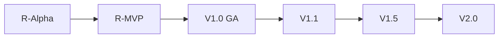

# Taifa Merchant — Product Backlog

| Field | Value |
| --- | --- |
| **Product** | Taifa Merchant |
| **Document** | 26 — Product Backlog |
| **Owner** | Product Management Office (PMO) |
| **Status** | Approved for execution |
| **Last updated** | 2026-08-06 |
| **Source PRD** | [00_PRODUCT_REQUIREMENTS_DOCUMENT.md](00_PRODUCT_REQUIREMENTS_DOCUMENT.md) |
| **Sprint reference** | [11_SPRINT_PLAN.md](../../taifa-merchant/11_SPRINT_PLAN.md) |

**Purpose:** Implementation-ready backlog for **Jira**, **GitHub Projects**, or **Azure DevOps**. Hierarchy: **Theme → Epic → Feature → User Story → Task → Subtask**.

**Estimation:** Fibonacci story points (1, 2, 3, 5, 8, 13, 21). **1 SP ≈ 0.5 dev-day** (team baseline; calibrate in TM-S1).

**Priority scale:** **P0** critical path · **P1** high · **P2** medium · **P3** low.

---

## How to import (Jira / GitHub Projects)

| Taifa field | Jira | GitHub Projects |
| --- | --- | --- |
| THM-* | Initiative / Theme label | Milestone group |
| EPIC-* | Epic | Epic issue |
| FEAT-* | Feature (or parent Epic) | Parent issue |
| TM-US-* / TMB-* | Story | Issue |
| TASK-* | Sub-task | Tasklist / child issue |
| Release | Fix Version | Milestone |
| Sprint | Sprint | Iteration |

**Labels:** `theme:{name}`, `release:{R-MVP|V1.0|V1.1|V1.5|V2.0}`, `platform:tnpi|identity|tip`, `risk:{id}`.

---

## Definition of Ready (DoR)

A user story is **ready for sprint** when:

| # | Criterion |
| --- | --- |
| DoR-1 | Linked to PRD section and `FR-TM-*` / `AC-TM-*` where applicable |
| DoR-2 | Acceptance criteria testable (Given/When/Then or checklist) |
| DoR-3 | Dependencies identified; blockers resolved or time-boxed spike complete |
| DoR-4 | TNPI/Identity/TIP API availability confirmed for env (staging min.) |
| DoR-5 | UX flow approved for customer-facing stories (Design sign-off) |
| DoR-6 | Security/privacy impact noted (none / review required) |
| DoR-7 | Story pointed; fits in one sprint with tasks broken down |
| DoR-8 | No duplicate platform logic—ADR-TM-001 checklist passed at design review |

---

## Definition of Done (DoD)

### Story DoD

- [ ] Acceptance criteria verified in staging  
- [ ] Unit + integration tests (TNPI contract tests where integrated)  
- [ ] RBAC and tenant isolation verified for multi-merchant paths  
- [ ] Analytics events emitted per PRD §31 (if user-facing)  
- [ ] en + sw strings for user-visible copy (if UI)  
- [ ] No new payment tables / orchestration logic in app DB  
- [ ] PR merged; deployed to staging  

### Sprint DoD

- [ ] Sprint goal demo to Product  
- [ ] Burn-down updated; carry-over stories re-pointed  
- [ ] Runbook delta for ops-impacting changes  

### Release DoD

- [ ] Release acceptance criteria from PRD §39 satisfied for that release  
- [ ] Pen test / security gate per release plan  
- [ ] Release notes + support playbook updated  

*Full MVP release DoD:* [14_DEFINITION_OF_DONE.md](../../taifa-merchant/14_DEFINITION_OF_DONE.md).

---

## Release map (MVP → V2.0)

| Release | Goal | Sprints (indicative) | Target |
| --- | --- | --- | --- |
| **R-Alpha** | Internal dogfood | TM-S1 – TM-S3 | Month 2 |
| **R-MVP** | Dar pilot: QR, KYB, dashboard, tx, refund, receipt, notify | TM-S4 – TM-S6, TM-S8, TM-S9 (subset), TM-S11 | Month 6 |
| **V1.0** | GA Dar + SoftPOS | TM-S7 + TM-S11 remainder | Month 7–8 |
| **V1.1** | Links, analytics, exports | TM-S12 – TM-S14 | Month 9–10 |
| **V1.5** | Multi-branch, settlement, audit UI | TM-S15 – TM-S18 | Month 11–13 |
| **V2.0** | AI GA, CRM, national hardening, iOS | TM-S19 – TM-S24 | Month 14–18 |



**Total backlog (all releases):** ~**420 SP** (estimated); **MVP slice ~185 SP**.

---

## Product themes

| Theme ID | Name | PRD pillar | Business priority | Technical priority |
| --- | --- | --- | --- | --- |
| **THM-01** | Access & Trust | Access + Trust | P0 | P0 |
| **THM-02** | Accept Payments | Accept | P0 | P0 |
| **THM-03** | Operate the Business | Operate | P0 | P1 |
| **THM-04** | Money Visibility | Understand (core) | P0 | P1 |
| **THM-05** | Grow & Engage | Understand (advanced) + Engage | P1 | P2 |
| **THM-06** | Platform Foundation | Enabler | P0 | P0 |

---

## Epics summary

| Epic ID | Title | Theme | Release | SP (sum) | Biz | Tech |
| --- | --- | --- | --- | --- | --- | --- |
| EPIC-01 | Foundation & DevEx | THM-06 | R-Alpha | 34 | P0 | P0 |
| EPIC-02 | Identity & Session | THM-01 | R-Alpha | 21 | P0 | P0 |
| EPIC-03 | Merchant Onboarding & KYB | THM-01 | R-MVP | 34 | P0 | P0 |
| EPIC-04 | Organization & RBAC | THM-03 | R-MVP | 26 | P0 | P0 |
| EPIC-05 | Branches & Devices | THM-03 | R-MVP / V1.0 | 29 | P0 | P1 |
| EPIC-06 | QR Acceptance | THM-02 | R-MVP | 34 | P0 | P0 |
| EPIC-07 | Transactions & Dashboard | THM-04 | R-MVP | 29 | P0 | P1 |
| EPIC-08 | Webhooks & Notifications | THM-05 | R-MVP | 21 | P0 | P1 |
| EPIC-09 | Refunds & Receipts | THM-04 | R-MVP | 26 | P0 | P0 |
| EPIC-10 | SoftPOS Acceptance | THM-02 | V1.0 | 34 | P1 | P0 |
| EPIC-11 | MVP Hardening & Security | THM-06 | R-MVP / V1.0 | 21 | P0 | P0 |
| EPIC-12 | Payment Links | THM-02 | V1.1 | 13 | P1 | P1 |
| EPIC-13 | Analytics & Reporting | THM-05 | V1.1 | 21 | P1 | P2 |
| EPIC-14 | Multi-Branch & Settlement | THM-03 / THM-04 | V1.5 | 34 | P1 | P1 |
| EPIC-15 | Audit & Compliance UX | THM-01 | V1.5 | 13 | P2 | P1 |
| EPIC-16 | AI Business Assistant | THM-05 | V2.0 | 21 | P2 | P2 |
| EPIC-17 | Customer CRM | THM-05 | V2.0 | 13 | P2 | P2 |
| EPIC-18 | National Scale & iOS | THM-06 | V2.0 | 34 | P1 | P1 |
| EPIC-19 | Localization & CX Polish | THM-01 | R-MVP – V2.0 | 13 | P1 | P2 |

---

## Features catalog

| Feature ID | Name | Epic | PRD F-* | Release |
| --- | --- | --- | --- | --- |
| FEAT-01-01 | BFF & workspace bootstrap | EPIC-01 | — | R-Alpha |
| FEAT-01-02 | TIP routing & observability | EPIC-01 | — | R-Alpha |
| FEAT-02-01 | OIDC web login | EPIC-02 | — | R-Alpha |
| FEAT-02-02 | Mobile auth session | EPIC-02 | — | R-Alpha |
| FEAT-03-01 | KYB wizard | EPIC-03 | F-01 | R-MVP |
| FEAT-03-02 | KYB status & go-live checklist | EPIC-03 | F-01 | R-MVP |
| FEAT-04-01 | Roles & permissions | EPIC-04 | — | R-MVP |
| FEAT-04-02 | Employee invite & lifecycle | EPIC-04 | — | R-MVP |
| FEAT-05-01 | Branch profile (MVP: 1) | EPIC-05 | F-03 | R-MVP |
| FEAT-05-02 | Device registration | EPIC-05 | F-05 | R-MVP |
| FEAT-05-03 | Multi-branch rollup | EPIC-05 | F-03 | V1.5 |
| FEAT-06-01 | Dynamic QR create | EPIC-06 | F-06 | R-MVP |
| FEAT-06-02 | QR payment confirmation UX | EPIC-06 | F-06 | R-MVP |
| FEAT-07-01 | Today dashboard | EPIC-07 | F-02 | R-MVP |
| FEAT-07-02 | Transaction list (7d) | EPIC-07 | F-11 | R-MVP |
| FEAT-07-03 | Transaction search | EPIC-07 | F-11 | V1.1 |
| FEAT-08-01 | Webhook consumer worker | EPIC-08 | F-15 | R-MVP |
| FEAT-08-02 | Push payment notifications | EPIC-08 | F-15 | R-MVP |
| FEAT-09-01 | Refund flow | EPIC-09 | F-10 | R-MVP |
| FEAT-09-02 | Digital receipt share | EPIC-09 | F-09 | R-MVP |
| FEAT-09-03 | Audit emit sensitive actions | EPIC-09 | — | R-MVP |
| FEAT-10-01 | SoftPOS session & tap | EPIC-10 | F-07 | V1.0 |
| FEAT-10-02 | Device attestation | EPIC-10 | F-05 | V1.0 |
| FEAT-11-01 | Load & performance test | EPIC-11 | — | R-MVP |
| FEAT-11-02 | Pen test remediation | EPIC-11 | — | V1.0 |
| FEAT-12-01 | Payment link create/share | EPIC-12 | F-08 | V1.1 |
| FEAT-13-01 | Weekly compare charts | EPIC-13 | F-14 | V1.1 |
| FEAT-13-02 | CSV/PDF export | EPIC-13 | F-13 | V1.1 |
| FEAT-14-01 | Settlement status read | EPIC-14 | — | V1.5 |
| FEAT-14-02 | Multi-branch reporting | EPIC-14 | F-03 | V1.5 |
| FEAT-15-01 | Owner audit log UI | EPIC-15 | — | V1.5 |
| FEAT-16-01 | AI sales Q&A beta | EPIC-16 | F-16 | V2.0 |
| FEAT-17-01 | Customer notes CRM | EPIC-17 | F-12 | V2.0 |
| FEAT-18-01 | iOS merchant app | EPIC-18 | — | V2.0 |
| FEAT-18-02 | 10k merchant scale hardening | EPIC-18 | — | V2.0 |
| FEAT-19-01 | en/sw i18n framework | EPIC-19 | — | R-MVP |
| FEAT-19-02 | Help center & support entry | EPIC-19 | — | R-MVP |

---

## Sprint allocation overview

| Sprint | Weeks | Goal | Release | Planned SP |
| --- | --- | --- | --- | --- |
| **TM-S1** | 2 | Repo, BFF skeleton, IaC | R-Alpha | 21 |
| **TM-S2** | 2 | Identity OIDC web + mobile | R-Alpha | 21 |
| **TM-S3** | 3 | Onboarding + TNPI merchant client | R-Alpha → R-MVP | 34 |
| **TM-S4** | 3 | Dashboard + transaction list | R-MVP | 29 |
| **TM-S5** | 3 | QR acceptance E2E | R-MVP | 34 |
| **TM-S6** | 2 | Webhooks + notifications | R-MVP | 21 |
| **TM-S7** | 3 | SoftPOS + devices (GA path) | V1.0 | 34 |
| **TM-S8** | 2 | Refunds + receipts + audit emit | R-MVP | 26 |
| **TM-S9** | 2 | Employees + branches + RBAC | R-MVP | 26 |
| **TM-S10** | 2 | AI insights beta (spike) | V2.0 | 13 |
| **TM-S11** | 2 | MVP hardening + pen test prep | R-MVP / V1.0 | 21 |
| **TM-S12** | 2 | Payment links | V1.1 | 13 |
| **TM-S13** | 2 | Analytics charts | V1.1 | 13 |
| **TM-S14** | 2 | Report export async | V1.1 | 8 |
| **TM-S15** | 3 | Multi-branch CRUD + rollup | V1.5 | 21 |
| **TM-S16** | 2 | Settlement read UI | V1.5 | 13 |
| **TM-S17** | 2 | Audit log UI | V1.5 | 13 |
| **TM-S18** | 2 | Search integration tx | V1.1 / V1.5 | 8 |
| **TM-S19** | 3 | AI assistant GA | V2.0 | 21 |
| **TM-S20** | 2 | CRM customers | V2.0 | 13 |
| **TM-S21** | 4 | iOS parity core flows | V2.0 | 34 |
| **TM-S22** | 2 | National rollout flags + ops | V2.0 | 13 |
| **TM-S23** | 2 | Performance 10k merchants | V2.0 | 13 |
| **TM-S24** | 2 | V2.0 release hardening | V2.0 | 8 |

**Note:** R-MVP pilot may ship after **TM-S6 + TM-S8 + TM-S9** with parallel **TM-S11** hardening; **TM-S7** intentionally **post–R-MVP** per PRD MVP scope (QR-only).

---

## Detailed backlog — R-Alpha through R-MVP

### EPIC-01 — Foundation & DevEx (THM-06)

#### TMB-001 — Register workspace schema (FEAT-01-01)

| Field | Value |
| --- | --- |
| **Type** | Story |
| **User story** | As a **platform engineer**, I want merchant app DB schema for UX-only data so that we never store payments locally. |
| **PRD** | FR-TM-010, AC-N2 |
| **Release** | R-Alpha |
| **Sprint** | TM-S1 |
| **Points** | 5 |
| **Biz / Tech** | P0 / P0 |
| **Dependencies** | ADR-TM-001, architecture pack 05 |
| **Risks** | TM-R01 |

**Acceptance criteria**

- AC-001-1: Schema has `merchant_ref`, preferences, onboarding draft only—no payment amounts table.  
- AC-001-2: Migration runs in dev/staging.  
- AC-001-3: CI lint fails if forbidden tables added.

**Tasks**

| Task ID | Description | SP |
| --- | --- | --- |
| TASK-001-a | Define schema ERD review with ARB | 1 |
| TASK-001-b | Implement migrations + RLS skeleton | 3 |
| TASK-001-c | CI boundary check job | 1 |

**Subtasks (TASK-001-b):** migration up/down · tenant column on all tables · seed fixture.

---

#### TMB-002 — ECS BFF skeleton (FEAT-01-01)

| Field | Value |
| --- | --- |
| **Sprint** | TM-S1 |
| **Points** | 8 |
| **Release** | R-Alpha |
| **Dependencies** | TMB-001, infra ECS module |

**Acceptance criteria**

- AC-002-1: Health `/health` live in staging.  
- AC-002-2: Correlation ID middleware (NFR-TM-010).  
- AC-002-3: Deploy via automation pipeline stub.

**Tasks:** TASK-002-a Service scaffold (3) · TASK-002-b Docker/ECS task def (3) · TASK-002-c Observability dashboards (2).

---

#### TMB-003 — TIP routes (FEAT-01-02)

| Field | Value |
| --- | --- |
| **Sprint** | TM-S1 |
| **Points** | 8 |
| **Release** | R-Alpha |
| **Dependencies** | TIP staging route, TMB-002 |
| **Risks** | TM-R02 |

**Acceptance criteria**

- AC-003-1: All outbound TNPI calls go through TIP base URL (AC-N1 pattern).  
- AC-003-2: mTLS or OAuth client creds per TIP standard.  
- AC-003-3: Contract test stub against TNPI sandbox.

**Tasks:** TASK-003-a TIP client wrapper (5) · TASK-003-b Config per env (2) · TASK-003-c Contract test (1).

---

### EPIC-02 — Identity & Session (THM-01)

#### TMB-004 — Identity OIDC web (FEAT-02-01) → TM-US-01

| Field | Value |
| --- | --- |
| **Sprint** | TM-S2 |
| **Points** | 8 |
| **Release** | R-Alpha |
| **Dependencies** | Identity staging tenant |

**Acceptance criteria**

- AC-004-1: Owner can sign up / log in on web (AC-TM-1 partial).  
- AC-004-2: MFA enforced when Identity policy requires (FR-TM-002).  
- AC-004-3: Session binds to org (FR-TM-003).

**Tasks:** TASK-004-a OIDC PKCE integration (5) · TASK-004-b Session store (2) · TASK-004-c E2E login test (1).

---

#### TMB-005 — Flutter auth mobile (FEAT-02-02) → TM-US-01

| Field | Value |
| --- | --- |
| **Sprint** | TM-S2 |
| **Points** | 13 |
| **Release** | R-Alpha |
| **Dependencies** | TMB-004, Identity mobile SDK |

**Acceptance criteria**

- AC-005-1: Android login parity with web.  
- AC-005-2: Secure token storage.  
- AC-005-3: Logout clears merchant context.

**Tasks:** TASK-005-a Native OIDC bridge (8) · TASK-005-b Auth guard routes (3) · TASK-005-c Instrument crash reporting (2).

---

### EPIC-03 — Merchant Onboarding & KYB (THM-01)

#### TMB-006 — Onboarding UI wizard (FEAT-03-01) → TM-US-02, TM-US-04

| Field | Value |
| --- | --- |
| **Sprint** | TM-S3 |
| **Points** | 13 |
| **Release** | R-MVP |
| **PRD** | AC-TM-1, FR-TM-012 |

**Acceptance criteria**

- AC-006-1: Multi-step wizard with save/resume.  
- AC-006-2: Copy en/sw for all steps (FEAT-19-01).  
- AC-006-3: Abandonment analytics `merchant.app.onboarding.started`.

**Tasks:** TASK-006-a UX implementation web (5) · TASK-006-b Mobile wizard (5) · TASK-006-c Draft API BFF (3).

---

#### TMB-007 — TNPI merchant API client (FEAT-03-01) → TM-US-02, TM-US-03

| Field | Value |
| --- | --- |
| **Sprint** | TM-S3 |
| **Points** | 13 |
| **Dependencies** | TMB-003, TNPI Merchant staging |
| **Risks** | TM-R02, TM-R03 |

**Acceptance criteria**

- AC-007-1: POST merchant creates `merchant_id` only in app DB (FR-TM-010).  
- AC-007-2: Status poll/display matches TNPI (AC-TM-2).  
- AC-007-3: Block accept until approved (FR-TM-013).

**Tasks:** TASK-007-a Client methods create/status (5) · TASK-007-b Error mapping UX (3) · TASK-007-c Integration tests (5).

---

#### TMB-008 — Branch CRUD proxy (FEAT-05-01) → TM-US-20

| Field | Value |
| --- | --- |
| **Sprint** | TM-S3 |
| **Points** | 8 |
| **Dependencies** | TMB-007, Maps geocode optional |

**Acceptance criteria**

- AC-008-1: One branch create/edit with hours (MVP cap enforced in BFF).  
- AC-008-2: TNPI authoritative branch IDs (FR-TM-030).

**Tasks:** TASK-008-a BFF proxy endpoints (3) · TASK-008-b UI branch screen SCR-015 (5).

---

#### TMB-008b — Go-live checklist (FEAT-03-02) → TM-US-05

| Field | Value |
| --- | --- |
| **Sprint** | TM-S9 |
| **Points** | 5 |
| **Release** | R-MVP |

**Acceptance criteria:** Checklist shows branch, device, first payment flags from TNPI + app state.

**Tasks:** TASK-008b-a Checklist API aggregate (2) · TASK-008b-b UI SCR-006 (3).

---

### EPIC-04 — Organization & RBAC (THM-03)

#### TMB-023 — Employee invite (FEAT-04-02) → TM-US-10

| Field | Value |
| --- | --- |
| **Sprint** | TM-S9 |
| **Points** | 8 |
| **Dependencies** | Identity invites, TMB-007 |

**Acceptance criteria:** AC-TM-7; invite creates Identity user scoped to merchant.

**Tasks:** TASK-023-a Invite API (3) · TASK-023-b UI SCR-017/018 (3) · TASK-023-c TNPI employee sync (2).

---

#### TMB-024 — RBAC enforcement (FEAT-04-01) → TM-US-11, TM-US-12

| Field | Value |
| --- | --- |
| **Sprint** | TM-S9 |
| **Points** | 13 |
| **Risks** | TM-R08 |

**Acceptance criteria**

- AC-024-1: Cashier cannot access refund routes.  
- AC-024-2: Manager can refund; owner all permissions (PRD Appendix A).  
- AC-024-3: Server-side enforcement tests.

**Tasks:** TASK-024-a Permission matrix middleware (5) · TASK-024-b UI gating (5) · TASK-024-c RLS/isolation tests (3).

---

### EPIC-06 — QR Acceptance (THM-02)

#### TMB-012 — QR create (FEAT-06-01) → TM-US-30

| Field | Value |
| --- | --- |
| **Sprint** | TM-S5 |
| **Points** | 13 |
| **Dependencies** | TNPI MAP staging, TMB-018 device |
| **Risks** | TM-R09, TM-R10 |

**Acceptance criteria:** AC-TM-3 partial; FR-TM-040; amount TZS.

**Tasks:** TASK-012-a MAP client create QR (5) · TASK-012-b BFF initiate endpoint (3) · TASK-012-c Unit tests (2) · TASK-012-d Device/branch binding (3).

---

#### TMB-013 — QR UX flow (FEAT-06-02) → TM-US-31

| Field | Value |
| --- | --- |
| **Sprint** | TM-S5 |
| **Points** | 13 |

**Acceptance criteria:** AC-TM-3; NFR-TM-002 (&lt;2s interactive); ≤3 taps (persona Neema).

**Tasks:** TASK-013-a SCR-008/009/010 web (5) · TASK-013-b Mobile accept flow (5) · TASK-013-c Polling/webhook hook (3).

---

#### TMB-014 — Payment push on confirm (FEAT-08-02) → TM-US-50

| Field | Value |
| --- | --- |
| **Sprint** | TM-S5 / TM-S6 |
| **Points** | 5 |

**Acceptance criteria:** AC-TM-6 (may complete in S6 with worker).

---

### EPIC-07 — Transactions & Dashboard (THM-04)

#### TMB-009 — Dashboard aggregate (FEAT-07-01) → TM-US-40

| Field | Value |
| --- | --- |
| **Sprint** | TM-S4 |
| **Points** | 13 |

**Acceptance criteria:** AC-N3 P95 &lt;800ms; today sales, count, success rate.

**Tasks:** TASK-009-a BFF aggregate TNPI + cache (8) · TASK-009-b SCR-007 (5).

---

#### TMB-010 — Transaction list (FEAT-07-02) → TM-US-41

| Field | Value |
| --- | --- |
| **Sprint** | TM-S4 |
| **Points** | 8 |

**Acceptance criteria:** 7-day list; role-based access.

**Tasks:** TASK-010-a List API proxy (3) · TASK-010-b SCR-011/012 (5).

---

#### TMB-011 — Search integration (FEAT-07-03)

| Field | Value |
| --- | --- |
| **Sprint** | TM-S18 |
| **Points** | 8 |
| **Release** | V1.1 |

**Dependencies:** Search platform index optional.

---

### EPIC-08 — Webhooks & Notifications (THM-05)

#### TMB-015 — EventBridge / webhook consumer (FEAT-08-01)

| Field | Value |
| --- | --- |
| **Sprint** | TM-S6 |
| **Points** | 13 |
| **Dependencies** | TIP webhook subscription |
| **Risks** | TM-R06 |

**Acceptance criteria**

- AC-015-1: Handles `payment.completed`, `payment.failed`, `merchant.approved`.  
- AC-015-2: Idempotent processing.  
- AC-015-3: Polling fallback if webhook &gt;15s.

**Tasks:** TASK-015-a Worker deploy (5) · TASK-015-b Event handlers (5) · TASK-015-c DLQ + alerts (3).

---

#### TMB-016 — Notification templates (FEAT-08-02)

| Field | Value |
| --- | --- |
| **Sprint** | TM-S6 |
| **Points** | 8 |

**Acceptance criteria:** Push on payment; KYB approved template.

**Tasks:** TASK-016-a Notifications API subscribe (3) · TASK-016-b Templates en/sw (3) · TASK-016-c SCR-020 preferences (2).

---

### EPIC-09 — Refunds & Receipts (THM-04)

#### TMB-020 — Refund flow (FEAT-09-01) → TM-US-42

| Field | Value |
| --- | --- |
| **Sprint** | TM-S8 |
| **Points** | 13 |

**Acceptance criteria:** AC-TM-4; FR-TM-052/053; Manager+ only.

**Tasks:** TASK-020-a Orchestration refund client (5) · TASK-020-b SCR-013 (5) · TASK-020-c Reason codes config (3).

---

#### TMB-021 — Receipt PDF/share (FEAT-09-02) → TM-US-43

| Field | Value |
| --- | --- |
| **Sprint** | TM-S8 |
| **Points** | 8 |

**Acceptance criteria:** AC-TM-5; Media presign if needed.

**Tasks:** TASK-021-a Receipt fetch TNPI (3) · TASK-021-b Share sheet mobile + link web (5).

---

#### TMB-022 — Audit emit (FEAT-09-03)

| Field | Value |
| --- | --- |
| **Sprint** | TM-S8 |
| **Points** | 5 |

**Acceptance criteria:** Refund + role change events to Core Audit (FR-TM-090).

---

### EPIC-05 — Branches & Devices (THM-03)

#### TMB-017 — SoftPOS session (FEAT-10-01) → TM-US-32

| Field | Value |
| --- | --- |
| **Sprint** | TM-S7 |
| **Points** | 13 |
| **Release** | V1.0 |
| **Risks** | TM-R04 |

**Acceptance criteria:** AC-TM-8.

---

#### TMB-018 — Device register (FEAT-05-02) → TM-US-21

| Field | Value |
| --- | --- |
| **Sprint** | TM-S5 (QR) / TM-S7 (SoftPOS) |
| **Points** | 8 |

**Acceptance criteria:** Device active in TNPI before accept.

**Tasks:** TASK-018-a Device register API (3) · TASK-018-b SCR-016 (5).

---

#### TMB-019 — Device attestation (FEAT-10-02)

| Field | Value |
| --- | --- |
| **Sprint** | TM-S7 |
| **Points** | 13 |
| **Release** | V1.0 |

---

### EPIC-11 — MVP Hardening (THM-06)

#### TMB-026 — Load test

| Field | Value |
| --- | --- |
| **Sprint** | TM-S11 |
| **Points** | 8 |
| **Release** | R-MVP |

**Acceptance criteria:** 1k concurrent dashboard reads; document P95.

---

#### TMB-027 — Security review / pen test prep

| Field | Value |
| --- | --- |
| **Sprint** | TM-S11 |
| **Points** | 13 |
| **Release** | R-MVP / V1.0 |
| **Risks** | TM-R08 |

---

#### TMB-027b — Logo upload Media (FEAT-09-02 optional)

| Field | Value |
| --- | --- |
| **Sprint** | TM-S8 |
| **Points** | 3 |
| **Priority** | Could (MVP) |

**Maps to** FR-TM-061.

---

### EPIC-19 — Localization (THM-01)

#### TMB-i18n — i18n framework (FEAT-19-01)

| Field | Value |
| --- | --- |
| **Sprint** | TM-S3 – TM-S5 |
| **Points** | 8 |
| **Release** | R-MVP |

**Tasks:** TASK-i18n-a String catalog pipeline · TASK-i18n-b Language SCR-023.

---

#### TMB-help — Help / support entry (FEAT-19-02)

| Field | Value |
| --- | --- |
| **Sprint** | TM-S6 |
| **Points** | 3 |

**Maps to** SCR-024.

---

## Detailed backlog — V1.0 through V2.0

### V1.0 (EPIC-10 + hardening)

| ID | Story | Sprint | SP | Acceptance (summary) |
| --- | --- | --- | --- | --- |
| TMB-017 | SoftPOS session | TM-S7 | 13 | AC-TM-8 E2E |
| TMB-019 | Attestation | TM-S7 | 13 | Certified device only |
| TMB-027 | Pen test remediate | TM-S11 | 13 | No critical open |

### V1.1 (EPIC-12, EPIC-13)

| ID | Story | Sprint | SP | PRD |
| --- | --- | --- | --- | --- |
| TMB-030 | Payment links | TM-S12 | 13 | TM-US-33, FR-TM-043 |
| TMB-031 | Weekly compare charts | TM-S13 | 13 | TM-US-51 |
| TMB-032 | Export CSV/PDF async | TM-S14 | 8 | TM-US-53 |
| TMB-011 | Tx search | TM-S18 | 8 | FR-TM-051 |

**TMB-030 acceptance:** Link creates via MAP; share intent WhatsApp; payment completes like QR.

**TMB-031 acceptance:** Owner sees week-over-week chart; data from Analytics/TNPI aggregate.

### V1.5 (EPIC-14, EPIC-15)

| ID | Story | Sprint | SP | PRD |
| --- | --- | --- | --- | --- |
| TMB-040 | Multi-branch CRUD | TM-S15 | 13 | TM-US-22 |
| TMB-041 | Branch rollup dashboard | TM-S15 | 8 | FEAT-14-02 |
| TMB-042 | Settlement status UI | TM-S16 | 13 | TM-US-44 |
| TMB-043 | Audit log owner UI | TM-S17 | 13 | FR-TM-091, SCR-025 |

### V2.0 (EPIC-16, EPIC-17, EPIC-18)

| ID | Story | Sprint | SP | PRD |
| --- | --- | --- | --- | --- |
| TMB-025 | AI sales insights beta | TM-S10 | 13 | Spike; TM-US-52 partial |
| TMB-050 | AI assistant GA | TM-S19 | 21 | AI-TM-001–006 |
| TMB-051 | Customer CRM notes | TM-S20 | 13 | TM-US-60 |
| TMB-052 | iOS core parity | TM-S21 | 34 | Onboard, QR, tx, refund |
| TMB-053 | Feature flags national | TM-S22 | 8 | Rollout W3–W4 |
| TMB-054 | Scale test 10k merchants | TM-S23 | 13 | NFR-TM-004 |
| TMB-055 | V2.0 release gate | TM-S24 | 8 | PRB sign-off |

---

## User story master list (traceability)

| Story ID | Summary | Epic | TMB primary | Release | SP |
| --- | --- | --- | --- | --- | --- |
| TM-US-01 | Identity signup/login | EPIC-02 | TMB-004, TMB-005 | R-Alpha | 21 |
| TM-US-02 | KYB wizard | EPIC-03 | TMB-006 | R-MVP | 13 |
| TM-US-03 | KYB status TNPI | EPIC-03 | TMB-007 | R-MVP | 13 |
| TM-US-04 | Save/resume onboarding | EPIC-03 | TMB-006 | R-MVP | (in 006) |
| TM-US-05 | Go-live checklist | EPIC-03 | TMB-008b | R-MVP | 5 |
| TM-US-10 | Invite staff | EPIC-04 | TMB-023 | R-MVP | 8 |
| TM-US-11 | Deactivate staff | EPIC-04 | TMB-024 | R-MVP | (in 024) |
| TM-US-12 | Role-gated UI | EPIC-04 | TMB-024 | R-MVP | 13 |
| TM-US-20 | One branch | EPIC-05 | TMB-008 | R-MVP | 8 |
| TM-US-21 | Register device | EPIC-05 | TMB-018 | R-MVP | 8 |
| TM-US-22 | Multi-branch rollup | EPIC-14 | TMB-040, TMB-041 | V1.5 | 21 |
| TM-US-30 | Dynamic QR | EPIC-06 | TMB-012 | R-MVP | 13 |
| TM-US-31 | Payment confirm UX | EPIC-06 | TMB-013 | R-MVP | 13 |
| TM-US-32 | SoftPOS | EPIC-10 | TMB-017 | V1.0 | 13 |
| TM-US-33 | Payment links | EPIC-12 | TMB-030 | V1.1 | 13 |
| TM-US-40 | Today dashboard | EPIC-07 | TMB-009 | R-MVP | 13 |
| TM-US-41 | Tx history 7d | EPIC-07 | TMB-010 | R-MVP | 8 |
| TM-US-42 | Refunds | EPIC-09 | TMB-020 | R-MVP | 13 |
| TM-US-43 | Receipt share | EPIC-09 | TMB-021 | R-MVP | 8 |
| TM-US-44 | Settlement view | EPIC-14 | TMB-042 | V1.5 | 13 |
| TM-US-50 | Payment notification | EPIC-08 | TMB-014, TMB-016 | R-MVP | 13 |
| TM-US-51 | Weekly charts | EPIC-13 | TMB-031 | V1.1 | 13 |
| TM-US-52 | AI assistant | EPIC-16 | TMB-050 | V2.0 | 21 |
| TM-US-53 | Export reports | EPIC-13 | TMB-032 | V1.1 | 8 |
| TM-US-60 | CRM notes | EPIC-17 | TMB-051 | V2.0 | 13 |

---

## Dependencies matrix

| Consumer | Depends on | Type | Notes |
| --- | --- | --- | --- |
| TMB-007 | TNPI Merchant staging | External | Blocks onboarding |
| TMB-012 | TNPI MAP QR | External | Blocks R-MVP pay |
| TMB-012 | TMB-018 | Internal | Device required |
| TMB-009 | TNPI orchestration read | External | Dashboard |
| TMB-015 | TIP webhooks | External | Real-time tx |
| TMB-020 | TNPI orchestration refund | External | |
| TMB-004 | Identity OIDC | External | Blocks all user stories |
| TMB-017 | MAP SoftPOS + PCI SDK | External | V1.0 only |
| TMB-030 | MAP links API | External | V1.1 |
| TMB-050 | Taifa AI gateway | External | V2.0 |
| All | TMB-003 TIP | Internal | Network path |

**Platform readiness gate (R-MVP):** TNPI Merchant + MAP QR + Orchestration **staging green** 2 weeks before TM-S5.

---

## Risk register (backlog-linked)

| Risk ID | Summary | Stories affected | Mitigation in backlog |
| --- | --- | --- | --- |
| TM-R01 | Duplicate payment logic | All pay stories | TMB-001 CI scan; design review DoR-8 |
| TM-R02 | TNPI API drift | TMB-007, 012, 020 | TMB-003 contract tests |
| TM-R03 | Onboarding drop-off | TMB-006, 007 | Save/resume; analytics |
| TM-R04 | PCI scope | TMB-017, 019 | MAP-only card data |
| TM-R06 | Webhook delay | TMB-013, 015 | Polling fallback task |
| TM-R08 | Tenant leak | TMB-024 | RLS tests in DoD |
| TM-R09 | MNO outage | TMB-013 | Status banner story (OPS-001 backlog) |
| TM-R10 | MAP geo gap | TMB-012 | Feature flag by region |

**OPS-001** (optional story): In-app TNPI status banner — P2, TM-S6, 3 SP.

---

## Business vs technical priority (MVP cut line)

| Rank | Item | Business | Technical | Rationale |
| --- | --- | --- | --- | --- |
| 1 | QR accept + confirm | P0 | P0 | Revenue |
| 2 | KYB onboarding | P0 | P0 | Legal sell |
| 3 | Identity login | P0 | P0 | Gate |
| 4 | Dashboard + tx list | P0 | P1 | Owner retention |
| 5 | Refunds + receipt | P0 | P0 | Operations |
| 6 | Notifications | P0 | P1 | Trust |
| 7 | RBAC + employees | P0 | P0 | Fraud/ops |
| 8 | Device + branch | P0 | P1 | MAP prereq |
| 9 | SoftPOS | P1 | P0 | V1.0 revenue expansion |
| 10 | Payment links | P1 | P1 | V1.1 viral |
| 11 | AI | P2 | P2 | V2.0 differentiator |

---

## Non-functional backlog items

| ID | Title | Release | Sprint | SP |
| --- | --- | --- | --- | --- |
| NFR-001 | WCAG 2.1 AA critical paths | R-MVP | TM-S11 | 8 |
| NFR-002 | Contract tests TNPI OpenAPI | R-MVP | TM-S3 | 5 |
| NFR-003 | RLS tenant isolation suite | R-MVP | TM-S9 | 5 |
| NFR-004 | DR drill BFF (no pay data) | V1.5 | TM-S22 | 3 |
| NFR-005 | 99.5% SLO dashboards | V1.0 | TM-S11 | 5 |

---

## Release acceptance bundles

| Release | Required stories (minimum) | PRD AC |
| --- | --- | --- |
| **R-MVP** | TMB-004–007, 008, 009–010, 012–013, 015–016, 020–022, 023–024, 018, 026 | AC-TM-1–7, AC-N1–N4 |
| **V1.0** | R-MVP + TMB-017, 019, 027 remediated | + AC-TM-8 |
| **V1.1** | + TMB-030–032, 011 | TM-US-33, 51, 53 |
| **V1.5** | + TMB-040–043 | TM-US-22, 44 |
| **V2.0** | + TMB-050–055 | TM-US-52, 60; national KPIs |

---

## Velocity & forecasting (PMO)

| Assumption | Value |
| --- | --- |
| Team size | 2 squads × 5 engineers (1 mobile, 2 BFF, 1 web, 1 QA shared) |
| Sprint length | 2 weeks (3 for S3, S4, S5, S7, S15, S21) |
| Target velocity | 18–22 SP / squad / 2-week sprint |
| MVP calendar | ~6 months from TM-S1 |
| V2.0 calendar | ~18 months from TM-S1 |

**Burndown:** Export story table to CSV from § Detailed backlog for Jira bulk import.

---

## CSV import template (GitHub Projects / Excel)

```csv
Issue Type,ID,Title,Theme,Epic,Feature,Release,Sprint,Story Points,Business Priority,Technical Priority,PRD Story,Dependencies,Risk Labels
Story,TMB-012,QR create payment,THM-02,EPIC-06,FEAT-06-01,R-MVP,TM-S5,13,P0,P0,TM-US-30,TMB-018;TNPI-MAP,TM-R09
Story,TMB-020,Refund flow,THM-04,EPIC-09,FEAT-09-01,R-MVP,TM-S8,13,P0,P0,TM-US-42,TNPI-Orchestration,
```

---

## Document control

| Version | Date | Change |
| --- | --- | --- |
| 1.0 | 2026-08-06 | Initial backlog MVP → V2.0 |

**Approvals:** CPO · Engineering Lead · TNPI Product · PMO

---

## Cross-references

- [00_PRODUCT_REQUIREMENTS_DOCUMENT.md](00_PRODUCT_REQUIREMENTS_DOCUMENT.md)  
- [11_SPRINT_PLAN.md](../../taifa-merchant/11_SPRINT_PLAN.md)  
- [12_MVP_DEFINITION.md](../../taifa-merchant/12_MVP_DEFINITION.md)  
- [13_ACCEPTANCE_CRITERIA.md](../../taifa-merchant/13_ACCEPTANCE_CRITERIA.md)  
- [14_DEFINITION_OF_DONE.md](../../taifa-merchant/14_DEFINITION_OF_DONE.md)  
- [15_RISK_REGISTER.md](../../taifa-merchant/15_RISK_REGISTER.md)
