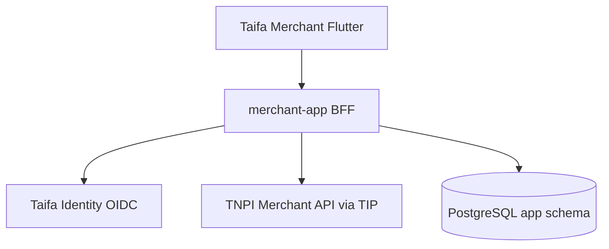

# Taifa Merchant — Sprint 1 Implementation

**Status:** Delivered  
**Sprint:** TM-S1 (Merchant Foundation)  
**Scope:** Authentication, registration, branches, employees, devices, dashboard — **no payments**

---

## Repository layout

### Backend (`apps/backend/taifa_merchant/`)

| Layer | Path |
| --- | --- |
| Domain | `domain/enums.py`, `domain/events.py`, `domain/repositories.py` |
| Application | `application/services.py` |
| Infrastructure | `infrastructure/models.py`, `infrastructure/identity/`, `infrastructure/tnpi/`, `infrastructure/events/` |
| Presentation | `presentation/views.py`, `presentation/serializers.py`, `presentation/auth.py` |
| API base | `/api/v1/merchant-app/` |

### Flutter (`apps/mobile/lib/features/taifa_merchant/`)

| Area | Path |
| --- | --- |
| Core | `core/merchant_api_client.dart`, `core/auth_token_storage.dart` |
| State | `application/merchant_auth_controller.dart` |
| UI | `presentation/auth/`, `dashboard/`, `branches/`, `employees/`, `devices/` |
| Routes | `merchant_routes.dart` → `/taifa-merchant/*` |

---

## Database schema (app layer)

Tables: `taifa_merchant_identity_user`, `taifa_merchant_account`, `taifa_merchant_profile`, `taifa_merchant_branch`, `taifa_merchant_employee`, `taifa_merchant_device`, `taifa_merchant_audit_log`.

**No payment tables.** `tnpi_merchant_id` / `tnpi_device_id` reference national platform (stub adapter in dev).

---

## Definition of Done (Sprint 1)

- [x] Sign up, login, logout, session, forgot-password (202), MFA-ready flag  
- [x] Business registration + profile  
- [x] Branches CRUD (deactivate via DELETE)  
- [x] Employee invite, role assign, deactivate  
- [x] Device register, activate, deactivate  
- [x] Dashboard with payment placeholders  
- [x] JWT auth (`MerchantJWTAuthentication`)  
- [x] RBAC permission matrix (Owner … Support)  
- [x] Event dispatch → audit log  
- [x] Integration tests (`test_sprint1_foundation.py`)  
- [x] OpenAPI stub `openapi/taifa-merchant-bff-sprint1.yaml`  
- [x] Flutter feature module (Riverpod, Dio, GoRouter, Hooks, Material 3)

---

## Testing

```bash
cd apps/backend
python manage.py test taifa_merchant.tests.test_sprint1_foundation
```

```bash
cd apps/mobile
flutter pub get
flutter test test/taifa_merchant/merchant_widget_test.dart
```

---

## Deployment (AWS)

See `infra/merchant-app/README.md` — ECS Fargate service, RDS PostgreSQL, Secrets Manager for `MERCHANT_JWT_SECRET`, API Gateway → ALB.

**Environment variables**

| Variable | Purpose |
| --- | --- |
| `MERCHANT_JWT_SECRET` | JWT signing |
| `TAIFA_IDENTITY_JWKS_URL` | Production Identity JWKS |
| `DATABASE_URL` | RDS PostgreSQL |

---

## Dependency graph



---

## Cross-references

- [26_PRODUCT_BACKLOG.md](26_PRODUCT_BACKLOG.md) — TMB-001–008, TMB-023–024, TMB-018  
- [00_PRODUCT_REQUIREMENTS_DOCUMENT.md](00_PRODUCT_REQUIREMENTS_DOCUMENT.md)
