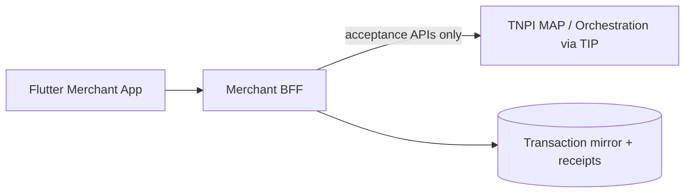

# Taifa Merchant — Sprint 3 Implementation

**Sprint:** Payment Acceptance (TNPI MAP v1.0 MVP)  
**Boundary:** All money movement delegated to **TNPI** via `TnpiAcceptancePort` — no orchestration, settlement, reconciliation, or fraud engines in the BFF.

---

## Architecture



| Layer | Location |
| --- | --- |
| TNPI port | `infrastructure/tnpi/payment_client.py` |
| Domain enums | `domain/payment_enums.py` |
| Persistence | `infrastructure/payment_models.py` |
| Application | `application/payment_services.py` |
| API | `presentation/payment_views.py` |

---

## Database (`0003_sprint3_payments`)

`MerchantTerminal`, `PaymentTransaction`, `QRPayment`, `PaymentLink`, `Receipt`, `Refund`, `TransactionAudit`

---

## REST API (`/api/v1/merchant-app/payments/...`)

| Capability | Endpoints |
| --- | --- |
| SoftPOS | `POST terminals`, `POST softpos/sessions`, `POST softpos/{id}/confirm` |
| QR | `POST qr`, `POST qr/{id}/complete` |
| Links | `POST links`, `POST links/{id}/complete` |
| Transactions | `GET transactions`, `GET transactions/{id}`, `POST transactions/{id}/refund` |
| Receipts | `GET receipts/{id}`, `POST receipts/{id}/share` |
| Analytics v1 | `GET analytics/today` |

OpenAPI: `apps/backend/openapi/taifa-merchant-bff-sprint3.yaml`

---

## Flutter

`presentation/payments/` — hub, SoftPOS, QR, links, transactions, analytics.  
`merchant_api_client.dart` — payment methods.  
Routes under `/taifa-merchant/payments/*`.

**SoftPOS:** emulated NFC token in dev; production wires certified kernel + device auth to TNPI MAP.

---

## Security & RBAC

Permissions: `payment:read`, `payment:accept`, `payment:refund` (owner/admin/manager/cashier read+accept; refund for owner/admin/manager).  
`TransactionAudit` + existing `AuditLog` / `MerchantActivity` on capture/refund.

---

## Tests

`tests/test_sprint3_payments.py` — SoftPOS → QR → link → list → refund → analytics; no settlement routes in BFF.

```bash
cd apps/backend && python manage.py migrate && python manage.py test taifa_merchant.tests
```

---

## Definition of done

| Item | Status |
| --- | --- |
| SoftPOS flow (session + confirm) | ✅ via TNPI stub |
| QR static/dynamic | ✅ |
| Payment links | ✅ |
| Transactions + search | ✅ |
| Refunds / void | ✅ |
| Digital receipts + share | ✅ |
| Analytics v1 | ✅ |
| TNPI integration boundary | ✅ port adapter |
| Tests | ✅ 10 backend tests |
| AWS deploy | Run `0003` migration per `infra/merchant-app/README.md` |

---

## Production notes

Replace `DevTnpiAcceptanceClient` with TIP HTTP client to MAP routes (`/acceptance/softpos/*`, `/acceptance/qr/*`, etc.).  
Redis (ElastiCache) recommended for session/idempotency cache in next hardening sprint.  
PDF receipts: generate to S3 via async worker; `pdf_s3_key` reserved.
