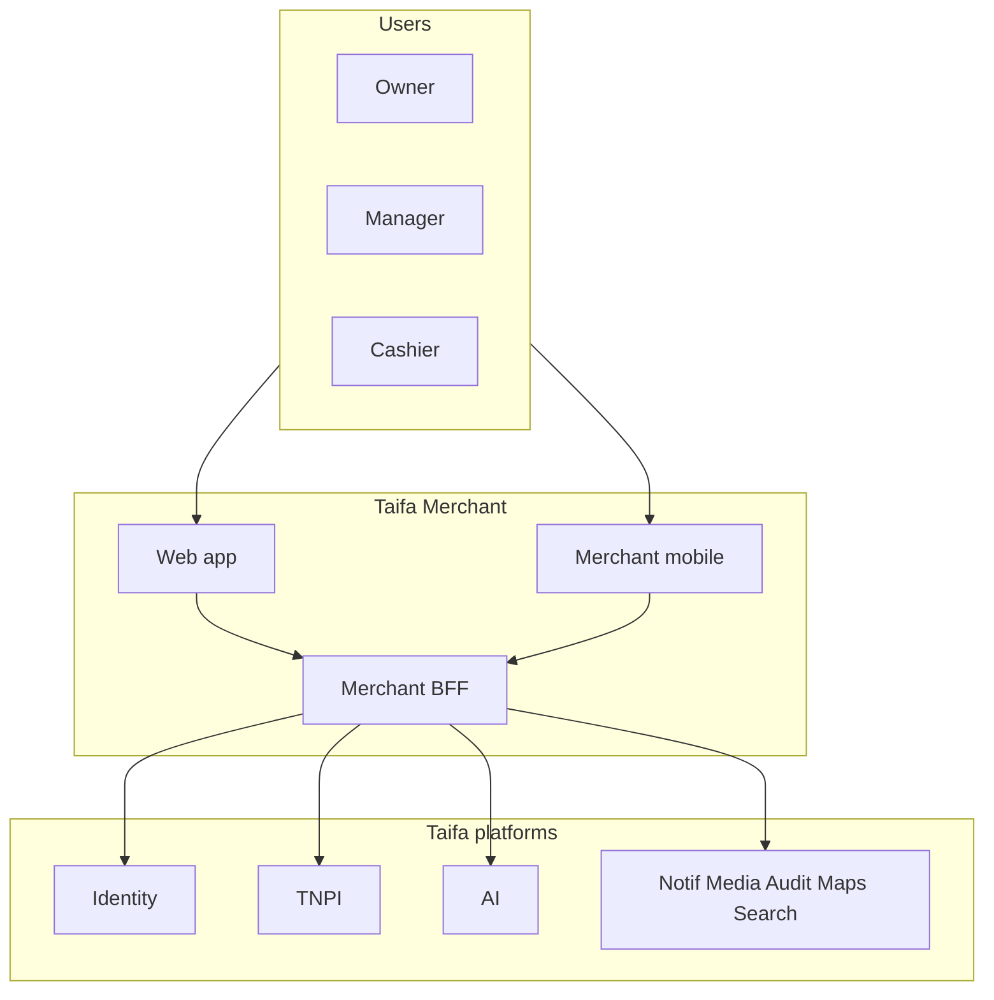

# 01 — Product Vision

---

## Executive summary

**Taifa Merchant** empowers every Tanzanian business—from market stall to national chain—to **register, verify, operate, and get paid** through one digital OS, powered by national infrastructure (Identity + TNPI) and differentiated by **AI business insights** and superior UX.

---

## Business purpose

Formalize commerce, reduce cash friction, and give merchants data-driven control without building fintech stacks.

---

## Vision statement

**Your business, one operating system—trusted, paid, and intelligent.**

---

## Product modules (summary)

Onboarding · Dashboard · Branches · Employees · Devices · SoftPOS · QR · Payment links · Receipts · Refunds · Transactions · Customers · Reports · Analytics · Notifications · AI Business Assistant — detail in [09_MODULE_CATALOG.md](09_MODULE_CATALOG.md).

---

## Architecture overview

---

## Success metrics (vision-level)

| KPI | Target (year 1 post-MVP) |
| --- | --- |
| Active merchants | 10,000 |
| Monthly TPV (via TNPI) | TZS 50B+ (stretch) |
| Merchant NPS | ≥ 40 |
| Onboarding completion | ≥ 70% started → live |

---

## Future expansion

Inventory, payroll hooks, credit marketplace (partners), multi-country East Africa.

---

## Cross-references

[02_BUSINESS_ARCHITECTURE.md](02_BUSINESS_ARCHITECTURE.md)
