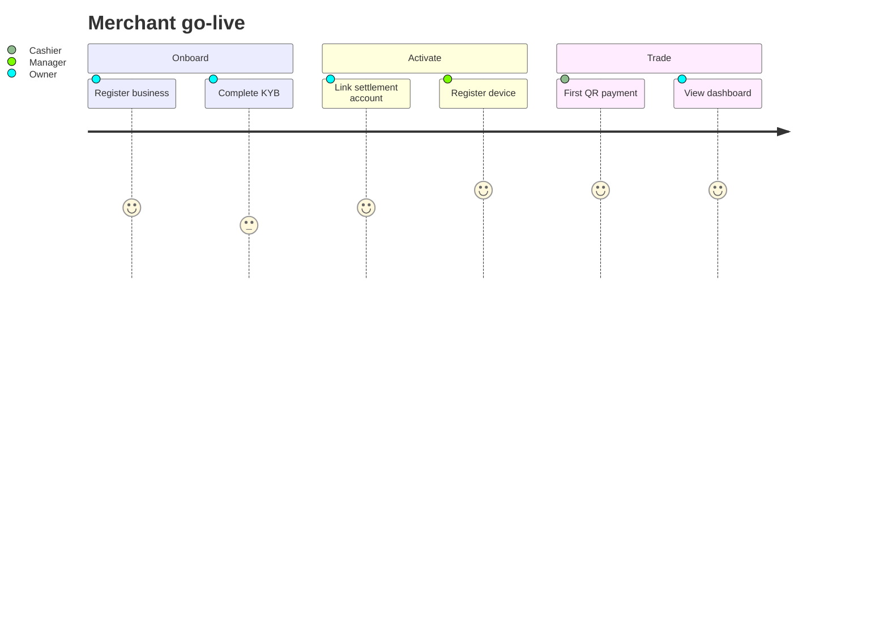
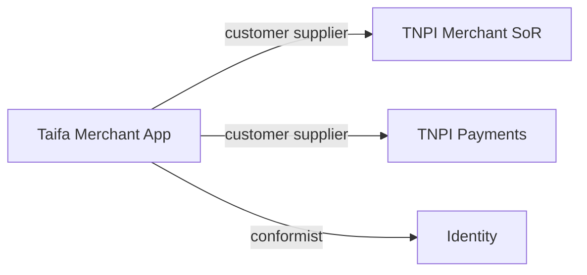

# 02 — Business Architecture

---

## Executive summary

Business architecture for **Taifa Merchant** as the **application layer** atop TNPI merchant/payments and Taifa Core—organized by capabilities, journeys, and platform delegation.

---

## Business purpose

Align squads, sponsors, and partners on what the product owns vs what platforms own.

---

## Capability map

| L1 | L2 capabilities | Platform delegate |
| --- | --- | --- |
| **Acquire** | Signup, KYB wizard, branch setup | TNPI Merchant + Identity |
| **Operate** | Staff, roles, devices | TNPI Merchant registry + app RBAC |
| **Accept** | QR, SoftPOS, links | TNPI MAP + Orchestration |
| **Manage money** | Tx list, refunds, receipts | TNPI only |
| **Grow** | Customers, campaigns (future) | App + TNPI customer refs |
| **Understand** | Reports, analytics, AI insights | App + Analytics + AI |
| **Engage** | Notifications | Core Notifications |

---

## Stakeholders

| Stakeholder | Need |
| --- | --- |
| Merchant owner | Revenue visibility, compliance |
| Manager | Staff/device control |
| Cashier | Fast accept |
| Taifa / TNPI | TPV, fraud posture |
| Partners | Banks, acquirers (via TNPI) |

---

## Customer journeys

---

## Context map

---

## Business rules (application)

- No payment capture in merchant app database.  
- `merchant_id` from TNPI is canonical business identifier.  
- Refunds only via TNPI API with permission `refunds:issue`.  
- KYB decisions authoritative in TNPI Merchant; app shows status only.

---

## Cross-references

[03_DOMAIN_MODEL.md](03_DOMAIN_MODEL.md) · [07_PLATFORM_INTEGRATION.md](07_PLATFORM_INTEGRATION.md)
