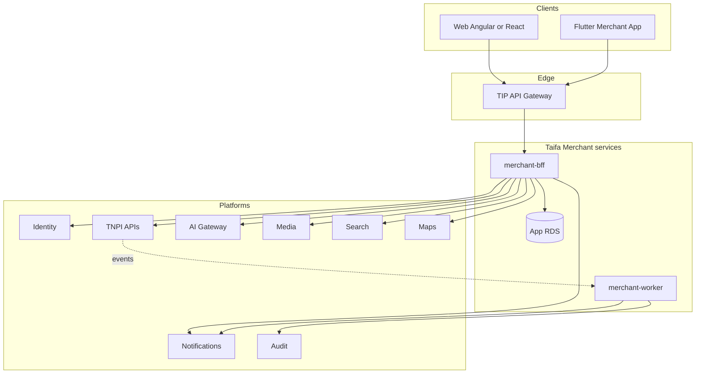
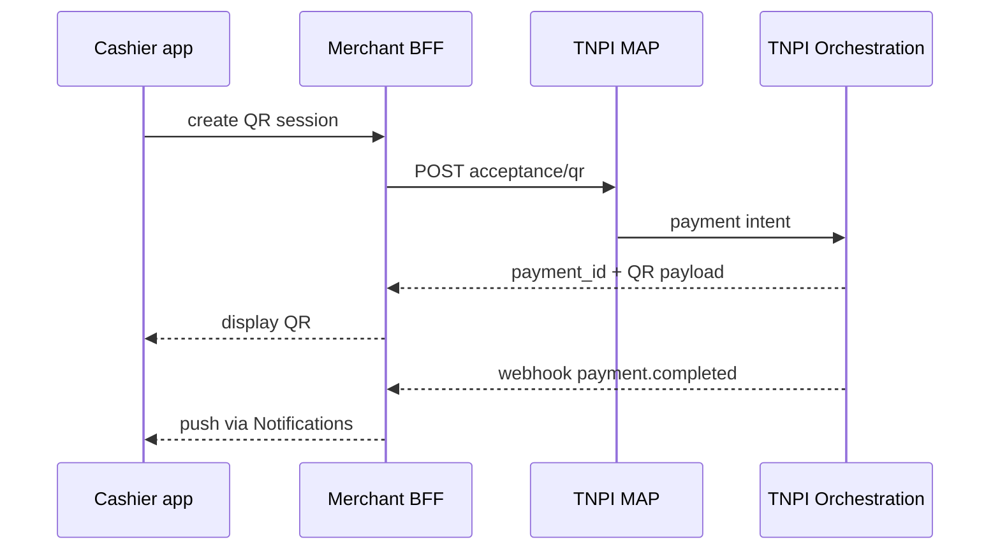
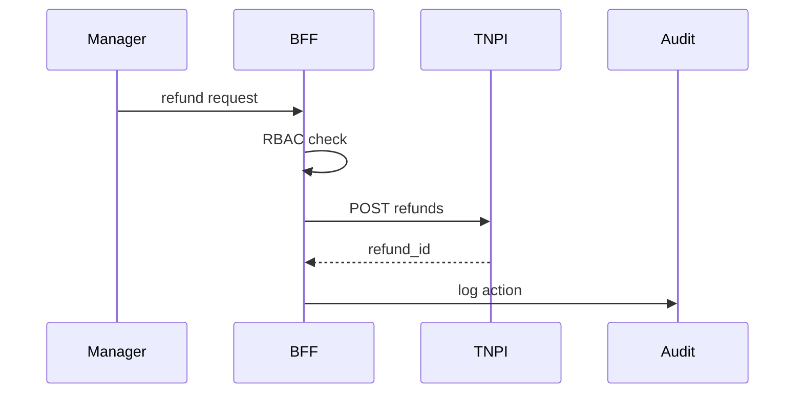

# 04 — Component Architecture

---

## Executive summary

Component model: **Web + Mobile** → **Merchant BFF** → platform SDKs; optional **read cache**; no payment engine.

---

## Business purpose

Implementable service boundaries for engineering.

---

## Component diagram

---

## Sequence: accept QR payment

---

## Sequence: refund

---

## Module-to-component map

| Module | Primary component |
| --- | --- |
| Onboarding | BFF + TNPI Merchant client |
| Dashboard | BFF aggregation |
| Acceptance | BFF → MAP |
| Transactions | BFF → Orchestration read |
| AI Assistant | BFF → AI tools (read TNPI analytics) |

---

## Cross-references

[06_API_SPECIFICATION.md](06_API_SPECIFICATION.md) · [08_AWS_ARCHITECTURE.md](08_AWS_ARCHITECTURE.md)
