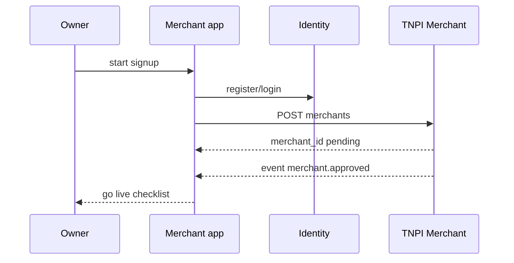

# 07 — Platform Integration

---

## Executive summary

Integration matrix for **Taifa Identity, TNPI, AI, Notifications, Analytics, Audit, Media, Maps, Search, TIP**.

---

## Integration table

| Platform | Use in Taifa Merchant | Integration pattern |
| --- | --- | --- |
| **Identity** | SSO, MFA, staff invites, business org | OIDC PKCE web; native SDK mobile |
| **TNPI Merchant** | KYB, branches, employees, devices, API keys (advanced) | REST via TIP |
| **TNPI Orchestration** | Payments, refunds, tx history | REST + webhooks → worker |
| **TNPI MAP** | QR, SoftPOS, links | REST |
| **TNPI Settlement** | Payout status (read) | REST read-only |
| **TNPI FRP** | Automatic on pay (no app logic) | Via orchestration |
| **Taifa AI** | Business assistant, insights | AI gateway tools (aggregated metrics) |
| **Notifications** | Payment alerts, onboarding | Topic per merchant user |
| **Analytics** | Funnels, cohorts | Event ingest `merchant.app.*` |
| **Audit** | Refunds, role changes, exports | Append-only API |
| **Media** | Logo, receipt PDF storage | Presigned upload |
| **Maps** | Branch pin, geocode | Geocoding API |
| **Search** | Transaction/customer search index | Optional sync job from TNPI read |
| **TIP** | All external API traffic | Enterprise/partner GW |

---

## Webhooks (inbound to merchant worker)

Subscribe via TIP to: `payment.completed`, `payment.failed`, `refund.completed`, `merchant.approved`, `device.registered`.

---

## Sequence: Identity + TNPI onboarding

---

## Anti-patterns (forbidden)

- Local `payment_intent` state machine  
- Storing MNO API secrets in merchant app  
- Custom JWT issuer  

---

## ADR

**ADR-TM-001** — Taifa Merchant is application SoR for UX/CRM only; TNPI is payment and merchant master SoR.

---

## Cross-references

[integration/00_PLATFORM_OVERVIEW.md](../integration/00_PLATFORM_OVERVIEW.md)
