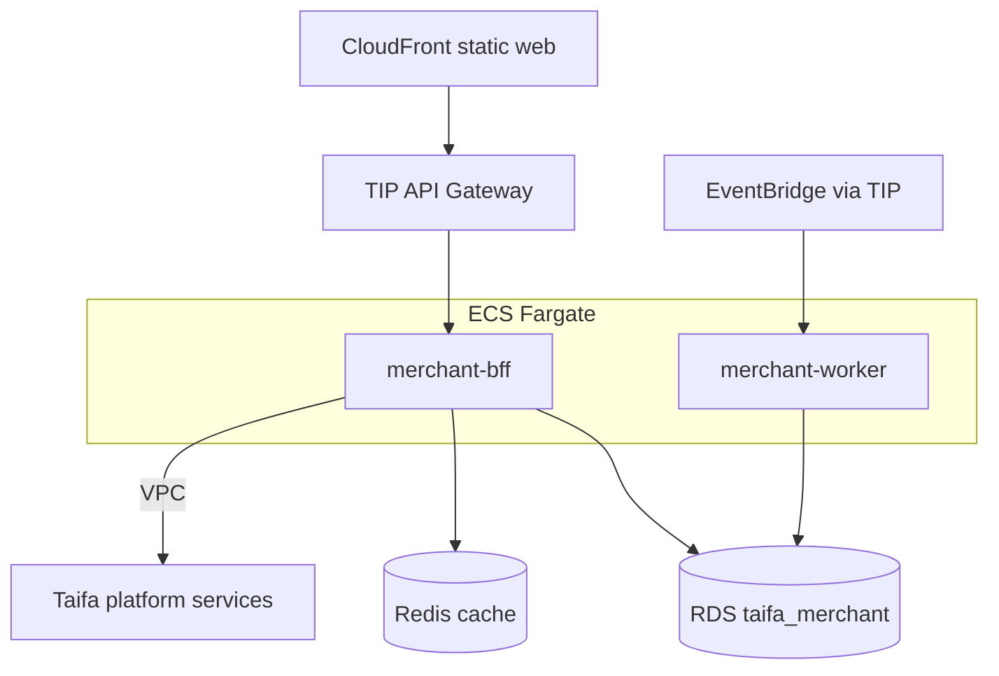

# 08 — AWS Architecture

---

## Executive summary

Taifa Merchant on AWS: **ECS Fargate** (BFF + worker), **RDS PostgreSQL**, **Redis**, **S3** (via Media), behind **TIP** gateway, **CloudWatch**, **X-Ray**, **Secrets Manager**.

---

## Architecture diagram

---

## Environments

| Env | Purpose |
| --- | --- |
| dev | Squad integration |
| staging | TNPI sandbox |
| prod | Live merchants |

---

## Mobile

Flutter → TIP; certificate pinning; attestation for SoftPOS device path (MAP).

---

## Security

Private subnets; no public RDS; WAF on merchant web.

---

## Cross-references

[payments/merchant/11_AWS_ARCHITECTURE.md](../payments/merchant/11_AWS_ARCHITECTURE.md) — TNPI side.
