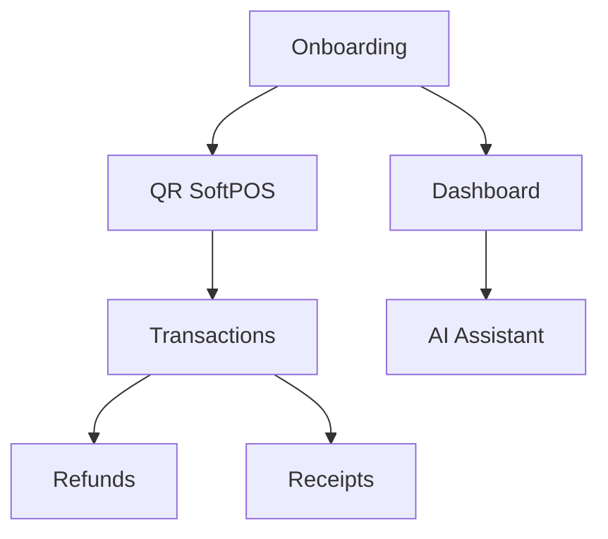

# 09 — Module Catalog

---

## Executive summary

Sixteen product modules—scope, platform deps, MVP flag.

---

| Module | Description | TNPI / Core | MVP |
| --- | --- | --- | --- |
| **Merchant Onboarding** | KYB wizard, checklist | TNPI Merchant, Identity | ✅ |
| **Merchant Dashboard** | Sales today, trends | TNPI read, Analytics | ✅ |
| **Branch Management** | Locations, hours | TNPI Merchant, Maps | ✅ |
| **Employee Management** | Roles, invites | TNPI + Identity | ✅ |
| **Device Management** | Terminals, SoftPOS | TNPI Merchant + MAP | ✅ |
| **SoftPOS** | Tap/enter amount | MAP + Orchestration | ✅ |
| **QR Payments** | Dynamic QR | MAP | ✅ |
| **Payment Links** | Share link pay | MAP | ⬜ post-MVP |
| **Receipts** | Digital receipt | Orchestration + Media | ✅ |
| **Refunds** | Partial/full | Orchestration | ✅ |
| **Transaction History** | Search, filter | Orchestration, Search | ✅ |
| **Customer Management** | CRM notes | App + TNPI ref | ⬜ |
| **Reports** | Daily/weekly export | Analytics, Media | ⬜ basic |
| **Analytics** | Charts, compare periods | Analytics platform | ⬜ basic |
| **Notifications** | Payment alerts | Notifications | ✅ |
| **AI Business Assistant** | Insights, Q&A | Taifa AI | ⬜ beta |

---

## Module dependency diagram

---

## Cross-references

[12_MVP_DEFINITION.md](12_MVP_DEFINITION.md)
