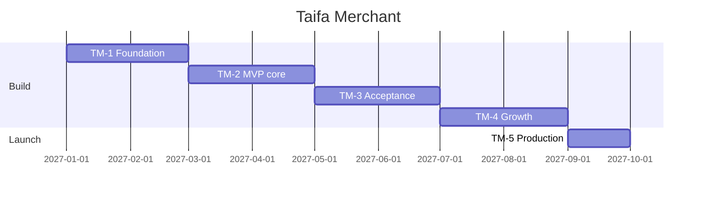

# 10 — Implementation Roadmap

---

## Executive summary

**9-month** roadmap: foundation → MVP go-live → growth features.

---

| Phase | Months | Outcome |
| --- | --- | --- |
| **TM-1** | 1–2 | BFF, Identity, TNPI client, onboarding |
| **TM-2** | 3–4 | QR + dashboard + notifications |
| **TM-3** | 5–6 | SoftPOS, refunds, employees/devices |
| **TM-4** | 7–8 | Analytics, AI beta, payment links |
| **TM-5** | 9 | Hardening, scale, national marketing ready |

---

## Dependencies

TNPI Merchant + MAP + Orchestration **staging ready**; TIP route; Identity business org.

---

## Cross-references

[11_SPRINT_PLAN.md](11_SPRINT_PLAN.md) · [TAIFA_MERCHANT_GATE_PACKAGE.md](TAIFA_MERCHANT_GATE_PACKAGE.md)
