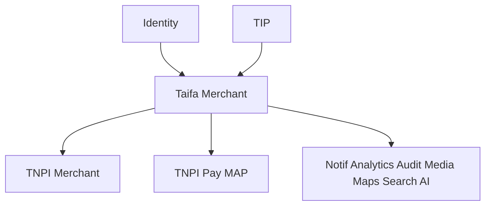

# Taifa Merchant — Gate Package

**Product:** Taifa Merchant (flagship business application)  
**Status:** Architecture planning complete  
**Date:** 2026-08-06

---

## 1. Product Readiness Report

### Executive summary

**Taifa Merchant** (`docs/taifa-merchant/`) is the **Digital OS for businesses**—application layer on **Identity, TNPI, Core, TIP**—not a duplicate of [TNPI Merchant Platform](../payments/merchant/00_INDEX.md).

### Readiness matrix

| Dimension | Status |
| --- | --- |
| Business architecture, domain, components | ✅ |
| DB (app-only), APIs, integrations | ✅ |
| Modules, MVP, sprints, deployment | ✅ |
| Acceptance, DoD, risks | ✅ |
| **Implementation** | ⬜ |
| **TNPI MAP + Merchant staging** | ⬜ prerequisite |
| **Identity business org** | ✅ assumed |

### Verdict

**Approved to implement** when TNPI sandbox merchant + QR path is available via TIP.

---

## 2. Architecture Review Report

| ID | Finding | Severity | Action |
| --- | --- | --- | --- |
| AR-TM-01 | No payment SoR in app | Critical | ADR-TM-001 |
| AR-TM-02 | BFF not bypass TIP | High | IaC enforce |
| AR-TM-03 | RBAC align TNPI + app | High | TM-S9 |
| AR-TM-04 | Receipt PII | Med | Media + redaction |

**Verdict:** Approved for TM-S1.

---

## 3. Dependency Graph

---

## 4. Sprint Summary

11 sprints (~26 weeks) — [11_SPRINT_PLAN.md](11_SPRINT_PLAN.md). MVP at **TM-S6** (QR + notifications).

---

## 5. MVP Summary

[12_MVP_DEFINITION.md](12_MVP_DEFINITION.md) — KYB, QR, tx, refund, receipt, dashboard, notify.

---

## 6. Production Readiness (target)

| Area | Target |
| --- | --- |
| Availability BFF | 99.9% |
| TNPI dependency | Circuit breaker + status page |
| Security | Pen test before pilot |
| Support | L1 playbook |

---

## Cross-references

[00_INDEX.md](00_INDEX.md) · [TAIFA_PRODUCT_PORTFOLIO_AND_DELIVERY_ROADMAP.md](../TAIFA_PRODUCT_PORTFOLIO_AND_DELIVERY_ROADMAP.md)
