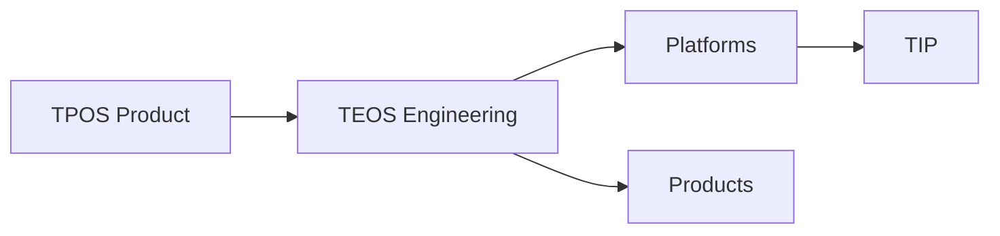

# Taifa Engineering Operating System (TEOS) — Charter

| Field | Value |
| --- | --- |
| **Program** | Taifa Engineering Operating System (TEOS) |
| **Status** | **Mandatory** for all engineering (platforms, products, infra) |
| **Authority** | [Architecture Constitution](../architecture/00_ARCHITECTURE_CONSTITUTION.md) · [GOVERNANCE](../GOVERNANCE.md) |
| **Complements** | [TPOS](../tpos/00_TPOS_CHARTER.md) (product) · [taifa-platform](../taifa-platform/README.md) (repo) |
| **Date** | 2026-08-06 |

---

## Executive summary

**TEOS** is Taifa’s mandatory **engineering operating system**—how software is **designed, built, tested, secured, released, operated, and improved** across Core, TNPI, TNMP, GDSP, TIP, and all products.

Enterprise **architecture is complete**; TEOS governs **execution discipline** without redefining domain architecture.

**No engineering team may bypass TEOS.**

---

## Mission

Deliver national-scale digital infrastructure with **predictable quality**, **security**, **velocity**, and **operability**—one engineering culture, many squads.

---

## Scope

| In scope | Out of scope |
| --- | --- |
| Lifecycle, standards, gates, councils, SRE, DevSecOps, QA | Re-architecting TNPI/TNMP/GDSP/TIP/Core |
| Reference architectures, ADRs, technology radar | Application feature code |
| Metrics (DORA + Taifa KPIs) | Replacing EARB constitution |
| Playbooks, checklists, templates | Product discovery (see TPOS) |

---

## Relationship to TPOS

| System | Owns |
| --- | --- |
| **TPOS** | *What* to build — PRD, UX, product gates, PAR |
| **TEOS** | *How* to build & run — design, code, test, deploy, operate |

---

## Principles

1. **Platform-first** — No duplicate Identity, TNPI, TIP, GDSP, TNMP in products.  
2. **Trunk-based delivery** — Small batches, feature flags, reversible deploys.  
3. **Security & privacy by design** — Threat model before pilot; Secure SDLC gates.  
4. **Observable by default** — Logs, metrics, traces on every service.  
5. **Docs-as-code** — ADRs, runbooks, OpenAPI in repo.  
6. **Measure & improve** — DORA metrics + Taifa scorecard.  
7. **Blameless learning** — Incidents drive systemic fixes.

---

## RACI (TEOS program)

| Activity | CTO | VP Eng | Chief Architect | Eng Director | DevSecOps | SRE | Security | QA Lead | Squad |
| --- | --- | --- | --- | --- | --- | --- | --- | --- | --- |
| TEOS standards | A | R | C | R | C | C | C | C | I |
| Architecture review | C | C | **A** | R | I | I | C | I | R |
| EGR (engineering gate) | I | A | R | R | C | I | C | C | R |
| Security gate | I | C | C | C | C | I | **A** | I | R |
| Release approval | C | C | C | C | R | C | C | C | R |
| Incident command | I | C | I | C | C | **A** | C | I | R |
| SLO definition | C | C | C | R | C | **A** | I | I | R |

*A = Accountable, R = Responsible, C = Consulted, I = Informed*

---

## Document map

| # | Document |
| --- | --- |
| 00 | This charter |
| 01 | [Engineering lifecycle](01_ENGINEERING_LIFECYCLE.md) |
| 02 | [Engineering standards](02_ENGINEERING_STANDARDS.md) |
| 03 | [Architecture governance](03_ARCHITECTURE_GOVERNANCE.md) |
| 04 | [Coding standards](04_CODING_STANDARDS.md) |
| 05 | [Git standards](05_GIT_STANDARDS.md) |
| 06 | [DevSecOps](06_DEVSECOPS.md) |
| 07 | [QA framework](07_QA_FRAMEWORK.md) |
| 08 | [Security engineering](08_SECURITY_ENGINEERING.md) |
| 09 | [SRE guide](09_SRE_GUIDE.md) |
| 10 | [Release management](10_RELEASE_MANAGEMENT.md) |
| 11 | [Incident management](11_INCIDENT_MANAGEMENT.md) |
| 12 | [Observability](12_OBSERVABILITY.md) |
| 13 | [Metrics & KPIs](13_METRICS_AND_KPIS.md) |
| 14 | [Governance & councils](14_GOVERNANCE.md) |
| 15 | [Playbook](15_PLAYBOOK.md) |
| 16 | [Checklists](16_CHECKLISTS.md) |
| 17 | [Reference architecture](17_REFERENCE_ARCHITECTURE.md) |
| 18 | [Engineering handbook](18_ENGINEERING_HANDBOOK.md) |
| 19 | [Decision records](19_DECISION_RECORDS.md) |
| 20 | [Roadmap](20_ROADMAP.md) |

---

## Compliance

Squads attest TEOS gates in PR templates and release records. [Governance scorecard](../governance/SCORECARD.md) includes TEOS maturity dimensions.

---

## Cross-references

[PDL entry](../platform/17_PLATFORM_DECISION_LOG.md) · [taifa-platform engineering](../../taifa-platform/docs/engineering/README.md)
