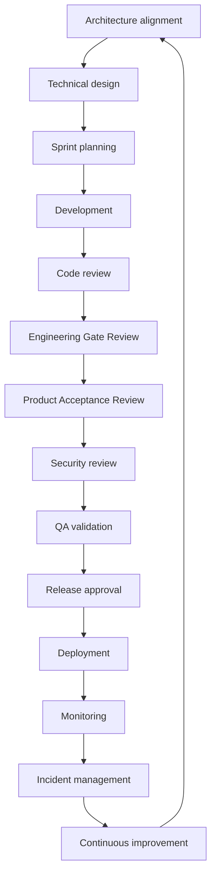

# 01 — Engineering lifecycle

**Owner:** VP Engineering · **Status:** Mandatory

---

## End-to-end flow

---

## Phases

| Phase | Entry | Exit gate | Artifacts |
| --- | --- | --- | --- |
| **Architecture** | Initiative / epic | ARB approval or ADR | ADR, context diagram |
| **Technical design** | Approved epic | Design review (ERB) | TDD, API sketch, threat model lite |
| **Sprint planning** | Ready backlog | Sprint goal + DoR | Sprint board |
| **Development** | DoR stories | PR ready | Code, tests |
| **Code review** | PR open | 2 approvals, CI green | PR, comments resolved |
| **Engineering Gate Review** | Feature complete | EGR PASS / CONDITIONS | [EGR template](16_CHECKLISTS.md#egr) |
| **Product Acceptance Review** | EGR pass | PAR PASS (TPOS) | PAR doc |
| **Security review** | Pilot+ / sensitive | Security sign-off | Threat model, scan results |
| **QA validation** | Staging deploy | Test report | Test plan results |
| **Release approval** | Release candidate | Release Board | Release notes |
| **Deployment** | Approved tag | Health checks green | Deploy record |
| **Monitoring** | Live | SLO within budget | Dashboards |
| **Incident management** | Alert/page | Postmortem if Sev1/2 | Incident ticket |
| **Continuous improvement** | Retro / metrics | Action items | ADR, TEOS updates |

---

## Gate summary

| Gate | When | Authority |
| --- | --- | --- |
| **G-ARCH** | New service, boundary change | ARB |
| **G-EGR** | Sprint / milestone merge | ERB |
| **G-PAR** | Product milestone | PRB (TPOS) |
| **G-SEC** | Prod / payments / PII | Security Council |
| **G-QA** | Release candidate | QA Council |
| **G-REL** | Production deploy | Release Board |

---

## Platform vs product

- **Platforms** (Core, TNPI, TNMP, GDSP, TIP): G-ARCH required for public API changes.  
- **Products** (TPOS): PAR + TEOS EGR before pilot.

---

## Waivers

CTO + accountable council chair; time-boxed; recorded in [19_DECISION_RECORDS.md](19_DECISION_RECORDS.md).

---

## Cross-references

[10_RELEASE_MANAGEMENT.md](10_RELEASE_MANAGEMENT.md) · [tpos/10_PRODUCT_GOVERNANCE.md](../tpos/10_PRODUCT_GOVERNANCE.md)
