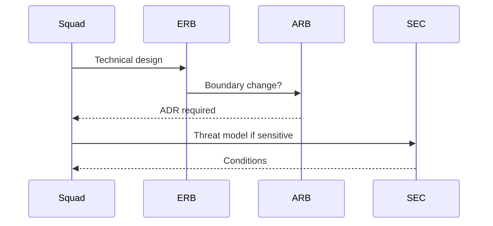

# 03 — Architecture governance

**Owner:** Chief Architect · **Council:** Architecture Council (ARB)

---

## Architecture Review Board (ARB)

| Mandate | Approve structural changes, anti-duplication, public contracts |
| Cadence | Weekly; emergency &lt; 24h for Sev1 risk |
| Inputs | ADR, diagrams, TIP registration plan |
| Outputs | Approved / deferred; PDL entry |

Full charter: [taifa-platform ARB](../../taifa-platform/docs/governance/ARCHITECTURE_REVIEW_BOARD.md).

---

## Architecture Decision Records (ADR)

| Field | Required |
| --- | --- |
| Status | Proposed / Accepted / Deprecated |
| Context | Problem |
| Decision | Choice |
| Consequences | +/- |

Template: [19_DECISION_RECORDS.md](19_DECISION_RECORDS.md).

---

## Technology radar

| Ring | Meaning |
| --- | --- |
| **Adopt** | Default for new work (e.g. Flutter, Django/FastAPI, Terraform, OpenAPI) |
| **Trial** | Pilot with ARB ticket (e.g. new observability backend) |
| **Assess** | Research only |
| **Hold** | Do not expand (legacy patterns) |

Published quarterly in [20_ROADMAP.md](20_ROADMAP.md) § Radar.

---

## Reference architectures

[17_REFERENCE_ARCHITECTURE.md](17_REFERENCE_ARCHITECTURE.md) — BFF, event-driven, TIP edge, mobile client.

---

## Platform standards

| Platform | SoR / rule |
| --- | --- |
| Identity | OIDC; no custom JWT issuers in products |
| TNPI | Payments, KYB merchant master |
| TIP | All partner/public API traffic |
| GDSP | Government service patterns |
| TNMP | Mobility; payments via TPP→TNPI |

---

## Solution review process

1. Squad drafts TDD + diagram.  
2. ERB reviews feasibility & TEOS compliance.  
3. ARB if new service, API break, or platform overlap.  
4. Security if PII, payments, auth, or prod boundary.

---

## Cross-references

[EA_GOVERNANCE.md](../governance/EA_GOVERNANCE.md) · [architecture/README.md](../architecture/README.md)
