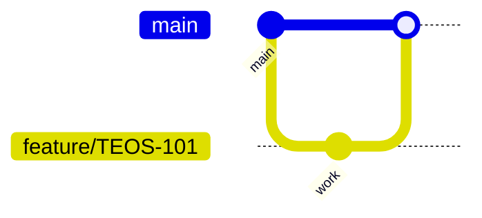

# 05 — Git standards

**Owner:** VP Engineering

---

## Branch strategy

| Branch | Use |
| --- | --- |
| `main` | Production-aligned trunk; protected |
| `release/{version}` | Hardening window |
| `feature/{ticket}-{slug}` | Features |
| `fix/{ticket}-{slug}` | Bugs |
| `hotfix/{ticket}-{slug}` | Production fixes |

No long-lived `develop` unless mobile train exception (ARB).

---

## Git flow (trunk-based)



---

## Commit messages

```
<type>(<scope>): <subject>

[body]

[footer: BREAKING CHANGE:]
```

Types: `feat`, `fix`, `docs`, `chore`, `refactor`, `test`, `ci`, `infra`.

---

## Pull requests

- Link ticket / ADR / gate ID  
- Fill PR template ([16_CHECKLISTS.md](16_CHECKLISTS.md))  
- Squash merge preferred  
- 2 approvals; 1 CODEOWNER for sensitive paths

---

## Cross-references

[taifa-platform GIT_WORKFLOW](../../taifa-platform/docs/engineering/GIT_WORKFLOW.md) · [BRANCH_STRATEGY](../../taifa-platform/docs/engineering/BRANCH_STRATEGY.md)
