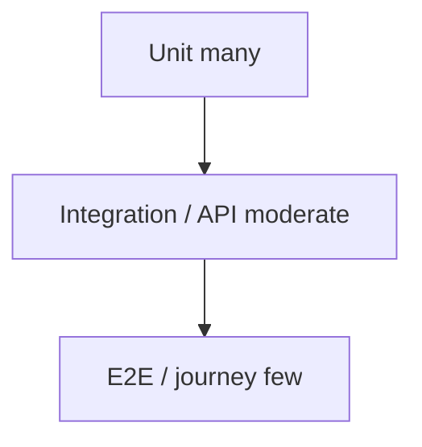

# 07 — QA framework

**Owner:** QA Council · **Chair:** QA Lead

---

## Test pyramid

---

## Test types

| Type | Scope | Tooling (indicative) |
| --- | --- | --- |
| **Unit** | Functions, services | pytest, flutter_test |
| **Integration** | DB, modules | pytest + test DB |
| **Contract** | OpenAPI / Pact | schemathesis, Pact |
| **API** | REST BFF | DRF APIClient, httpx |
| **Widget** | Flutter UI units | flutter_test |
| **E2E** | Staging journeys | Playwright / integration_driver |
| **Performance** | P95 latency | k6, Locust |
| **Load** | Capacity | k6 scenarios |
| **Stress** | Breaking point | Staged in pre-prod |
| **Accessibility** | WCAG 2.1 AA critical paths | axe, manual |
| **Security** | DAST, fuzz | OWASP ZAP (staging) |
| **Regression** | Release candidate | Automated suite |

---

## Coverage standards

| Layer | Minimum (default) |
| --- | --- |
| New packages | ≥ 70% line coverage on changed code |
| Payments/TNPI clients | 90% + contract tests |
| Critical auth paths | 100% branch on RBAC middleware |

Waivers: QA Council + Security for payment paths.

---

## QA gate (G-QA)

- [ ] Test plan executed for release scope  
- [ ] No open Sev1/2 defects  
- [ ] Regression green on staging  
- [ ] Accessibility spot-check on critical paths (products)

---

## Cross-references

[governance/QUALITY_ENGINEERING.md](../governance/QUALITY_ENGINEERING.md) · [16_CHECKLISTS.md](16_CHECKLISTS.md)
