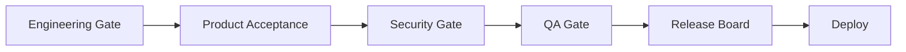

# 10 — Release management

**Owner:** Release Board

---

## Release types

| Type | Cadence | Approval |
| --- | --- | --- |
| **Standard** | Bi-weekly train | Release Board |
| **Hotfix** | As needed | EM + SRE + Security (if auth/pay) |
| **Pilot** | Dar / controlled | PAR + G-SEC |

---

## Release gates (summary)

| Gate | Doc |
| --- | --- |
| EGR | [01_ENGINEERING_LIFECYCLE.md](01_ENGINEERING_LIFECYCLE.md) |
| PAR | TPOS product acceptance |
| G-SEC | [08_SECURITY_ENGINEERING.md](08_SECURITY_ENGINEERING.md) |
| G-QA | [07_QA_FRAMEWORK.md](07_QA_FRAMEWORK.md) |

---

## Release artifact

- Version semver (apps) / calendar (mobile optional)  
- Changelog  
- Rollback plan  
- Feature flag matrix

---

## Environments

`dev` → `staging` → `pre-prod` (optional) → `prod`

Promotion requires green CI on commit SHA deployed.

---

## CAB (Change Advisory Board)

Required for: TNPI prod, Identity prod, schema migrations with downtime, firewall/WAF changes.

---

## Cross-references

[06_DEVSECOPS.md](06_DEVSECOPS.md) · [16_CHECKLISTS.md](16_CHECKLISTS.md#release)
