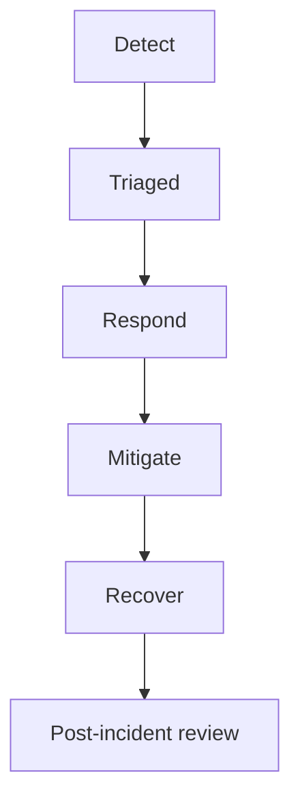

# 11 — Incident management

**Owner:** SRE Lead · **Process:** ITIL-aligned

---

## Severity

| Sev | Definition | Example |
| --- | --- | --- |
| **1** | National-scale outage or payment stop | TNPI down |
| **2** | Major feature broken, no workaround | Merchant cannot login |
| **3** | Degraded / workaround exists | Slow dashboard |
| **4** | Minor / internal | CI flake |

---

## Lifecycle

---

## Roles

| Role | Responsibility |
| --- | --- |
| **Incident Commander** | Coordinates; comms |
| **Tech Lead** | Root cause, fix |
| **Comms** | Status page, stakeholders |
| **Scribe** | Timeline |

---

## Communication

- Internal: Slack `#incidents`  
- External: status.taifa (when live) per Legal  
- Updates every 30m for Sev1

---

## Post-incident review (PIR)

Within 5 business days: timeline, root cause, action items with owners, blameless.

Template in [16_CHECKLISTS.md](16_CHECKLISTS.md#pir).

---

## Cross-references

[INCIDENT_RESPONSE.md](../INCIDENT_RESPONSE.md) · [09_SRE_GUIDE.md](09_SRE_GUIDE.md)
