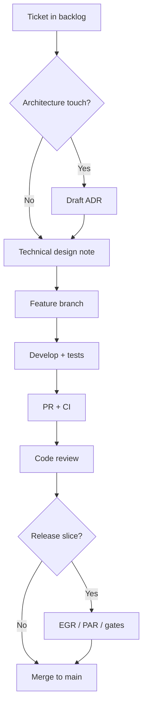

# 15 — Engineering playbook

**Audience:** Squad leads, EMs, new engineers

---

## Onboarding (week 1)

1. Read [00_TEOS_CHARTER.md](00_TEOS_CHARTER.md) and [18_ENGINEERING_HANDBOOK.md](18_ENGINEERING_HANDBOOK.md)  
2. Access: GitHub, AWS (via SSO), observability, incident channel  
3. Clone `taifa-platform` (or product repo); run local README  
4. Shadow code review + standup

---

## Starting a feature

---

## Code review playbook

- Review within 1 business day  
- Check: tests, security (authz), observability, no platform duplication  
- Use [16_CHECKLISTS.md](16_CHECKLISTS.md#code-review)

---

## Pre-release playbook

1. Confirm scope vs PAR criteria  
2. Run [16_CHECKLISTS.md](16_CHECKLISTS.md#release)  
3. Schedule Release Board slot  
4. Deploy staging → smoke → promote  
5. Monitor 24h post-deploy

---

## Hotfix playbook

1. Branch from prod tag  
2. Minimal fix + test  
3. Security/SRE consult if auth/pay  
4. Release Board expedited approval  
5. Backport to `main`

---

## Platform integration playbook

| Need | Do not build | Use |
| --- | --- | --- |
| Login | Custom IdP | Taifa Identity / OIDC |
| Pay | Direct MNO | TNPI via TIP |
| Partner API | Public BFF | TIP gateway |
| Gov forms | Ad-hoc | GDSP patterns |

---

## Cross-references

[01_ENGINEERING_LIFECYCLE.md](01_ENGINEERING_LIFECYCLE.md) · [16_CHECKLISTS.md](16_CHECKLISTS.md)
