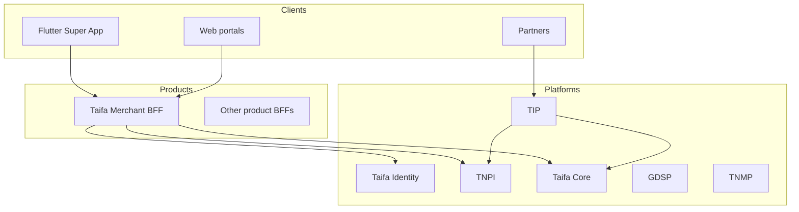

# 17 — Reference architecture

**Owner:** Chief Architect · **Scope:** Engineering patterns (not EA redesign)

---

## Ecosystem context

Products **orchestrate**; platforms **own** domain SoR.

---

## BFF pattern (default product backend)

| Layer | Responsibility |
| --- | --- |
| **Presentation** | HTTP, auth middleware, DTOs |
| **Application** | Use cases, orchestration |
| **Domain** | Entities, policies |
| **Infrastructure** | DB, HTTP clients to platforms |

No payment ledger in BFF; call TNPI APIs via TIP where required.

---

## Mobile client pattern

- Feature modules under `lib/features/{product}/`  
- Shared auth session from super app shell  
- API via Dio; env-specific base URLs  
- Deep links via GoRouter

---

## Event-driven integration

- Domain events: `taifa.{domain}.{entity}.{action}`  
- Prefer async for non-user-facing side effects  
- Idempotent consumers; DLQ + replay runbook

---

## TIP edge

- All partner traffic terminates at TIP  
- Rate limits, WAF, API keys, audit  
- Products expose internal APIs only to mesh/VPC

---

## Data

- Product OLTP DB per BFF where needed  
- TNPI owns payment/settlement SoR  
- PII minimization; reference Identity subject IDs

---

## Deployment unit

- Container per BFF/service on ECS/EKS (org standard)  
- IaC in repo `infrastructure/`  
- Secrets from Secrets Manager

---

## Cross-references

[architecture/README.md](../architecture/README.md) · [03_ARCHITECTURE_GOVERNANCE.md](03_ARCHITECTURE_GOVERNANCE.md)
