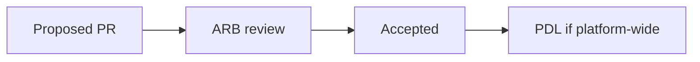

# 19 — Decision records (ADR)

**Owner:** Architecture Council · **Location:** `docs/adr/` or product `docs/.../adr/`

---

## When to write an ADR

- New service or bounded context  
- Technology choice with long-term cost  
- Breaking API or event schema  
- Cross-platform integration pattern  
- Deprecation of a component

---

## Template

```markdown
# ADR-NNNN: Title

- **Status:** Proposed | Accepted | Deprecated | Superseded by ADR-XXXX
- **Date:** YYYY-MM-DD
- **Deciders:** names / ARB
- **Tags:** merchant, tnpi, mobile

## Context

What is the issue? Constraints?

## Decision

What we chose.

## Consequences

Positive, negative, follow-ups.

## Alternatives considered

Brief list.
```

---

## Process



1. Author opens PR with ADR in `Proposed`  
2. ARB reviews within one cycle  
3. On accept, merge; link from code/README  
4. Platform-wide decisions → [17_PLATFORM_DECISION_LOG.md](../platform/17_PLATFORM_DECISION_LOG.md)

---

## Index

Maintain `docs/adr/README.md` with table of ADRs.

---

## Cross-references

[03_ARCHITECTURE_GOVERNANCE.md](03_ARCHITECTURE_GOVERNANCE.md) · [taifa-platform ADR policy](../../taifa-platform/docs/governance/ADR.md)
