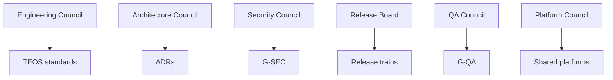

# Taifa Engineering Operating System (TEOS)

**Status:** Mandatory · **PDL:** [PDL-027](../platform/17_PLATFORM_DECISION_LOG.md)

TEOS governs **how** Taifa engineers build and run software. [TPOS](../tpos/00_TPOS_CHARTER.md) governs **what** products deliver.

---

## Document index

| # | Document | Purpose |
| --- | --- | --- |
| 00 | [TEOS Charter](00_TEOS_CHARTER.md) | Mission, scope, principles, RACI |
| 01 | [Engineering lifecycle](01_ENGINEERING_LIFECYCLE.md) | End-to-end flow and gates |
| 02 | [Engineering standards](02_ENGINEERING_STANDARDS.md) | Repo, config, APIs, DB, IaC, docs |
| 03 | [Architecture governance](03_ARCHITECTURE_GOVERNANCE.md) | ARB, ADR, radar, solution review |
| 04 | [Coding standards](04_CODING_STANDARDS.md) | Backend, Flutter, errors, logging |
| 05 | [Git standards](05_GIT_STANDARDS.md) | Branching, commits, PRs |
| 06 | [DevSecOps](06_DEVSECOPS.md) | CI/CD, IaC, deploy strategies |
| 07 | [QA framework](07_QA_FRAMEWORK.md) | Test types, coverage, G-QA |
| 08 | [Security engineering](08_SECURITY_ENGINEERING.md) | Secure SDLC, G-SEC |
| 09 | [SRE guide](09_SRE_GUIDE.md) | SLI/SLO, DR, capacity |
| 10 | [Release management](10_RELEASE_MANAGEMENT.md) | Trains, CAB, release gates |
| 11 | [Incident management](11_INCIDENT_MANAGEMENT.md) | Sev, PIR, roles |
| 12 | [Observability](12_OBSERVABILITY.md) | Metrics, logs, traces |
| 13 | [Metrics & KPIs](13_METRICS_AND_KPIS.md) | DORA + quality |
| 14 | [Governance](14_GOVERNANCE.md) | Councils, RACI, escalation |
| 15 | [Playbook](15_PLAYBOOK.md) | Day-to-day procedures |
| 16 | [Checklists & templates](16_CHECKLISTS.md) | PR, EGR, PAR, release, PIR |
| 17 | [Reference architecture](17_REFERENCE_ARCHITECTURE.md) | BFF, TIP, events |
| 18 | [Engineering handbook](18_ENGINEERING_HANDBOOK.md) | Practitioner quick start |
| 19 | [Decision records](19_DECISION_RECORDS.md) | ADR template & process |
| 20 | [Roadmap](20_ROADMAP.md) | Rollout & technology radar |

---

## Quick links

- [Enterprise governance](../GOVERNANCE.md)  
- [Architecture constitution](../architecture/00_ARCHITECTURE_CONSTITUTION.md)  
- [Monorepo engineering](../../taifa-platform/docs/engineering/README.md)

---

## Governance model

All squads **must** follow TEOS; exceptions require Engineering Council approval and PDL entry.
