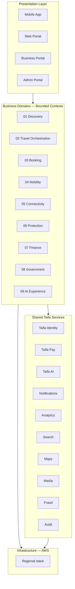
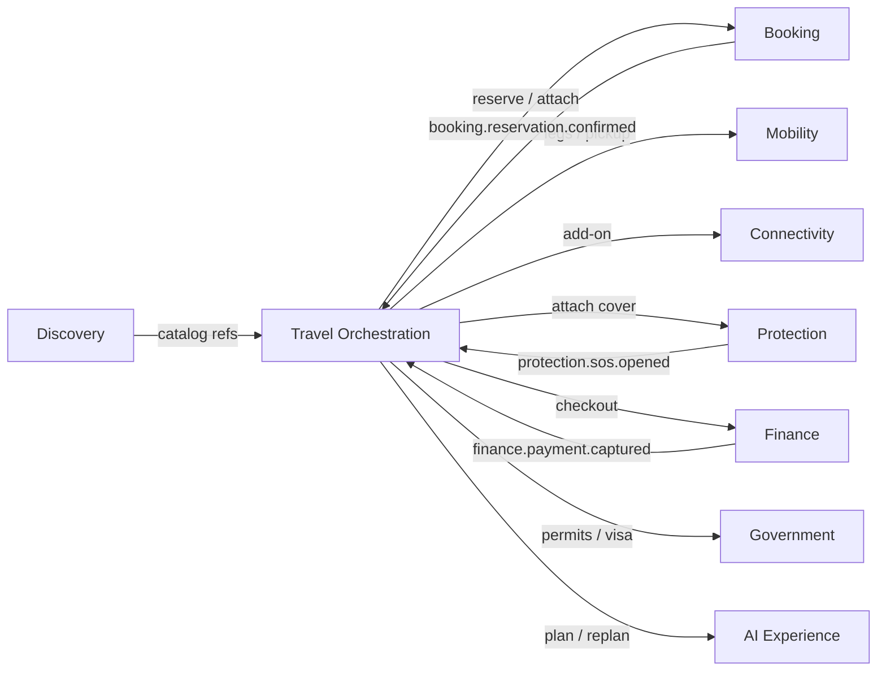

# Taifa Tourism — Enterprise Architecture (Governance Index)

**Platform law:** [`docs/architecture/`](../architecture/README.md) (constitution) · [`docs/platform/`](../platform/README.md) (EARB & gate). Compliance: [GOVERNANCE_COMPLIANCE_REPORT.md](../architecture/GOVERNANCE_COMPLIANCE_REPORT.md).

**Domain charter:** **[CANONICAL_ENTERPRISE_ARCHITECTURE.md](CANONICAL_ENTERPRISE_ARCHITECTURE.md)** — boundaries, events, APIs, data ownership, overlap resolutions.  
**Role:** Navigation for the **Digital Tourism Operating System (DTOS)**.  
**Status:** Architecture-first — **no feature implementation** without domain assignment per canonical doc.  
**Scope:** National tourism infrastructure (Tanzania → East Africa).

---

## Architectural stance

| Principle | Application |
| --- | --- |
| **DDD** | Nine bounded contexts (business domains); ubiquitous language per domain. |
| **Clean / Hexagonal** | Domain core → application use cases → ports (API, events, adapters). |
| **Event-driven** | Cross-domain integration via **domain events** on EventBridge; no shared DB writes across domains. |
| **Microservices** | Logical services per subdomain; **phase-1 modular monolith** in `apps/backend` with extraction triggers. |
| **AWS Well-Architected** | Security, reliability, performance, cost, sustainability, operational excellence per [15_AWS_DEPLOYMENT.md](15_AWS_DEPLOYMENT.md). |

**Central intelligence:** [02_TRAVEL_ORCHESTRATION_DOMAIN.md](02_TRAVEL_ORCHESTRATION_DOMAIN.md) coordinates Discovery, Booking, Mobility, Connectivity, Protection, Finance, Government, and AI Experience.

---

## Layer model (presentation → business → platform → cloud)

---

## Domain catalog (mandatory classification)

| # | Domain | Document | Owns |
| --- | --- | --- | --- |
| 01 | **Discovery** | [01_DISCOVERY_DOMAIN.md](01_DISCOVERY_DOMAIN.md) | Inspire, catalog, reviews, destination AI |
| 02 | **Travel Orchestration** | [02_TRAVEL_ORCHESTRATION_DOMAIN.md](02_TRAVEL_ORCHESTRATION_DOMAIN.md) | **Authoritative workflow blueprint (v2.0)** — journey phases, sagas, modules, APIs, AWS |
| 03 | **Booking** | [03_BOOKING_DOMAIN.md](03_BOOKING_DOMAIN.md) | Reservations, inventory, pricing, availability |
| 04 | **Mobility** | [04_MOBILITY_DOMAIN.md](04_MOBILITY_DOMAIN.md) | Movement, tracking, navigation |
| 05 | **Connectivity** | [05_CONNECTIVITY_DOMAIN.md](05_CONNECTIVITY_DOMAIN.md) | eSIM, MNO, roaming |
| 06 | **Protection** | [06_PROTECTION_DOMAIN.md](06_PROTECTION_DOMAIN.md) | Insurance, SOS, advisories |
| 07 | **Finance** | [07_FINANCE_DOMAIN.md](07_FINANCE_DOMAIN.md) | Travel wallet slice, FX, splits, loyalty |
| 08 | **Government** | [08_GOVERNMENT_DOMAIN.md](08_GOVERNMENT_DOMAIN.md) | Visa, permits, authority integrations |
| 09 | **AI Experience** | [09_AI_EXPERIENCE_DOMAIN.md](09_AI_EXPERIENCE_DOMAIN.md) | Concierge, translation, recommendations |

**Rule:** Every PRD item, API route, and Flutter screen must cite **one primary domain** (+ optional secondary consumers).

---

## Cross-cutting architecture

| # | Document | Topic |
| --- | --- | --- |
| 10 | [10_SHARED_SERVICES.md](10_SHARED_SERVICES.md) | Taifa Identity, Pay, AI, platform adapters |
| 11 | [11_EVENT_ARCHITECTURE.md](11_EVENT_ARCHITECTURE.md) | Event catalog, buses, sagas, choreography |
| 12 | [12_API_STANDARDS.md](12_API_STANDARDS.md) | REST, versioning, idempotency, OpenAPI |
| 13 | [13_DATABASE_ARCHITECTURE.md](13_DATABASE_ARCHITECTURE.md) | Schema ownership, CQRS read models |
| 14 | [14_SECURITY_ARCHITECTURE.md](14_SECURITY_ARCHITECTURE.md) | Zero trust, RBAC, PII, compliance |
| 15 | [15_AWS_DEPLOYMENT.md](15_AWS_DEPLOYMENT.md) | Well-Architected mapping |
| 16 | [16_ROADMAP.md](16_ROADMAP.md) | Phased national rollout |
| 17 | [17_IMPLEMENTATION_GUIDE.md](17_IMPLEMENTATION_GUIDE.md) | Monorepo mapping, strangler fig, DoD |
| ADR | [adr/README.md](adr/README.md) | Boundary exceptions; [0001](adr/0001-phase1-protection-connectivity-in-tourism-app.md) phase-1 packaging |
| — | [../architecture/GOVERNANCE_COMPLIANCE_REPORT.md](../architecture/GOVERNANCE_COMPLIANCE_REPORT.md) | Tourism vs platform constitution |
| — | [../platform/earb/06_ARCHITECTURE_REVIEW_REPORT.md](../platform/earb/06_ARCHITECTURE_REVIEW_REPORT.md) | Enterprise-wide EARB review |
| — | [../platform/14_PLATFORM_IMPLEMENTATION_GUIDE.md](../platform/14_PLATFORM_IMPLEMENTATION_GUIDE.md) | **Taifa Core Phase 1 execution** |
| — | [../platform/00_PLATFORM_OVERVIEW.md](../platform/00_PLATFORM_OVERVIEW.md) | Taifa Core overview |

---

## Legacy companion docs (historical depth)

| Document | Use |
| --- | --- |
| [TOURISM_DTOS_BLUEPRINT.md](TOURISM_DTOS_BLUEPRINT.md) | Product journeys, wireframes, early API list |
| [TRAVEL_INSURANCE_BLUEPRINT.md](TRAVEL_INSURANCE_BLUEPRINT.md) | Protection subdomain detail (insurance) |
| [ARCHITECTURE_LAYERS.md](ARCHITECTURE_LAYERS.md) | Four-layer summary + MVP repo map |

**Governance:** **[CANONICAL_ENTERPRISE_ARCHITECTURE.md](CANONICAL_ENTERPRISE_ARCHITECTURE.md)** wins on boundaries, events, APIs, and ownership. Domain docs **01–09** elaborate; blueprints inform UX/regulators only.

---

## Context map (domain relationships)

---

## Document template (per domain 01–09)

Each domain document implements:

1. Business purpose · 2. Responsibilities · 3. Submodules · 4. Microservices · 5. Entities · 6. Aggregates · 7. Value objects · 8. Domain events · 9. APIs · 10. Database tables · 11. Event flows · 12. Security · 13. AWS · 14. Dependencies · 15. Future expansion  

Plus: diagrams, integration points, testing strategy, risks, scalability.

---

## Approval & change control

- **Architecture Decision Records (ADRs):** `docs/tourism/adr/` (create when implementing).  
- **Breaking API or event schema:** requires version bump per [12_API_STANDARDS.md](12_API_STANDARDS.md).  
- **New subdomain:** must fit an existing domain or trigger domain split review.
