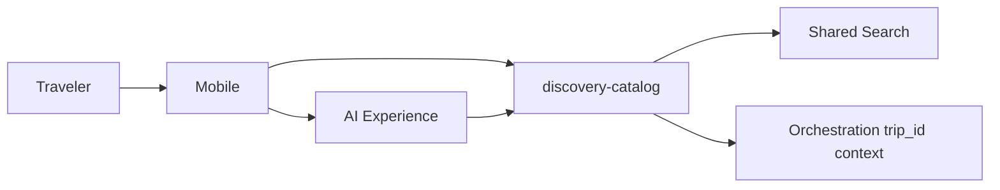
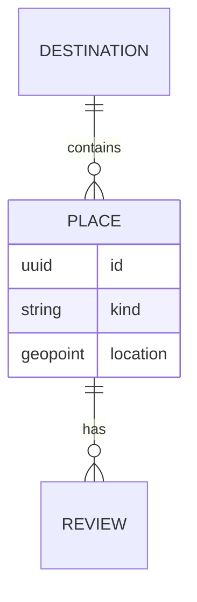

# 01 — Discovery Domain

**Bounded context:** `tourism.discovery`  
**Strategic classification:** Supporting domain (high traffic, SEO, conversion).

---

## 1. Business purpose

Help travelers **discover** Tanzania—destinations, experiences, social proof, and personalized inspiration—without owning trip execution or payments.

## 2. Responsibilities

Catalog curation, search/browse, reviews/ratings, seasonal content, event listings, restaurant/attraction metadata, AI-powered recommendations **as suggestions** (orchestration consumes).

**Out of scope:** Reservations, trip state, checkout.

## 3. Submodules

`destinations` · `parks` · `beaches` · `mountains` · `museums` · `culture` · `events` · `dining` · `attractions` · `reviews` · `ratings` · `recommendations`

## 4. Microservices

| Service | Phase-1 | Extract |
| --- | --- | --- |
| `discovery-catalog` | Client seed + CMS stub | OpenSearch index |
| `discovery-reviews` | Future | >100k reviews/mo |
| `discovery-recommendations` | AI Experience invokes | Real-time feed |

## 5–7. Domain model (summary)

**Entities:** `Destination`, `Place`, `Event`, `Review`, `Rating`, `Collection`  
**Aggregates:** `Destination` (root + localized content), `ReviewThread` (per place)  
**Value objects:** `GeoPoint`, `Locale`, `Seasonality`, `PriceBand`, `MediaRef`

## 8. Domain events

`tourism.discovery.place.viewed` · `tourism.discovery.review.submitted` · `tourism.discovery.collection.featured`

## 9. APIs

`/api/v1/tourism/inspiration/feed` · `/api/v1/tourism/places` · `/api/v1/tourism/places/{id}/reviews` (future)

## 10. Database tables

`discovery_place`, `discovery_place_i18n`, `discovery_review`, `discovery_rating_agg` (read model)

## 11. Event flows

## 12. Security

Public read for catalog; authenticated write for reviews; moderation queue for UGC.

## 13. AWS

OpenSearch, CloudFront, S3 (media), Personalize (optional)

## 14. Dependencies

Media, Search, Maps, AI Experience; consumed by Orchestration & Presentation.

## 15. Future expansion

TTB co-branding, operator CMS, UNESCO heritage trails, Kiswahili-first content graph.

---

## Diagrams

**Testing:** snapshot feeds; moderation rules; load test search.  
**Risks:** Stale content — TTL + partner webhooks.  
**Scalability:** CDN + search replica; geo-sharded indexes.
