# 02 — Travel Orchestration Domain (Authoritative Blueprint)

**Bounded context:** `tourism.orchestration`  
**Strategic classification:** **Core domain** — central intelligence of Taifa Tourism (DTOS).  
**Version:** 2.0 (enterprise architecture board)  
**Status:** **Authoritative for all travel workflows** — trip lifecycle, sagas, orchestration modules, and integration contracts.

**Governance hierarchy**

| Priority | Document | Scope |
| --- | --- | --- |
| 1 | [CANONICAL_ENTERPRISE_ARCHITECTURE.md](CANONICAL_ENTERPRISE_ARCHITECTURE.md) | Cross-domain boundaries, event registry §5, API namespaces §6, data ownership §7 |
| 2 | **This document** | Orchestration purpose, journey phases, domain model, sagas, ports, AWS target for orchestration |
| 3 | [11_EVENT_ARCHITECTURE.md](11_EVENT_ARCHITECTURE.md) · [12_API_STANDARDS.md](12_API_STANDARDS.md) | Platform envelopes, idempotency, OpenAPI |

**Anti-patterns:** Reservations, ledger entries, insurance policies, eSIM profiles, ride dispatch, or visa issuance implemented inside orchestration. **Coordinate only.**

---

## Executive summary

Taifa Tourism is an **AI-powered Digital Travel Operating System**, not a booking app. **Travel Orchestration** is the layer that turns independent national services (operators, parks, MNOs, insurers, immigration adapters, Taifa Pay) into **one seamless journey** for the traveler.

Orchestration owns the **Trip** as the continuity object: planning versions, cart composition, checkout session, activation choreography, live timeline projection, replan commands, and post-trip closure. Every other domain exposes **published APIs** and **domain events**; orchestration never performs shared-database writes outside its aggregates.

**Design references (adapted):** journey orchestration (Disney, Amazon Travel), multi-supplier cart (Booking.com), mobility coordination (Uber), GDS-style delegation (Amadeus)—scaled for **Tanzania national infrastructure** and **East Africa** expansion.

---

## Business architecture

### Business vision

The traveler should **never have to think about logistics**. Before arrival, during the trip, and after departure, the platform coordinates discovery signals, AI planning, multi-supplier booking, single payment, activation, in-trip monitoring, disruption replanning, and post-trip memory—**automatically**, with explicit consent where required (location, medical, payments).

### Business purpose (§1)

Coordinate the end-to-end **traveler journey** as a single coherent **Trip**: intent → plan → book (delegate) → pay once (delegate) → activate → monitor → replan → complete—without owning supplier inventory, money truth, policies, connectivity profiles, or dispatch state.

**National mandate:** Orchestration layer for Tanzania’s digital tourism stack; extensible to EAC partner markets via currency, government adapters, and multi-region EventBridge.

### Responsibilities (§2)

| In scope | Out of scope (delegate) |
| --- | --- |
| Trip & itinerary **version** lifecycle | Hotel/flight/seat inventory (**03 Booking**) |
| Plan interview **session** binding to trip | Destination CMS & UGC (**01 Discovery**) |
| Multi-domain **cart composition** | Payment capture & split **execution** (**07 Finance / Taifa Pay**) |
| Checkout **session**, totals metadata, fee breakdown presentation | Policy underwriting & claims (**06 Protection**) |
| **Payment coordination** (single capture command) | eSIM/MNO provisioning (**05 Connectivity**) |
| **Split plan metadata** (who gets what; Finance executes) | Rides, AVL, SafetyIncident SoR (**04 Mobility**) |
| Attach **foreign keys** to bookings, policies, esim orders | Visa/permit **issuance** (**08 Government**) |
| Replan **proposals** & user commit commands | LLM hosting & tool runtime (**09 AI Experience**) |
| Timeline **projection** & trip state machine | Push/SMS delivery (**Notifications** platform) |
| Travel Pass / QR **orchestration** (aggregate tokens from domains) | Fraud scoring execution (**Fraud** platform) |
| Saga correlation & idempotency | Loyalty ledger posting (**07 Finance**) |
| Emergency **coordination** (invoke Protection/Mobility ports) | SOS incident geometry persistence (**04 Mobility**) |

### Capability map

| Journey phase | Orchestration capabilities | Primary delegates |
| --- | --- | --- |
| **1 Dream** | Trip shell (draft), budget band, link inspire context | Discovery, AI, Government (visa hints) |
| **2 Planning** | Plan session, itinerary versions, select & lock | AI Experience |
| **3 Unified booking** | Booking coordinator, holds, attach refs | Booking, Government, Mobility |
| **4 Unified checkout** | Cart, totals, coupons metadata, pay command | Finance, Protection, Connectivity |
| **5 Trip activation** | State → ACTIVE, pass assembly, notify intents | All fulfilled domains + Notifications |
| **6 During trip** | Timeline, context engine, replan, risk signals | Booking, Mobility, AI, Protection |
| **7 Post trip** | Close trip, review prompts, history snapshot | Discovery, Finance (loyalty), Analytics |

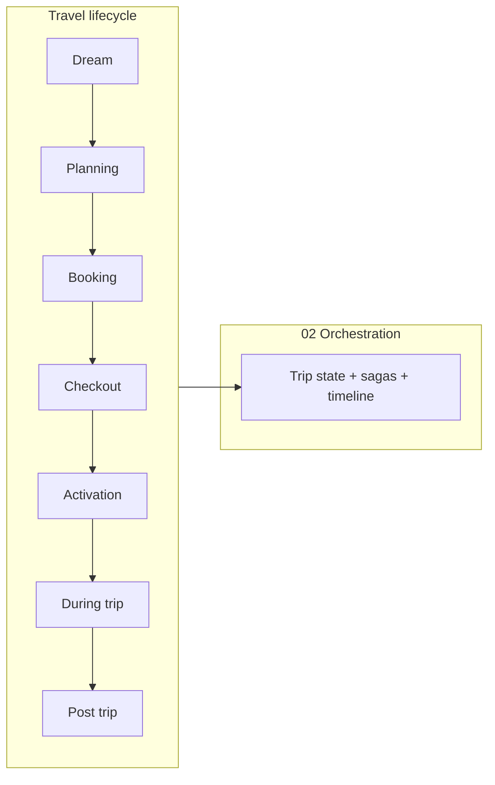

---

## Bounded context & ubiquitous language (§3–§4)

### Bounded context

- **Context name:** Travel Orchestration (`tourism.orchestration`)
- **Upstream:** Presentation (Mobile, Web, Business, Admin portals)
- **Downstream:** Booking, Finance, Mobility, Protection, Connectivity, Government, AI Experience, Discovery (read)
- **Integration:** Published REST/command APIs **outbound** via ports; **inbound** via orchestration API + EventBridge subscriptions
- **Consistency:** Strong consistency **inside** Trip / Checkout / ItineraryVersion aggregates; **eventual** for timeline and partner confirmations

### Ubiquitous language

| Term | Definition |
| --- | --- |
| **Trip** | One traveler journey from intent to completion; root aggregate. |
| **Party** | Who travels (size, ages, accessibility, purpose). |
| **Plan interview** | Structured preferences captured for AI planning (not the LLM session itself). |
| **Itinerary version** | Immutable option: days, legs, estimates, risks—one may be **selected**. |
| **Cart** | Composed set of **line intents** referencing Booking/Mobility/Protection/Connectivity SKUs. |
| **Checkout session** | Payable snapshot: lines, taxes/fees **display**, insurance/eSIM flags, state machine. |
| **Booking ref** | Foreign key to a reservation in **03 Booking** (or bridge ref). |
| **Activation** | Transition to **ACTIVE** after successful pay + fulfillment choreography started. |
| **Travel Pass** | Digital artifact (QR + token bundle) assembled from domain confirmations. |
| **Timeline** | Projected schedule of what happens next (read model). |
| **Replan** | Proposed delta to selected itinerary; commit triggers Booking amend saga. |
| **Saga** | Correlated multi-step flow (checkout, activation, replan) with compensation rules. |
| **Split plan** | Metadata describing provider shares; **execution** is Finance. |
| **Orchestration command** | Intent to change orchestration state (not a domain command in Booking). |

---

## Orchestration modules (internal logical design)

Modules are **application/domain packages** inside the bounded context—not separate microservices until extraction triggers.

| Module | Responsibility | Does not |
| --- | --- | --- |
| **AI Trip Planner (facade)** | Bind trip to AI plan requests; persist selected output as itinerary versions | Run models (→ **09 AI**) |
| **Itinerary Generator (facade)** | Version CRUD, selection, feasibility hooks | Store hotel inventory |
| **Booking Coordinator** | Reserve/hold/attach/cancel **via BookingPort** | Price engines |
| **Unified Checkout** | Build session, validate lines, present grand total | Capture money |
| **Payment Coordination** | Single `capture` command to Finance with idempotency | Ledger writes |
| **Payment Split Coordinator** | Build & attach split plan metadata post-quote | Execute splits |
| **Partner Coordinator** | Notify partners on activation (async intents) | Partner CRM |
| **Timeline Engine** | Project `tourism.timeline.updated` from events | Own booking status SoR |
| **Trip State Manager** | Trip & checkout state machines | Mobility dispatch |
| **Notification Coordinator** | Map events → notification intents (platform) | Deliver push |
| **Travel Pass Generator** | Assemble pass payload from refs + QR scope | Issue insurance |
| **Risk Manager** | Trip-level risk flags from AI + advisories (read) | Publish advisories |
| **Replanning Engine** | Disruption → proposal → commit saga | Auto-change bookings without consent |
| **Travel Context Engine** | Consent-based context (location, budget burn **view**) | Raw GPS store (minimal) |
| **Emergency Coordinator** | Escalate to **ProtectionPort** / link Mobility incident | Own SOS SoR |

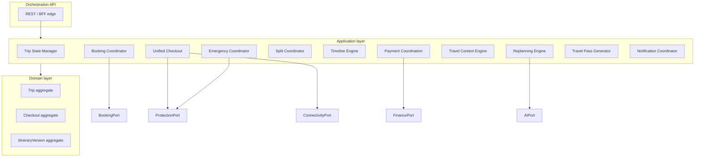

---

## Complete travel journey (orchestration design)

### Phase 1 — Dream

| Step | Orchestration | Integration |
| --- | --- | --- |
| Discover Tanzania | Optional `DRAFT` trip or anonymous inspire session link | **Discovery**: places, collections, weather widgets |
| AI recommends | Store `inspire_context_id` on trip metadata | **AI**: ranked destinations |
| Budget estimation | `BudgetBand` on trip (estimate only) | **AI** + Discovery price hints |
| Visa guidance | Checklist ref, not visa record | **Government**: eligibility API |
| Travel inspiration | Deep links to Discovery content | **Discovery** events → Analytics |

### Phase 2 — Planning

| Step | Orchestration | Integration |
| --- | --- | --- |
| AI interview | `PlanInterview` VO persisted on trip | **AI**: `plan(trip_profile)` |
| Generate itineraries | N × `ItineraryVersion` (immutable JSON) | **AI**: `ai.plan.generated` → orchestration persists |
| Content per version | Days, hotels, transport, activities, restaurants, costs, travel time, map refs, alternatives, risk summary | Maps via **Shared Maps**; risks via **Protection** advisories read |
| Select itinerary | `tourism.itinerary.selected` | **Booking**: materialize holds (async saga) |

### Phase 3 — Unified booking

On confirm itinerary, **Booking Coordinator** fans out **parallel port calls** (with circuit breakers):

Hotels, flights, buses, ferries, car rentals, guides, safari, park permits, museum tickets, restaurants, events, insurance **intent**, airport pickup, chauffeur, eSIM **intent**, FX **display**—each delegated. Orchestration stores **refs + line status** on cart/checkout only.

### Phase 4 — Unified checkout

Orchestration **calculates presentation totals**: subtotal, taxes, insurance premium line, service fees, government fees, discounts/coupons (validated via Finance/Booking ports), FX display. **One** `POST checkout/pay` → **FinancePort.capture**; Finance emits `finance.payment.captured` and `finance.split.executed`.

### Phase 5 — Trip activation

On pay success: `tourism.trip.activated`; **Travel Pass Generator**; timeline seed; async: insurance activate, eSIM provision, partner notify intents, emergency profile link (Protection), mobility legs scheduled.

### Phase 6 — During trip

**Timeline Engine** subscribes to `booking.*`, `mobility.*`, `protection.sos.opened`, weather webhooks (via Discovery/adapters). **Replanning Engine** on disruption; user accepts → amend saga; refunds via **FinancePort**.

### Phase 7 — Post trip

Trip → `COMPLETED`; trigger review prompts (**Discovery**), loyalty (**Finance**), memories (**Media** + AI), recommendations (**AI**), analytics (events only).

---

## Domain model (§5–§8)

### Aggregates (§5)

| Aggregate | Root | Consistency boundary |
| --- | --- | --- |
| **Trip** | `Trip` | Status, party, dates, selected `itinerary_version_id`, foreign refs map, plan interview snapshot |
| **ItineraryPlan** | `ItineraryVersion` | Versioned structure, estimates, risk summary (immutable after publish) |
| **Checkout** | `CheckoutSession` | Lines, flags, totals snapshot, pay state, idempotency keys |
| **OrchestrationSaga** | `SagaInstance` (technical) | Correlation id, step, compensation log (checkout / replan / activation) |

**Invariants**

- One `SELECTED` itinerary per trip at a time.
- Trip `ACTIVE` only after checkout `COMPLETED` (or approved B2B pay-later policy).
- Checkout `grand_total_minor` = sum(line quotes) + approved fees − discounts (snapshot at lock).
- At most one `OPEN` checkout per trip.
- Replan commit requires trip `ACTIVE` and user consent token.

### Entities (§6)

| Entity | Belongs to | Description |
| --- | --- | --- |
| `Trip` | Trip aggregate | Journey root |
| `ItineraryVersion` | ItineraryPlan | Planned option |
| `CheckoutSession` | Checkout | Pay session |
| `CartLine` | Checkout | Line intent + `booking_ref` / SKU ref |
| `TripBookingLink` | Trip | Junction: trip ↔ external booking id |
| `SagaInstance` | Infrastructure | Saga persistence |
| `TimelineEntry` | Read model | Projected calendar row |
| `ReplanProposal` | Trip (child) | Delta until accepted/rejected |
| `TravelPass` | Trip (child) | Issued pass metadata + QR scope |
| `SplitPlanMetadata` | Checkout | Provider shares (not ledger) |

### Value objects (§7)

`TripId`, `CheckoutId`, `ItineraryVersionId`, `PartyProfile`, `BudgetTier`, `DateRange`, `PlanInterview`, `BookingRef`, `MoneyLine`, `FeeLine`, `TaxLine`, `DiscountRef`, `IdempotencyKey`, `CorrelationId`, `ConsentToken`, `GeoConsent`, `RiskSummary`, `MapRef`, `TravelPassToken`.

### Domain services (§8)

| Service | Role |
| --- | --- |
| `CartCompositionService` | Merge port quotes into cart lines |
| `CheckoutTotalsService` | Lock presentation totals (not tax authority SoR) |
| `TripTransitionService` | Enforce state machine rules |
| `ItinerarySelectionService` | Select version, emit event |
| `SagaCompensationPolicy` | Rules for reverse steps |
| `TravelPassAssemblyService` | Collect confirmation tokens from ports |

### Application services (§9)

| Use case | Command / flow |
| --- | --- |
| `CreateTrip` | `CreateTripCommand` |
| `StartPlan` | `StartPlanCommand` → AI port |
| `SelectItinerary` | `SelectItineraryCommand` |
| `BuildCart` | `BuildCartCommand` |
| `StartCheckout` | `StartCheckoutCommand` |
| `PayCheckout` | `PayCheckoutCommand` → saga |
| `ActivateTrip` | `ActivateTripCommand` (often saga-internal) |
| `AttachBooking` | `AttachBookingCommand` |
| `RequestReplan` | `RequestReplanCommand` |
| `CommitReplan` | `CommitReplanCommand` → amend saga |
| `CompleteTrip` | `CompleteTripCommand` |
| `OpenEmergencyEscalation` | Delegates **Emergency Coordinator** → Protection (not a substitute for SOS API) |

---

## Commands & queries (§11–§12)

### Commands (mutating)

| Command | Idempotent | Notes |
| --- | --- | --- |
| `CreateTrip` | Optional key | |
| `UpdatePlanInterview` | Per trip version | |
| `SelectItinerary` | Yes | Key = trip + version |
| `BuildCart` | Yes | |
| `StartCheckout` | Yes | |
| `PayCheckout` | **Required** | Header `Idempotency-Key` |
| `CommitReplan` | **Required** | |
| `CancelTrip` | Yes | Triggers cancel saga via Booking/Finance |

### Queries (read)

| Query | Source |
| --- | --- |
| `GetTrip` | Trip aggregate |
| `ListItineraries` | Itinerary versions |
| `GetCheckout` | Checkout aggregate |
| `GetTimeline` | Timeline read model (Redis/OpenSearch/Aurora replica) |
| `GetTravelPass` | Assembled view |
| `GetTripBudgetView` | Estimate + Finance actuals (port) |

---

## Domain events (§10)

**Registry:** [CANONICAL_ENTERPRISE_ARCHITECTURE.md](CANONICAL_ENTERPRISE_ARCHITECTURE.md) §5.

### Published (`tourism.*`)

| Event | When |
| --- | --- |
| `tourism.trip.created` | Trip created |
| `tourism.trip.planned` | ≥1 itinerary version stored |
| `tourism.itinerary.selected` | User locks version |
| `tourism.cart.built` | Cart composed |
| `tourism.checkout.started` | Session open |
| `tourism.checkout.completed` | Pay + fulfillment steps OK |
| `tourism.trip.activated` | Pass/timeline live |
| `tourism.replan.proposed` | Delta offered |
| `tourism.replan.committed` | User accepted (add to registry when implemented) |
| `tourism.trip.completed` | Post-trip closure |
| `tourism.timeline.updated` | Projector |

### Subscribed (inbound)

`booking.hold.created` · `booking.reservation.confirmed` · `booking.reservation.paid` · `booking.reservation.cancelled` · `finance.payment.captured` · `finance.refund.completed` · `protection.policy.issued` · `protection.sos.opened` · `connectivity.esim.provisioned` · `mobility.leg.scheduled` · `mobility.incident.recorded` · `government.permit.issued` · `ai.plan.generated` · `ai.replan.suggested`

---

## State machines (§14)

### Trip lifecycle

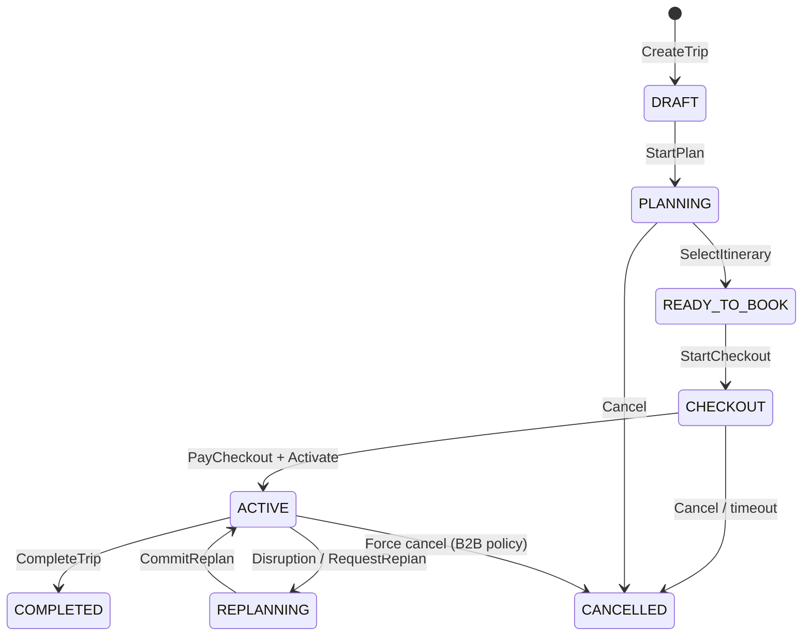

### Checkout session

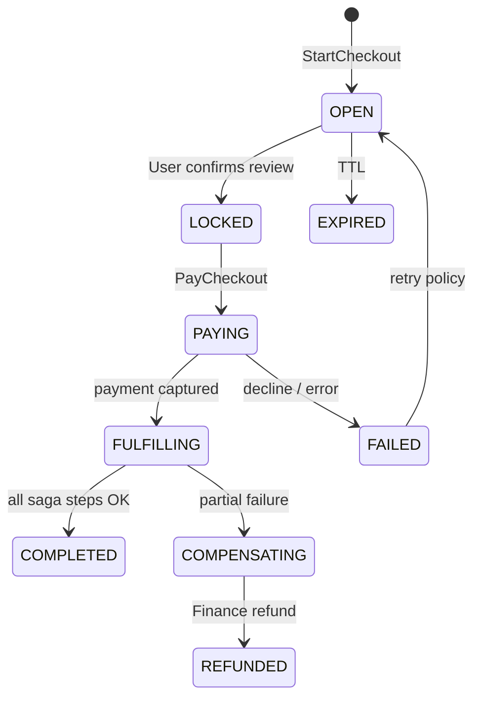

---

## Event flows (§13)

### Dream → plan

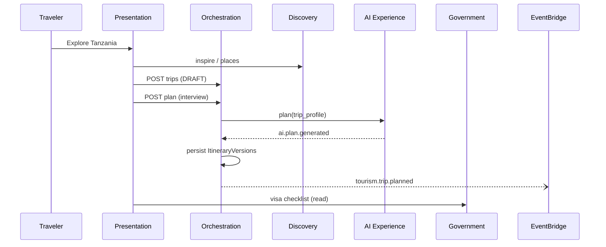

### Unified checkout saga

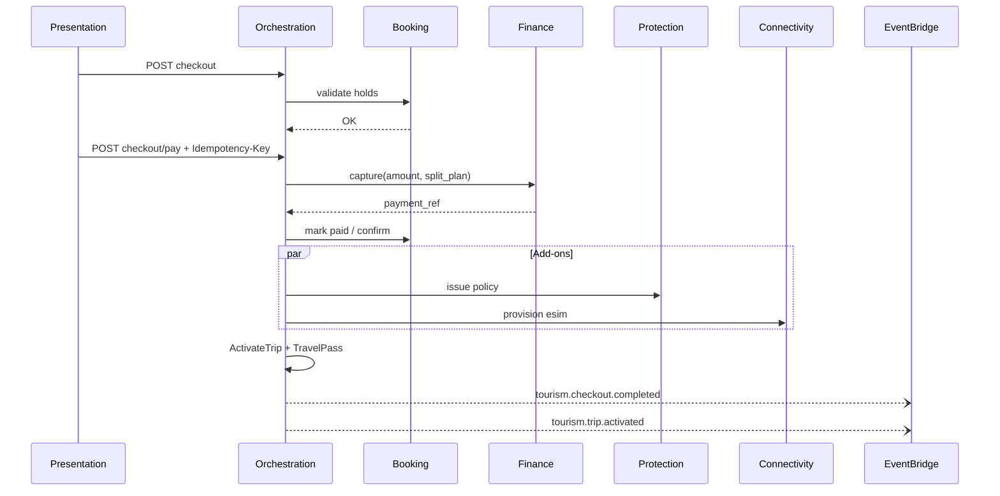

### Disruption replan

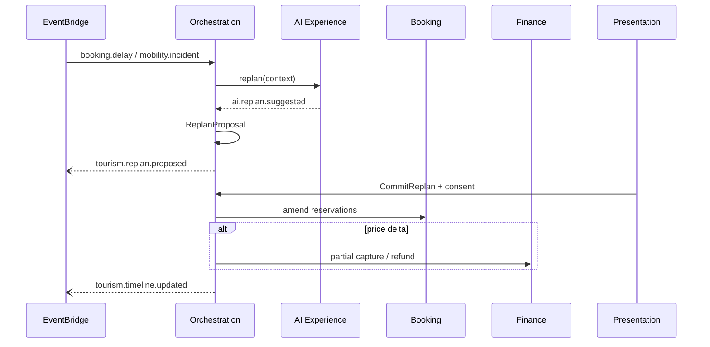

### Event flow (checkout — diagram)

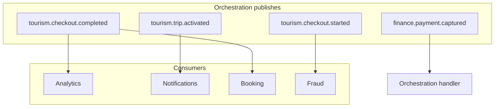

---

## APIs (§15)

**Base:** `/api/v1/tourism/` · Standards: [12_API_STANDARDS.md](12_API_STANDARDS.md)

### Trip & planning

| Method | Path | Description |
| --- | --- | --- |
| GET/POST | `/trips` | List / create |
| GET | `/trips/{id}` | Detail + refs |
| PATCH | `/trips/{id}` | Party, dates (allowed states) |
| POST | `/trips/{id}/plan` | Start / update interview → trigger AI |
| GET | `/trips/{id}/itineraries` | List versions |
| GET | `/trips/{id}/itineraries/{vid}` | Version detail |
| POST | `/trips/{id}/itineraries/{vid}/select` | Lock selection |

### Cart & checkout

| Method | Path | Description |
| --- | --- | --- |
| POST | `/trips/{id}/cart/build` | Compose cart |
| GET | `/trips/{id}/cart` | Current cart view |
| POST | `/trips/{id}/checkout` | Open session |
| GET | `/trips/{id}/checkout` | Session + totals |
| POST | `/trips/{id}/checkout/pay` | **Idempotency-Key required** |
| POST | `/trips/{id}/attach-booking` | Link existing reservation |

### Active trip

| Method | Path | Description |
| --- | --- | --- |
| GET | `/trips/{id}/timeline` | Live timeline |
| GET | `/trips/{id}/travel-pass` | Pass + QR payload |
| POST | `/trips/{id}/replan` | Request replan |
| POST | `/trips/{id}/replan/{pid}/commit` | Accept proposal |
| POST | `/trips/{id}/complete` | Post-trip close |
| GET | `/trips/{id}/budget` | Estimate vs actuals (Finance port) |

**Not on orchestration API:** `POST .../sos` → **Protection** `/tourism/protection/sos` (phase-1 alias `assist/sos`).

### Hexagonal ports (outbound)

`DiscoveryPort` · `BookingPort` · `FinancePort` · `MobilityPort` · `ProtectionPort` · `ConnectivityPort` · `GovernmentPort` · `AIPlannerPort` · `NotificationPort` · `AuditPort` · `MapsPort`

---

## Database schema (§16) & ER diagram (§17)

**Owner:** Orchestration only — tables below. No `commerce_*_booking` rows.

### Tables (logical)

| Table | Purpose |
| --- | --- |
| `tourism_trip` | Trip aggregate |
| `tourism_itinerary_version` | Immutable plans |
| `tourism_checkout` | Checkout sessions |
| `tourism_checkout_line` | Cart/checkout lines |
| `tourism_trip_booking_link` | trip ↔ booking_id |
| `tourism_saga_instance` | Saga state |
| `tourism_replan_proposal` | Replan deltas |
| `tourism_travel_pass` | Pass issuance record |
| `tourism_timeline_entry` | Optional; prefer CQRS store |
| `tourism_domain_outbox` | Outbox for EventBridge |

**ADR-0001:** `tourism_assistance_case`, `tourism_esim_order` are **not** orchestration schema—see [adr/0001](adr/0001-phase1-protection-connectivity-in-tourism-app.md).

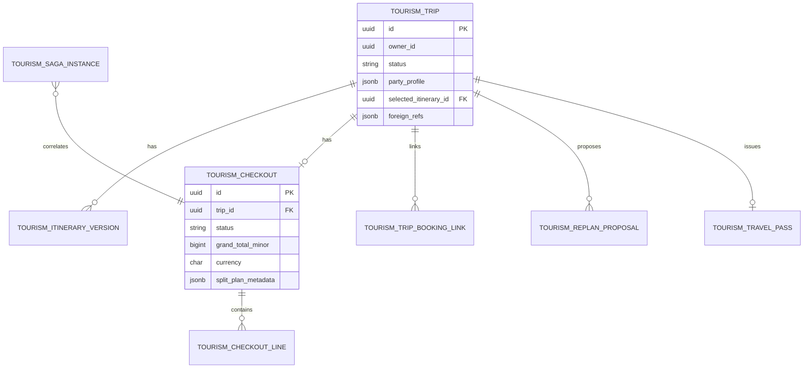

---

## Component diagram (§18)

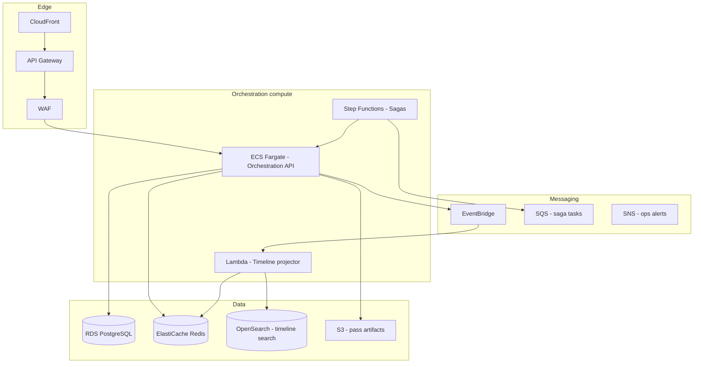

---

## Deployment diagram (§19)

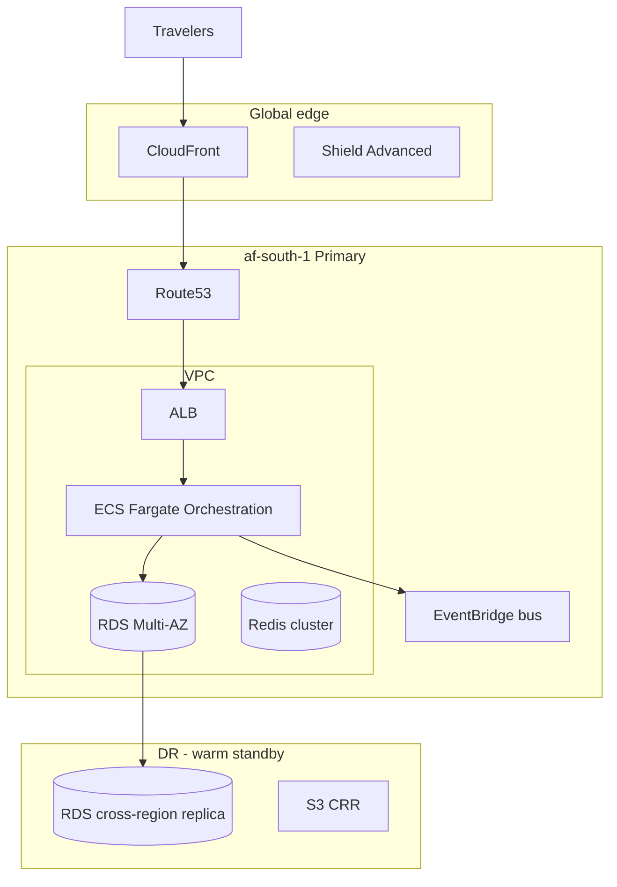

**Phase-1:** Modular monolith `apps/backend/tourism/` on single-region ECS/EC2; target topology above per [16_ROADMAP.md](16_ROADMAP.md).

---

## Event bus architecture (§21)

| Layer | Technology | Use |
| --- | --- | --- |
| Domain bus | **Amazon EventBridge** (`taifa.tourism` event bus) | Cross-domain events |
| Envelope | `event_id`, `occurred_at`, `correlation_id`, `causation_id`, `schema_version`, `payload` | [11_EVENT_ARCHITECTURE.md](11_EVENT_ARCHITECTURE.md) |
| Outbox | `tourism_domain_outbox` + CDC/Lambda | No dual write |
| Saga signals | Step Functions + SQS | Long-running checkout/activation |
| Ops fanout | SNS | DLQ alarms |

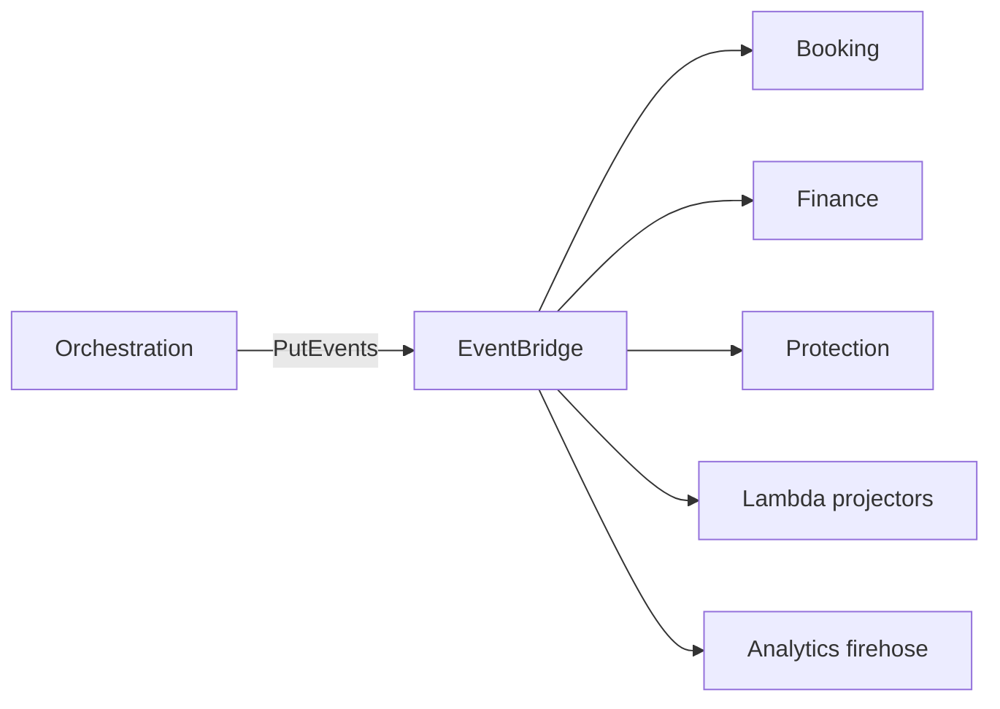

---

## Saga pattern (§22) & compensation (§23)

### Checkout saga (orchestrated)

| Step | Action | On failure |
| --- | --- | --- |
| 1 | Lock checkout | Abort |
| 2 | Validate holds (Booking) | Abort |
| 3 | Capture payment (Finance) | Abort |
| 4 | Confirm bookings paid | Compensate: refund step 3 |
| 5 | Issue insurance (Protection) | Compensate: 3–4 per policy |
| 6 | Provision eSIM (Connectivity) | Compensate: 3–4; cancel eSIM |
| 7 | Activate trip + pass | Retry idempotent |
| 8 | Publish events | Outbox retry |

### Activation saga (async choreography)

Partner notifications, mobility schedule, timeline seed—**at-least-once** consumers; orchestration marks activation complete when **minimum** criteria met (pay + core bookings confirmed).

### Replan amend saga

Amend Booking → price delta → Finance partial capture/refund → timeline update.

### Compensation transactions (§23)

| Failed after | Compensation |
| --- | --- |
| Capture only | `FinancePort.refund(full)` |
| Capture + some confirms | Partial refund + cancel unconfirmed holds |
| Policy issued | Protection cancel port (if within cooling) |
| eSIM provisioned | Connectivity revoke port |

All compensation steps carry same `correlation_id` as original saga.

---

## Failure recovery (§24) & retry (§25)

| Failure type | Strategy |
| --- | --- |
| Transient partner 5xx | Exponential backoff + jitter; max 5 attempts |
| Finance timeout | **Idempotent** replay of capture; query payment status before retry |
| Event publish fail | Outbox poller until ACK |
| Step Functions failure | SNS alert; manual replay console with idempotency |
| Split execution lag | Orchestration shows “settlement pending”; Finance event drives UI |

**Circuit breaker:** per-port failure thresholds; degrade to “save trip, pay later” only for approved B2B.

---

## Idempotency strategy (§26)

| Operation | Key scope | Store |
| --- | --- | --- |
| `PayCheckout` | Client `Idempotency-Key` + `checkout_id` | `tourism_idempotency` (TTL 24h) |
| `CommitReplan` | Key + `proposal_id` | Same |
| `SelectItinerary` | Key + `version_id` | Same |
| Saga steps | `correlation_id` + step name | `tourism_saga_instance` |

Duplicate requests return **same** HTTP response body (200) without double capture.

---

## Security model (§27)

| Control | Implementation |
| --- | --- |
| Authentication | Taifa Identity — bearer + device binding |
| Authorization | ABAC: `trip.owner_id == subject`; roles for B2B agents |
| Step-up | High-value checkout → NIDA/biometric via Identity |
| Transport | TLS 1.2+; mTLS partner webhooks |
| WAF | OWASP rules on API Gateway |
| PII minimization | Trip stores party summary; passport in Government vault |
| Consent | Location sharing explicit `ConsentToken` on context engine |
| KMS | RDS encryption, S3 pass artifacts, Secrets Manager partner keys |

---

## Audit logging (§28)

Every command mutating Trip/Checkout: `actor`, `trip_id`, `command`, `before_hash`, `after_hash`, `correlation_id` → **Taifa Audit Logs** (immutable). Checkout pay and replan commit are **regulator-grade** retention (7+ years metadata; no card PAN).

---

## Monitoring (§29) & metrics (§30)

| Metric | Target (SLO) |
| --- | --- |
| `orchestration.api.latency.p99` | &lt; 500 ms read; &lt; 2 s command |
| `checkout.saga.success_rate` | &gt; 99.5% |
| `checkout.saga.duration.p95` | &lt; 30 s |
| `idempotency.duplicate_rate` | monitored |
| `timeline.projector.lag` | &lt; 5 s |
| `partner.port.error_rate` | per adapter dashboards |

**Tools:** CloudWatch metrics/alarms, X-Ray traces (API → ports), CloudTrail API audit, synthetic canaries (plan → checkout dry-run).

---

## AWS architecture (§31)

| Concern | AWS service |
| --- | --- |
| Public API | API Gateway + WAF + Shield |
| Compute | ECS Fargate (API), Lambda (projectors) |
| Orchestration runtime | Step Functions (sagas) |
| Events | EventBridge |
| Queues | SQS (work queues, DLQ) |
| Fanout | SNS (ops) |
| OLTP | RDS PostgreSQL Multi-AZ |
| Cache | ElastiCache Redis |
| Timeline search | OpenSearch |
| Objects | S3 (pass PDFs, exports) |
| CDN | CloudFront |
| DNS | Route 53 |
| Secrets | Secrets Manager |
| Crypto | KMS |
| Observability | CloudWatch, X-Ray, CloudTrail |
| Backup | AWS Backup (RDS, S3) |

---

## Scalability (§32)

| Dimension | Strategy |
| --- | --- |
| Read-heavy timeline | CQRS + Redis + OpenSearch; autoscale projector Lambdas |
| API | Horizontal Fargate tasks; ALB |
| Checkout | Queue-backed saga workers; limit in-flight per trip |
| Data | Partition trips by `owner_id` hash at 10M+ MAU; read replicas |
| Events | EventBridge scale; avoid hot single detail type where possible |
| Multi-country | Per-market government/MNO adapters; single orchestration schema with `market_code` |

**Target:** Millions of concurrent **sessions**; peak checkout TPS bounded by Finance and Booking SLOs—orchestration scales horizontally and sheds load via caching and async activation.

---

## Disaster recovery (§33) & backup (§34)

| RPO / RTO | Target |
| --- | --- |
| Trip/checkout OLTP | RPO 5 min, RTO 1 h (Multi-AZ failover) |
| Event bus | EventBridge multi-AZ inherent; replay from outbox |
| Regional loss | Warm standby region; Route53 health failover; promote read replica |

**AWS Backup:** daily RDS snapshots; S3 versioning + CRR for pass artifacts; quarterly restore drills.

---

## Performance requirements (§35)

| Scenario | Requirement |
| --- | --- |
| Trip detail read | p99 &lt; 300 ms (cached) |
| Plan trigger (async) | ACK &lt; 1 s; complete via push/poll |
| Cart build | p95 &lt; 3 s (parallel port calls) |
| Checkout pay | End-to-end saga p95 &lt; 30 s |
| Timeline update after event | &lt; 5 s visible to user |
| Availability | 99.95% orchestration API (excluding planned maintenance) |

---

## Integrations (no shared DB writes)

| Domain | Orchestration → | Style | Domain → Orchestration |
| --- | --- | --- | --- |
| **01 Discovery** | Place IDs, inspire refs | Sync API read | Events (analytics only) |
| **03 Booking** | Reserve, confirm, cancel, attach | Sync API + saga | `booking.reservation.*`, `booking.hold.created` |
| **07 Finance** | Capture, refund, split plan submit | Sync API | `finance.payment.captured`, `finance.refund.completed`, `finance.split.executed` |
| **04 Mobility** | Schedule pickup, trip bridge | Sync API | `mobility.leg.scheduled`, `mobility.incident.recorded` |
| **06 Protection** | Quote/issue policy, SOS **invocation** | Sync API | `protection.policy.issued`, `protection.sos.opened` |
| **05 Connectivity** | Quote/provision eSIM | Sync API | `connectivity.esim.*` |
| **08 Government** | Visa/permit checklist & application ref | Sync API | `government.permit.issued` |
| **09 AI Experience** | Plan, replan, concierge tools | Sync API | `ai.plan.generated`, `ai.replan.suggested` |
| **Shared Taifa** | Identity, Pay, Notifications, Maps, Fraud, Audit, Analytics | Platform SDKs | Platform events |

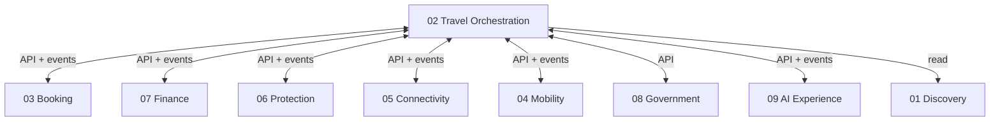

---

## Implementation roadmap

| Phase | Orchestration deliverable |
| --- | --- |
| **P0 (now)** | Trip, plan, itinerary select, cart, checkout saga, attach booking; monolith `tourism` |
| **P1** | Outbox → EventBridge; timeline projector; travel pass |
| **P2** | Step Functions checkout; OpenSearch timeline; replan saga |
| **P3** | Extract `orchestration-trip` service; multi-region DR |
| **P4** | East Africa `market_code`; B2B convoy trips |

Align with [16_ROADMAP.md](16_ROADMAP.md) and [17_IMPLEMENTATION_GUIDE.md](17_IMPLEMENTATION_GUIDE.md). **Gate:** [CANONICAL_ENTERPRISE_ARCHITECTURE.md](CANONICAL_ENTERPRISE_ARCHITECTURE.md) §12.

---

## Testing strategy

| Level | Focus |
| --- | --- |
| Unit | Aggregate invariants, totals, state transitions |
| Integration | Adapters + Postgres; mock ports |
| Contract | Pact: Orchestration ↔ Booking, Finance |
| Saga | Step Functions local + failure injection |
| Load | Cart build fanout; checkout soak |
| E2E | Device → plan → pay → activated timeline |
| Chaos | Subscriber down; verify outbox replay |

---

## Future roadmap

- Multi-trip portfolios (corporate, schools, pilgrimage convoys)
- Shared real-time timeline (guide + traveler)
- Offline trip shell sync with CRDT merge on reconnect
- National open data feeds into Risk Manager
- Cross-border East Africa single checkout metadata, multi-currency display

---

## Decision records (ADR)

| ADR | Relevance |
| --- | --- |
| [0001](adr/0001-phase1-protection-connectivity-in-tourism-app.md) | Phase-1 tables in `taifa_tourism`; orchestration must not absorb 05/06 logic |
| Future | B2B pay-later without capture; multi-active region |

---

## Technical risks

| Risk | Impact | Mitigation |
| --- | --- | --- |
| God-service orchestration | Boundary erosion | Ports only; architecture reviews; §2 out-of-scope table |
| Checkout partial failure | Money/booking mismatch | Saga + compensation; idempotency |
| AI hallucinated inventory | Wrong cart | Ground all lines on Booking quotes |
| Timeline lag | Poor in-trip UX | CQRS SLO; push on `timeline.updated` |
| Partner adapter outage | Blocked activation | Async activation; visible pending states |
| Event schema drift | Broken consumers | Canonical §5 + registry CI |

---

## Recommendations

1. **Treat this document as the workflow constitution**—every tourism PRD cites a journey phase and orchestration use case.
2. **Implement checkout first on Step Functions** once outbox is live; until then, in-process saga with same state names as §14.
3. **Never add booking or payment tables** to orchestration schema; use links and events only.
4. **Move SOS and eSIM HTTP** to Protection/Connectivity namespaces per canonical §6 while keeping orchestration as saga caller only.
5. **Register `tourism.replan.committed` and `tourism.trip.completed`** in canonical §5 when shipped.
6. **Run quarterly** saga game days (capture succeed / booking fail / refund path).

---

## Document maintenance

| Change | Update |
| --- | --- |
| New orchestration command/API | This doc §15 + canonical §6 |
| New `tourism.*` event | This doc §10 + canonical §5 + `11_EVENT_ARCHITECTURE.md` |
| New table | This doc §16 + canonical §7 + ADR if exception |
| Boundary dispute | Canonical wins; escalate to architecture board |

**Single source of truth:** For **how travel workflows run**, this document. For **who owns money, bookings, and safety records**, [CANONICAL_ENTERPRISE_ARCHITECTURE.md](CANONICAL_ENTERPRISE_ARCHITECTURE.md).

---

## Target package structure (reference — not implementation)

```
tourism-orchestration/
  domain/              # aggregates, VOs, domain events, domain services
  application/         # commands, handlers, saga orchestration
  ports/               # inbound/outbound interfaces
  adapters/
    in/http/           # REST
    in/events/         # EventBridge handlers
    out/booking/       # BookingPort HTTP
    out/finance/       # FinancePort
    out/...            # other ports
  infrastructure/      # RDS repos, outbox, idempotency store
```

**Phase-1 monorepo mapping:** `apps/backend/tourism/` — orchestration aggregates only; see [17_IMPLEMENTATION_GUIDE.md](17_IMPLEMENTATION_GUIDE.md).
