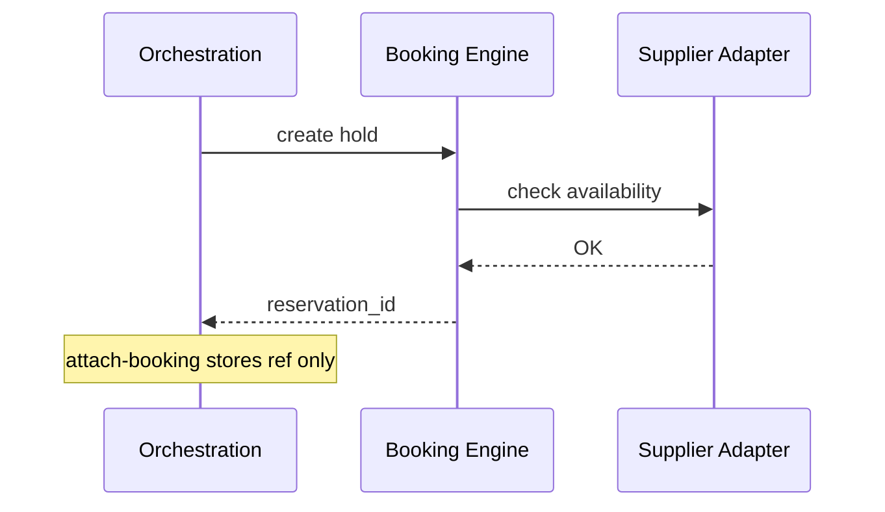

# 03 — Booking Domain

**Bounded context:** `tourism.booking`  
**Strategic classification:** Core domain (supplier truth for reservations).

---

## 1. Business purpose

Own **reservation lifecycle**: availability, pricing, holds, confirmations, amendments, cancellations—for all bookable inventory types.

## 2. Responsibilities

Hotels, flights, buses, ferries, car rental, tour packages, restaurants, safari packages, park permits, tickets; **booking engine** rules; **no** trip orchestration or payment ledger.

## 3. Submodules

Per vertical adapter + shared `reservation-core`, `availability`, `pricing`, `inventory`

## 4. Microservices

| Service | Inventory |
| --- | --- |
| `booking-hotel` | Stays |
| `booking-flight` | Flights |
| `booking-ground` | Bus, ferry |
| `booking-tour` | Tours, safari, permits |
| `booking-dining` | Restaurants |
| `booking-engine` | Shared state machine |

**Phase-1:** `apps/backend/commerce/` (`tour-bookings`, `stay-bookings`, `flight-bookings`, …)

## 5–7. Domain model

**Entities:** `Reservation`, `Hold`, `FareQuote`, `InventorySlot`  
**Aggregates:** `Reservation` (status: draft → confirmed → paid → cancelled)  
**Value objects:** `ConfirmationCode`, `GuestCount`, `StayDates`, `PNR`, `SupplierRef`

## 8. Domain events

`booking.hold.created` · `booking.confirmed` · `booking.paid` · `booking.cancelled` · `booking.amended`

## 9. APIs

`/api/v1/commerce/*-bookings` · future `/api/v1/tourism/booking/...` facade

## 10. Database tables

`commerce_tour_booking`, `commerce_stay_booking`, `commerce_flight_booking`, … (owned here)

## 11. Event flows

## 12. Security

Owner-scoped reservations; partners use mTLS + scoped API keys; no client `status=paid`.

## 13. AWS

Aurora, ElastiCache (availability), SQS (supplier sync)

## 14. Dependencies

Finance (pay webhooks), Orchestration (refs), Discovery (catalog IDs)

## 15. Future expansion

Channel manager, GDS, park authority real-time quotas, dynamic packaging.

**Testing:** property-based pricing; supplier contract tests.  
**Risks:** Overbooking — pessimistic locking + waitlist saga.
