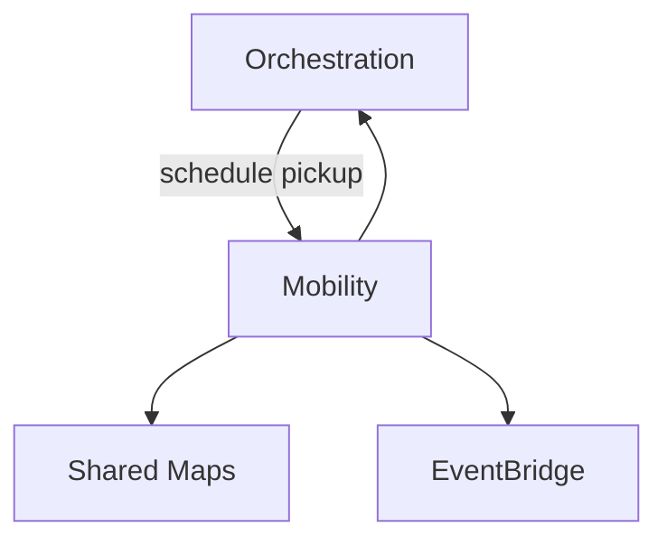

# 04 — Mobility Domain

**Bounded context:** `tourism.mobility` (facade over national `trips` mobility)  
**Strategic classification:** Generic subdomain — **reuse Taifa Mobility**, do not fork dispatch.

---

## 1. Business purpose

Move travelers across legs: airport pickup, ride-hailing, chauffeur, rentals, boats, navigation, GPS, trip progress.

## 2. Responsibilities

Scheduled/pickup rides linked to `trip_id`, deep links with itinerary context, multi-day chauffeur contracts, progress signals—not tourism checkout (Orchestration).

## 3. Submodules

`airport-pickup` · `ride-hail` · `chauffeur` · `rental` · `boat` · `navigation` · `tracking` · `progress`

## 4. Microservices

Reuse: `trips` transit, national mobility, AVL. Tourism-specific: `mobility-trip-bridge` (maps `trip_id` ↔ mobility trip).

## 5–7. Domain model

**Entities:** `MobilityLeg`, `TripContract`, `VehicleAssignment`  
**Aggregates:** `MobilityTripContract` (chauffeur multi-day)  
**Value objects:** `Stop`, `ETA`, `RoutePolyline`, `TripProgress`

## 8. Domain events

`mobility.leg.scheduled` · `mobility.pickup.completed` · `mobility.trip.progress` · integrates `trips` safety events

## 9. APIs

Deep link `/mobility?trip_id=` · `/api/v1/trips/...` (existing) · future `tourism/mobility/legs`

## 10. Database tables

Owned by `trips` app; tourism stores only foreign keys on Orchestration trip graph.

## 11. Event flows

## 12–15. Security / AWS / Dependencies / Future

Identity + driver RBAC; ECS + location streams; depends on Maps, Notifications; EAC cross-border routes.

**Risks:** Duplicating dispatch — **mandate reuse** of `apps/backend/trips`.
