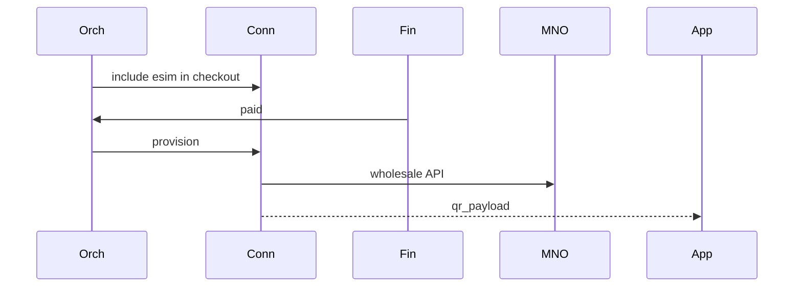

# 05 — Connectivity Domain

**Bounded context:** `tourism.connectivity`  
**Strategic classification:** Supporting domain (MNO partnerships).

---

## 1. Business purpose

Telecom for travelers: eSIM, bundles, activation, operator integrations, roaming status, QR install flows.

## 2. Responsibilities

Quote/provision eSIM SKUs, SM-DP+ payloads, partner adapters (Vodacom, Airtel, Halotel, TTCL), status—not trip planning.

## 3. Submodules

`esim` · `activation` · `bundles` · `mno-vodacom` · `mno-airtel` · `mno-halotel` · `mno-ttcl` · `roaming` · `status` · `qr`

## 4. Microservices

`connectivity-catalog` · `connectivity-provision` · `connectivity-mno-adapter-*`

**Phase-1:** `tourism` connectivity routes + `TourismEsimOrder`

## 5–7. Domain model

**Entities:** `ConnectivityOrder`, `EsimProfile`, `BundleSku`  
**Aggregates:** `ConnectivityOrder` (pending → provisioned → active)  
**Value objects:** `Iccid`, `QrPayload`, `DataAllowance`, `ValidityDays`

## 8. Domain events

`connectivity.esim.quoted` · `connectivity.esim.provisioned` · `connectivity.esim.activated` · `connectivity.roaming.status`

## 9. APIs

`GET connectivity/esim/plans` · `POST connectivity/esim/quote` · `GET connectivity/esim/{id}/qr`

## 10. Database tables

`tourism_esim_order` (phase-1); future `connectivity_profile`, `mno_webhook_inbox`

## 11. Event flows

## 12–15.

TCRA compliance; Secrets Manager; Orchestration + Finance; regional MNO expansion.

**Risks:** Manual fallback USSD; provision retries with idempotency.
