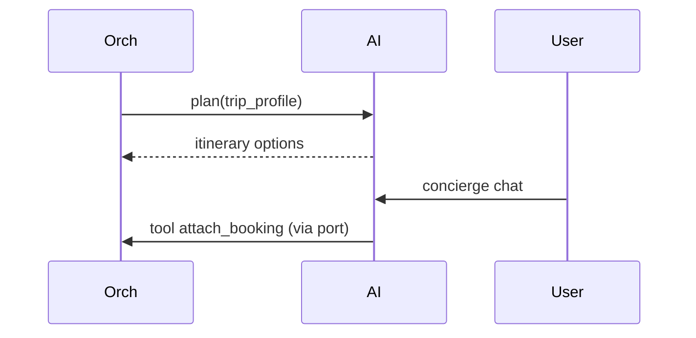

# 09 — AI Experience Domain

**Bounded context:** `tourism.ai`  
**Strategic classification:** Supporting (differentiator).

---

## 1. Business purpose

Intelligent UX: concierge, voice, translation, OCR, recommendations, trip advisor persona, memory, smart notifications.

## 2. Responsibilities

**Inference and tooling**—not owning trip or booking state. Orchestration invokes planners; Discovery consumes ranking.

## 3. Submodules

`concierge` · `voice` · `translation` · `ocr` · `recommendations` · `trip-advisor` · `memory` · `expense-assistant` · `smart-notify`

## 4. Microservices

`ai-concierge` · `ai-planner` · `ai-translate` — platform: `ecosystem/ai`, `taifa_ai_os`

## 5–7. Domain model

**Entities:** `ConciergeSession`, `TranslationRequest`, `RecommendationBatch`  
**Aggregates:** `ConciergeSession` (messages + tool calls)  
**Value objects:** `PromptContext`, `TripGraphSnapshot`, `Locale`

## 8. Domain events

`ai.plan.generated` · `ai.replan.suggested` · `ai.translation.completed`

## 9. APIs

`POST tourism/ai/concierge` (future) · `POST tourism/ai/translate` · invoke via `ecosystem/ai/{capability}`

**Not in this domain:** emergency SOS and nearby facilities → **06 Protection** (`/tourism/protection/`; phase-1 `tourism/assist/*`). Do not use `POST tourism/assist` for AI.

## 10. Database tables

Session store (Redis/Dynamo); no booking rows.

## 11. Event flows

## 12–15.

Prompt injection guards; Bedrock/SageMaker; Orchestration + Discovery; multilingual East Africa.

**Risks:** Hallucinated prices — always ground on Booking quotes.
