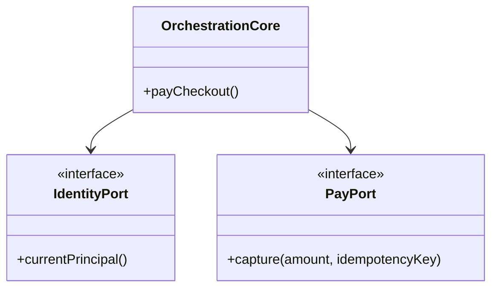

# 10 — Shared Taifa Services (Platform Layer)

Tourism domains **must not reimplement** these capabilities—only consume via ports/adapters.

---

## Service catalog

| Service | Tourism usage | Integration pattern |
| --- | --- | --- |
| **Taifa Identity** | Device + OIDC; owner principal on all aggregates | JWT / session middleware `IsDevice` |
| **Taifa Pay** | Single money truth; `capture_merchant_payment` | Finance domain facade |
| **Taifa AI** | Plan, concierge, translate | HTTP invoke + tool contracts |
| **Notifications** | Trip milestones, SOS ack, replan | SNS + push; event-driven |
| **Analytics** | Funnel, attach rates | EventBridge → warehouse |
| **Search** | Discovery places, experiences | OpenSearch index |
| **Maps** | Mobility, nearby help | Shared geo SDK |
| **Media** | Destination assets, certs | S3 + CloudFront signed URLs |
| **Fraud Detection** | Checkout velocity, device graph | Pre-capture scoring |
| **Audit Logs** | Immutable compliance trail | Append-only store |

---

## Hexagonal ports (example)

---

## Dependency rules

1. Business domains → Shared services (OK).  
2. Shared services → Business domains (forbidden).  
3. Business domain A → Business domain B: **API or events only**, never shared tables.

---

## Phase-1 monorepo mapping

| Platform | Repo path |
| --- | --- |
| Identity / device auth | `payments/auth`, device register |
| Pay / ledger | `enterprise`, `payments` |
| AI | `ecosystem`, `taifa_ai_os` |
| Mobility maps/AVL | `trips` |
| Commerce bookings | `commerce` (Booking domain) |

---

## Testing

Contract tests per port; sandbox merchants for Pay; mock identity in unit tests.

## Risks

Platform drift — versioned SDK for tourism adapters.
