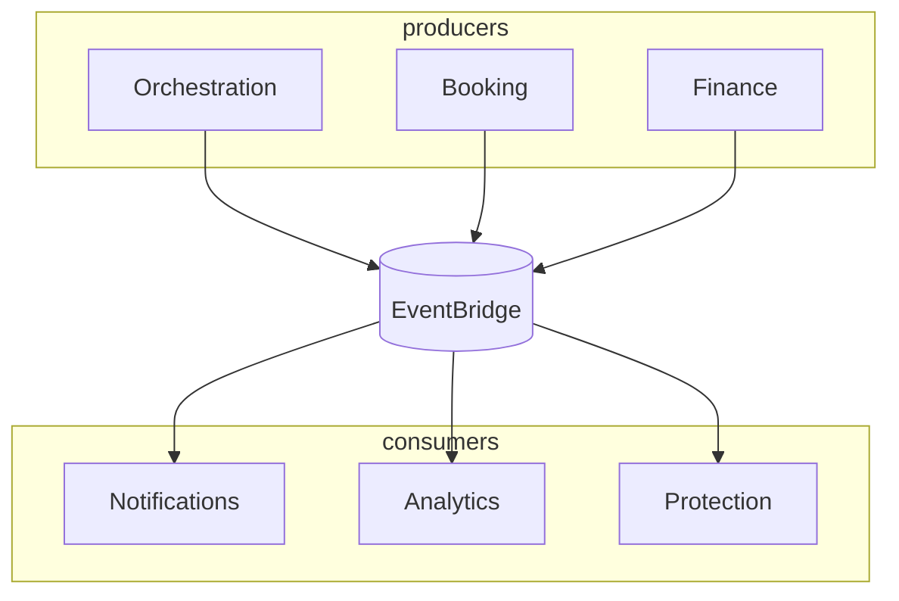

# 11 — Event Architecture

> **Governance:** Authoritative event **names and catalog** — [`../../architecture/02_EVENT_CATALOG.md`](../../architecture/02_EVENT_CATALOG.md). This document covers Tourism **envelope, outbox, sagas, and choreography** only.

**Bus:** Amazon EventBridge (default) · **Topics:** `taifa.tourism` · **Schema registry:** EventBridge Schema / Glue

---

## Design principles

- **Past tense** event names: `tourism.trip.created`  
- **Envelope:** `event_id`, `occurred_at`, `correlation_id`, `causation_id`, `schema_version`, `payload`  
- **Ownership:** publishing domain owns schema; consumers are idempotent  
- **No dual write:** outbox pattern in same DB transaction as aggregate save

---

## Global event catalog (excerpt)

**Authoritative registry:** [CANONICAL_ENTERPRISE_ARCHITECTURE.md](CANONICAL_ENTERPRISE_ARCHITECTURE.md) §5. Use full names below; deprecated aliases are listed there.

| Event | Publisher | Subscribers |
| --- | --- | --- |
| `tourism.trip.created` | Orchestration | Analytics, AI |
| `tourism.checkout.completed` | Orchestration | Booking, Protection, Connectivity, Finance |
| `booking.reservation.confirmed` | Booking | Orchestration |
| `booking.reservation.paid` | Booking | Orchestration, Analytics |
| `finance.payment.captured` | Finance | Orchestration, Booking, Fraud |
| `protection.sos.opened` | Protection | Orchestration, Mobility, Notifications, Ops |
| `mobility.incident.recorded` | Mobility | Protection, Ops |
| `connectivity.esim.provisioned` | Connectivity | Notifications |
| `ai.plan.generated` | AI Experience | Orchestration |

---

## Choreography vs orchestration

| Pattern | Use |
| --- | --- |
| **Orchestration (saga)** | Unified checkout, replan with compensation |
| **Choreography** | Analytics, search index updates, notifications |

---

## Outbox implementation (phase-1)

1. `domain_events` table in publisher DB.  
2. Lambda/CDC polls → EventBridge `PutEvents`.  
3. DLQ + replay tooling.

---

## Saga: checkout (reference)

See [02_TRAVEL_ORCHESTRATION_DOMAIN.md](02_TRAVEL_ORCHESTRATION_DOMAIN.md) §11.

**Compensation:** refund via Finance on partial failure after capture.

---

## Security

IAM per publisher; event payloads minimize PII; encrypted in transit (TLS).

## Testing

Contract tests (schema); replay harness; chaos on subscriber failure.

## Risks

Event schema sprawl — registry + deprecation policy in [12_API_STANDARDS.md](12_API_STANDARDS.md).
