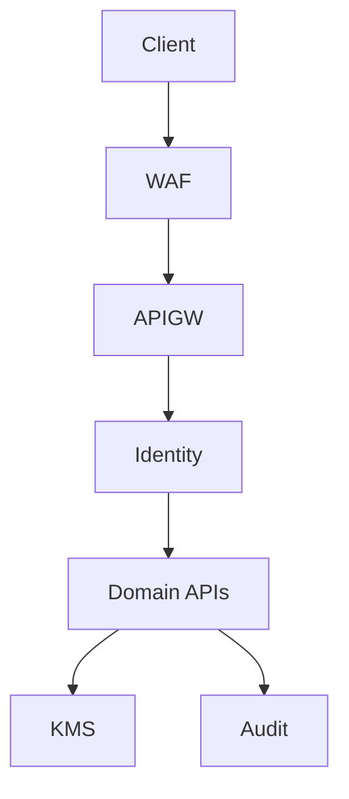

# 14 — Security Architecture

> **Governance:** Platform security law — [`../../architecture/05_SECURITY_STANDARDS.md`](../../architecture/05_SECURITY_STANDARDS.md). Below: Tourism-specific threats and controls.

**Model:** Zero trust · defense in depth · least privilege

---

## Identity & access

| Actor | Mechanism |
| --- | --- |
| Traveler | Device registration → bearer token |
| Partner | Cognito + mTLS + RBAC (`tourism-partner-admin`) |
| Ops | MFA mandatory, `tourism-ops` |
| Government adapter | Service account, IP allowlist |

---

## Data classification

| Class | Examples | Controls |
| --- | --- | --- |
| Public | Destination copy | CDN |
| Internal | Itinerary drafts | AuthZ owner |
| Confidential | Passport refs | Vault, masked UI |
| Restricted | Payment PAN | Never stored—tokens only |

---

## Domain-specific controls

- **Orchestration:** idempotent pay; no client-forged `payment_ref`  
- **Booking:** server-side status transitions  
- **Protection:** SOS rate limits; location consent  
- **Connectivity:** activation codes single-use display  
- **AI:** prompt injection filtering; no PII in logs

---

## Threat model (STRIDE summary)

| Threat | Mitigation |
| --- | --- |
| Spoofing | Identity service, signed webhooks |
| Tampering | Audit logs, HMAC |
| Repudiation | Immutable audit |
| Info disclosure | RLS by owner, encryption |
| DoS | WAF, rate limits |
| Elevation | RBAC, no admin in mobile tokens |

---

## Compliance

TIRA (insurance), TCRA (telecom), personal data protection (Tanzania)—jurisdiction-specific retention in Protection/Government docs.

## Testing

OWASP API top 10 scans; pen test before national launch; RLS integration tests.
