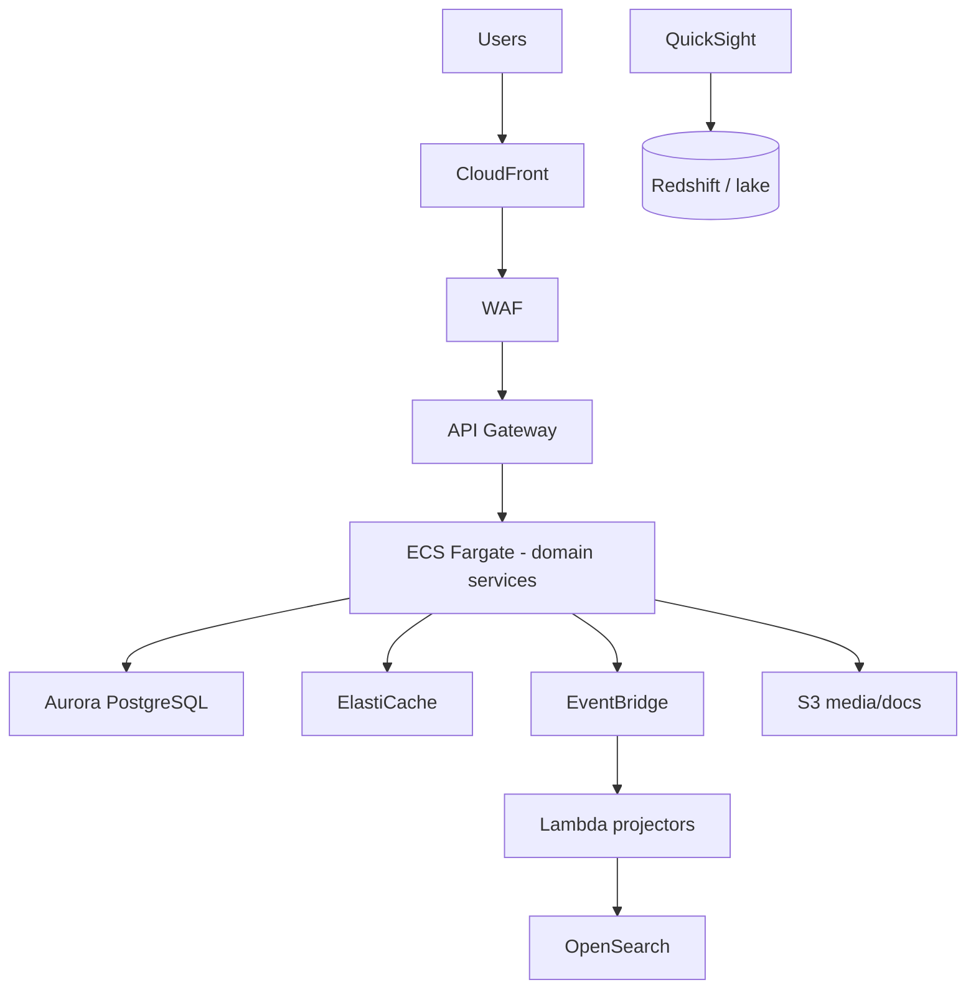

# 15 — AWS Deployment (Well-Architected)

Target regional deployment: **af-south-1** (Cape Town) or **eu-west-1** with Tanzania edge—finalize with latency study.

---

## Pillar mapping

| Pillar | Tourism choices |
| --- | --- |
| **Operational excellence** | IaC (Terraform), runbooks, CloudWatch dashboards per domain |
| **Security** | WAF, Shield, KMS, Secrets Manager, GuardDuty |
| **Reliability** | Multi-AZ Aurora, SQS DLQ, Step Functions sagas |
| **Performance** | CloudFront, ElastiCache, read replicas |
| **Cost** | Fargate autoscaling, S3 lifecycle, Graviton where supported |
| **Sustainability** | Right-size tasks, schedule non-prod |

---

## Reference topology

---

## Environment strategy

`dev` · `staging` · `prod` (+ `pilot` for TTB); separate accounts via AWS Organizations.

---

## Observability

OpenTelemetry → X-Ray; SLOs: checkout p99 < 3s, SOS ingest < 1s.

## DR

RTO 4h / RPO 15m prod (tunable); game days quarterly.

## Phase-1

Single ECS service (Django monolith) with **logical domain packages**—extract Fargate services per [16_ROADMAP.md](16_ROADMAP.md) triggers.
