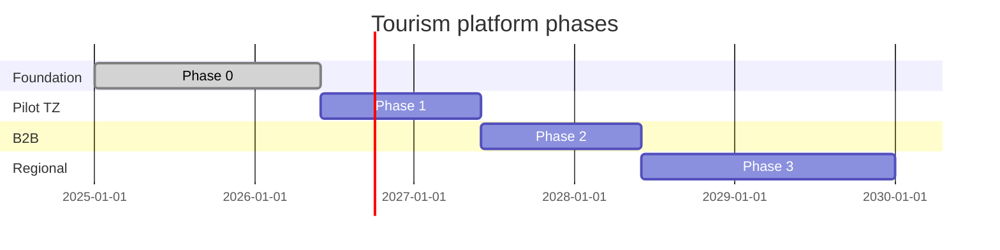

# 16 — Roadmap (National → East Africa)

Phases align domains to production maturity—not feature dumps.

---

## Phase 0 — Foundation (current)

| Domain | Deliverable |
| --- | --- |
| Orchestration | Trip, plan, cart, checkout, pay, attach booking |
| Booking | tour/stay/flight commerce APIs |
| Protection | Insurance attach, SOS, nearby |
| Connectivity | eSIM MVP catalog + QR |
| Presentation | Mobile tourism module |
| Platform | Identity, Pay, device auth |

**Exit criteria:** End-to-end trip + pay on staging; architecture docs 00–17 approved.

---

## Phase 1 — National pilot (TZ)

| Domain | Deliverable |
| --- | --- |
| Discovery | CMS + inspiration API, OpenSearch |
| Orchestration | Timeline read model, EventBridge outbox |
| Booking | Park permits adapter (TANAPA), dining holds |
| Mobility | Airport pickup `trip_id` bridge |
| Government | Visa checklist adapter |
| AI Experience | Production planner via Taifa AI |
| Finance | Split metadata → settlement worker |

---

## Phase 2 — Operator & B2B

Business Portal, partner webhooks, white-label packages, group billing, guide marketplace (Discovery + Booking).

---

## Phase 3 — East Africa expansion

Multi-country discovery graph, FX orchestration, regional MNO connectivity, cross-border mobility corridors.

---

## Phase 4 — Extract microservices

Triggers: team size > 2 per domain, independent deploy cadence, SLO conflict.

Priority extraction order:

1. Orchestration checkout saga (Step Functions)  
2. Booking engine  
3. Connectivity MNO adapters  
4. Discovery search  

---

## KPIs

Attach rate insurance/eSIM, checkout conversion, SOS ack time, operator NPS, GMV per trip.

## Risks

Premature microservices — stay modular monolith until Phase 4 triggers met.
