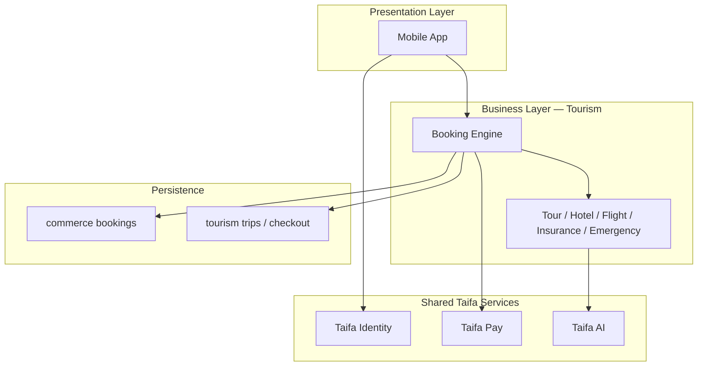

# Taifa Tourism — Four-layer summary (companion)

> **Governance:** **[CANONICAL_ENTERPRISE_ARCHITECTURE.md](CANONICAL_ENTERPRISE_ARCHITECTURE.md)** is authoritative for boundaries. This page is a quick layer ↔ repo map; see [00_INDEX.md](00_INDEX.md) for navigation.

**Canonical enterprise pack:** [00_INDEX.md](00_INDEX.md) — nine DDD bounded contexts, events, AWS Well-Architected.

```
                    TAIFA TOURISM

                          │
──────────────────────────────────────────────────

Presentation Layer

• Mobile App
• Web Portal
• Business Portal
• Admin Portal

──────────────────────────────────────────────────

Business Layer

• Destination Service
• Booking Engine
• Hotel Service
• Flight Service
• Bus Service
• Ferry Service
• Car Rental Service
• Tour Package Service
• Insurance Service
• Visa Service
• Currency Service
• Emergency Service
• Review Service
• AI Recommendation Service

──────────────────────────────────────────────────

Shared Taifa Services

• Taifa Identity
• Taifa Pay
• Taifa AI
• Notifications
• Analytics
• Search
• Maps
• Media
• Fraud Detection
• Audit Logs

──────────────────────────────────────────────────

Infrastructure

AWS
```

---

## Layer responsibilities

| Layer | Role |
| --- | --- |
| **Presentation** | Traveler, partner, and ops UX; no money or inventory truth—calls APIs only. |
| **Business** | Tourism domain: catalog, availability, carts, bookings, packages, compliance add-ons (visa/insurance), emergencies, reviews, AI planning. |
| **Shared Taifa** | Cross-app identity, payments/ledger, AI invoke, push/SMS, observability, geo, assets, risk, audit. |
| **Infrastructure** | AWS (compute, data, edge, security)—see [TOURISM_DTOS_BLUEPRINT.md](TOURISM_DTOS_BLUEPRINT.md) §15. |

**Principle:** **02 Orchestration** coordinates; **03 Booking** reserves; **07 Finance / Taifa Pay** captures funds; **04 Mobility** dispatches. See [CANONICAL_ENTERPRISE_ARCHITECTURE.md](CANONICAL_ENTERPRISE_ARCHITECTURE.md).

---

## Business layer → nine domains (canonical)

Every capability maps to exactly one bounded context—see [CANONICAL_ENTERPRISE_ARCHITECTURE.md](CANONICAL_ENTERPRISE_ARCHITECTURE.md) §3.

| Legacy service name | Domain |
| --- | --- |
| Destination, Reviews, Ratings | 01 Discovery |
| AI Trip Planner, Itinerary, Replan, Checkout orchestration, Timeline | 02 Orchestration (+ 09 AI for inference) |
| Hotels, Flights, Bus, Ferry, Car, Tours, Restaurants, Safari, Permits, Tickets, Booking Engine | 03 Booking |
| Airport pickup, Rides, Chauffeur, Boat, Maps, GPS, Progress | 04 Mobility |
| eSIM, MNO, QR activation | 05 Connectivity |
| Insurance, SOS, Emergency, Claims, Advisories | 06 Protection |
| Taifa Pay, Wallet, FX, Refunds, Splits, Loyalty | 07 Finance |
| Visa, TANAPA, TTB, Tax, Permits | 08 Government |
| Concierge, Voice, Translation, OCR, Recommendations | 09 AI Experience |

**Removed duplication:** “Booking Engine” inventory/holds → **03**; cart/unified checkout → **02**; payment split **execution** → **07**; SOS workflow → **06**; `SafetyIncident` SoR → **04** (Mobility / `trips`).

---

## Mapping to this monorepo (today)

### Presentation

| Portal | Status | Location |
| --- | --- | --- |
| Mobile App | **Live (MVP)** | `apps/mobile/lib/features/tourism/` |
| Web Portal | Planned | — |
| Business Portal | Planned | Partner routes in DTOS blueprint |
| Admin Portal | Partial (platform) | Django admin + mobility ops patterns |

### Business (phase-1 placement)

| Logical service | Backend / client today |
| --- | --- |
| Booking Engine | `apps/backend/tourism/` — trips, cart, checkout, pay |
| Tour Package Service | `commerce` tour-bookings + mobile catalog |
| Hotel Service | `commerce` stay-bookings |
| Flight Service | `commerce` flight-bookings |
| Insurance Service | `commerce` insurance-policies + tourism checkout attach |
| Emergency Service | `tourism` assist/sos + `trips` SafetyIncident |
| Connectivity (eSIM) | `tourism` connectivity/esim/* (add-on to checkout) |
| AI Recommendation Service | Seed itineraries in `tourism.services`; target `ecosystem/ai` |
| Destination, Bus, Ferry, Car, Visa, Review, Currency | Spec / roadmap — not standalone apps yet |

### Shared Taifa

| Service | Tourism usage today |
| --- | --- |
| Taifa Identity | Device auth (`IsDevice`), owner principal on trips/bookings |
| Taifa Pay | `capture_merchant_payment` on unified checkout & commerce `/pay` |
| Taifa AI | Planned for plan/replan; concierge in blueprint |
| Notifications | Transit/tourism patterns via mobility notifications (SOS) |
| Analytics | Platform metrics; tourism events in roadmap (TOUR-012) |
| Search | Mobile tourism catalog search; national search TBD |
| Maps | Mobility/deep links; trip map in blueprint |
| Media | S3/docs in blueprint; client gradients MVP |
| Fraud Detection | Enterprise platform / velocity on checkout (blueprint) |
| Audit Logs | Transit audit pattern; tourism audit entity in blueprint |

---

## Request flow (simplified)



**Example — book a tour on an active trip:** Mobile → Identity → create `tour-booking` (commerce) → `attach-booking` (tourism) → optional unified `checkout`/`pay` (tourism + Taifa Pay) → optional insurance/eSIM lines on same checkout.

---

## Related docs

- [TOURISM_DTOS_BLUEPRINT.md](TOURISM_DTOS_BLUEPRINT.md) — lifecycle, APIs, data model, AWS
- [TRAVEL_INSURANCE_BLUEPRINT.md](TRAVEL_INSURANCE_BLUEPRINT.md) — Insurance Service detail
- [00_INDEX.md](00_INDEX.md) — doc index and implemented API surface

When adding a feature, place it in the **business** box it belongs to, call **shared** services for identity/pay/AI—not reimplement them in tourism.
