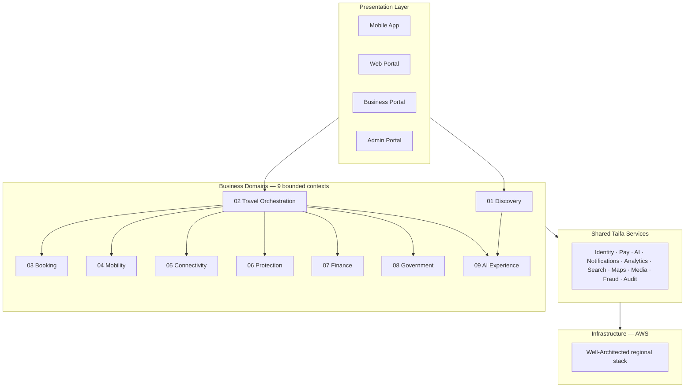
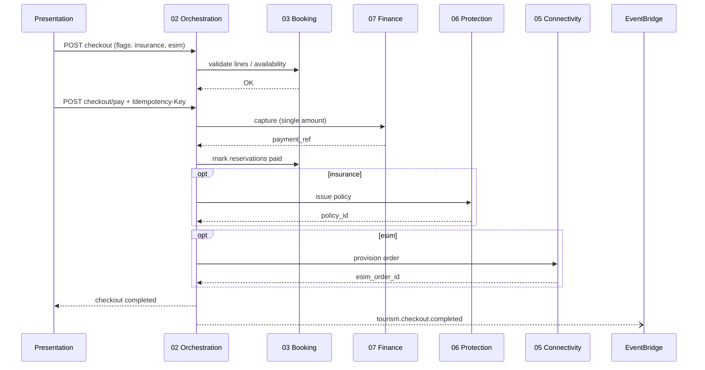

# Taifa Tourism — Canonical Enterprise Architecture

**Version:** 1.0 (architecture board)  
**Status:** **Authoritative** — supersedes all conflicting boundary, event, API, and ownership statements.  
**Audience:** Engineering, product, partners, regulators, AWS/platform teams.

**Hierarchy:**

0. **[`docs/architecture/`](../architecture/README.md)** — platform constitution (API, events, DB, security, DoD).  
1. **This document** — Tourism boundaries, ownership, events, APIs (canonical for DTOS).  
2. [00_INDEX.md](00_INDEX.md) — navigation + context map.  
3. Domain docs **01–09** — deep dives (**02** = authoritative for all travel workflows; must align with §2–§7 here).  
4. Cross-cutting **10–17** — platform standards.  
5. [TOURISM_DTOS_BLUEPRINT.md](TOURISM_DTOS_BLUEPRINT.md) · [TRAVEL_INSURANCE_BLUEPRINT.md](TRAVEL_INSURANCE_BLUEPRINT.md) — product/regulatory depth only.  
6. [ARCHITECTURE_LAYERS.md](ARCHITECTURE_LAYERS.md) — presentation/platform layer cheat sheet.

**Rule:** No implementation code until a feature is classified here (primary domain + ports + events).

---

## 1. Vision & positioning

Taifa Tourism is a **Digital Tourism Operating System (DTOS)** for Tanzania (national infrastructure) with East Africa expansion. It is not a booking app.

**Central intelligence:** **Travel Orchestration** coordinates all other business domains. It does **not** own inventory, ledger, policies, MNO provisioning, or dispatch.

---

## 2. Domain boundary charter (owns / does not own)

| # | Domain | **Owns (system of record)** | **Does not own** |
| --- | --- | --- | --- |
| 01 | **Discovery** | Places, destinations, UGC reviews/ratings, editorial collections | Trips, reservations, pay, SOS |
| 02 | **Travel Orchestration** | Trip, itinerary versions, checkout **session**, cart composition, timeline **projection**, replan **commands** | Hotel seats, ledger, policies, eSIM profiles, rides, visa issuance |
| 03 | **Booking** | Reservations, holds, availability, supplier pricing, confirmation codes | Trip shell, payment capture, trip timeline |
| 04 | **Mobility** | Movement legs, contracts, AVL progress (via **national `trips` platform**) | Tourism checkout, insurance |
| 05 | **Connectivity** | eSIM/connectivity orders, MNO adapter state, QR/SM-DP+ payload | Trip planning, insurance |
| 06 | **Protection** | Policies (travel), assistance cases, claims workflow, advisory feed; **SOS workflow** | Payment ledger; **SafetyIncident SoR** = Mobility platform |
| 07 | **Finance** | Ledger, capture, refunds, splits **execution**, loyalty ledger | Cart lines, reservation inventory |
| 08 | **Government** | Permit/visa **application refs**, authority adapter state | Trip/itinerary content |
| 09 | **AI Experience** | Sessions, inference, tool **definitions**; ranked **suggestions** | Committed trip/booking state (writes via Orchestration ports) |

---

## 3. Merged responsibility matrix (legacy services → single domain)

Eliminates overlap between the old “feature service” list and the nine domains.

| Legacy / marketing name | **Canonical owner** | Notes |
| --- | --- | --- |
| Destination Service, Reviews, Ratings | **01 Discovery** | |
| AI Recommendations (catalog rank) | **09 AI Experience** generates; **01 Discovery** publishes/hosts | No duplicate “recommendation microservice” in Discovery |
| AI Trip Planner, Itinerary Generator, Replan, Schedule Optimizer | **09 AI Experience** computes; **02 Orchestration** commits versions | |
| Booking Engine, Hotels, Flights, Bus, Ferry, Car, Tours, Restaurants, Safari, Permits, Tickets | **03 Booking** | Government **permits** = Booking holds + **08 Government** adapter |
| Booking Orchestrator, Unified Checkout, Timeline, Notification Coordination | **02 Orchestration** | |
| Payment Split Engine | **07 Finance** executes; **02 Orchestration** stores **split plan metadata** only | |
| Budget Calculator | **02 Orchestration** (trip estimates) + **09 AI** (bands); actuals from **07 Finance** | |
| Airport Pickup, Ride Hailing, Chauffeur, Boat, Navigation, GPS, Trip Progress | **04 Mobility** | Tourism never forks dispatch |
| eSIM, MNO integrations, QR activation | **05 Connectivity** | |
| Travel Insurance, SOS, Hospitals/Police/Embassy directory, Claims, Advisories | **06 Protection** | Nearby directory = Protection read API |
| Taifa Pay, Wallet, FX, Refunds, Split pay, Loyalty, Invoices | **07 Finance** (platform) | Tourism **07** = travel façade + metadata only |
| Visa, Immigration, TANAPA, TTB, Tax, Licensing | **08 Government** | |
| Concierge, Voice, Translation, OCR, Trip Advisor, Memory, Smart Notifications | **09 AI Experience** | Smart notifications = **Notifications** platform delivers |

---

## 4. Integration rules (non‑negotiable)

1. **Cross-domain writes:** only through the **owning** domain’s API or an orchestrated saga—never shared-table updates from another context.  
2. **Orchestration** may store **foreign keys** (`booking_id`, `policy_id`, `esim_order_id`) on `Trip` / `Checkout`—not duplicate booking rows.  
3. **Taifa Pay** is the only money truth; **Finance** domain; Orchestration triggers capture via `FinancePort`.  
4. **SafetyIncident** is created by **Protection** SOS use case but **persisted under Mobility platform** (`trips`)—Protection owns `AssistanceCase` and links `safety_incident_id`.  
5. **AI** returns proposals; **Orchestration** is the only domain that selects itinerary / commits replan.  
6. **Discovery** experience catalog on mobile (phase-1 seed) migrates to **Discovery APIs**—not new fields on `Trip`.  
7. Event names use **domain prefix** (§5)—no duplicate synonyms (`sos.opened` vs `protection.sos.opened` → canonical only).

---

## 5. Canonical domain event registry

Single catalog for EventBridge. Publishers must use these names; see [11_EVENT_ARCHITECTURE.md](11_EVENT_ARCHITECTURE.md) for envelope & outbox.

| Event | Publisher | Primary consumers |
| --- | --- | --- |
| `discovery.place.viewed` | Discovery | Analytics |
| `discovery.review.submitted` | Discovery | Analytics, Discovery (agg) |
| `tourism.trip.created` | Orchestration | Analytics, AI |
| `tourism.trip.planned` | Orchestration | Discovery |
| `tourism.itinerary.selected` | Orchestration | Booking |
| `tourism.cart.built` | Orchestration | Analytics |
| `tourism.checkout.started` | Orchestration | Finance, Fraud |
| `tourism.checkout.completed` | Orchestration | Booking, Protection, Connectivity, Finance, Notifications |
| `tourism.trip.activated` | Orchestration | Notifications, Mobility |
| `tourism.replan.proposed` | Orchestration | AI, Presentation |
| `tourism.replan.committed` | Orchestration | Booking, Finance |
| `tourism.trip.completed` | Orchestration | Discovery, Finance, Analytics |
| `tourism.timeline.updated` | Orchestration (projector) | Notifications |
| `booking.hold.created` | Booking | Orchestration |
| `booking.reservation.confirmed` | Booking | Orchestration, Analytics |
| `booking.reservation.paid` | Booking | Orchestration |
| `booking.reservation.cancelled` | Booking | Orchestration, Finance |
| `mobility.leg.scheduled` | Mobility | Orchestration |
| `mobility.incident.recorded` | Mobility | Protection, Ops |
| `connectivity.esim.quoted` | Connectivity | Orchestration |
| `connectivity.esim.provisioned` | Connectivity | Orchestration, Notifications |
| `protection.policy.issued` | Protection | Orchestration, Analytics |
| `protection.sos.opened` | Protection | Orchestration, Mobility, Notifications, Ops |
| `protection.claim.submitted` | Protection | Finance (future) |
| `finance.payment.captured` | Finance | Orchestration, Booking, Fraud |
| `finance.refund.completed` | Finance | Orchestration |
| `finance.split.executed` | Finance | Partners |
| `government.permit.issued` | Government | Orchestration, Booking |
| `ai.plan.generated` | AI Experience | Orchestration |
| `ai.replan.suggested` | AI Experience | Orchestration |

**Deprecated aliases (do not use in new code):** `booking.confirmed` → `booking.reservation.confirmed`; `booking.paid` → `booking.reservation.paid`; `assistance.sos.opened` → `protection.sos.opened`.

---

## 6. Canonical API namespaces

| Domain | URL prefix (target) | Phase-1 reality |
| --- | --- | --- |
| Orchestration | `/api/v1/tourism/trips`, `.../cart`, `.../checkout` | `apps/backend/tourism/` |
| Discovery | `/api/v1/tourism/discovery/` | Mobile seed catalog |
| Booking | `/api/v1/tourism/booking/` (facade) | `/api/v1/commerce/*-bookings` |
| Mobility | `/api/v1/trips/` + tourism bridge | `trips` app |
| Connectivity | `/api/v1/tourism/connectivity/` | under `tourism/` today |
| Protection | `/api/v1/tourism/protection/` | `tourism/assist/*`, `commerce/insurance-policies` |
| Finance | `/api/v1/payments/`, commerce `.../pay` | enterprise + commerce |
| Government | `/api/v1/tourism/government/` | adapters TBD |
| AI Experience | `/api/v1/tourism/ai/` + `ecosystem/ai/` | seed plan in orchestration |

**Naming fix:** `POST /tourism/assist/sos` is **Protection** (emergency), not AI. AI concierge → `POST /tourism/ai/concierge` (future). `GET /tourism/assist/nearby` → migrate to `/tourism/protection/nearby` (alias retained for compatibility).

---

## 7. Canonical data ownership

| Table / store | Owner domain | Phase-1 Django app |
| --- | --- | --- |
| `tourism_trip`, `tourism_itinerary_version`, `tourism_checkout` | Orchestration | `taifa_tourism` |
| `commerce_*_booking` | Booking | `commerce` |
| `commerce_insurance_policy` | Protection | `commerce` (migrate label to protection schema) |
| `tourism_assistance_case` | Protection | `taifa_tourism` (deployed with orchestration app—**logical** owner Protection) |
| `tourism_esim_order` | Connectivity | `taifa_tourism` (same deployment concession) |
| `trips_safetyincident` | Mobility (platform) | `trips` |
| Ledger / wallet | Finance | `payments`, `enterprise` |
| `discovery_*` | Discovery | future |

**Phase-1 concession:** Protection and Connectivity tables may live in the `tourism` Django app **physically**; **logical ownership** and future extraction packages remain **06** and **05**. No new non-orchestration tables in `tourism` without ADR. **Recorded:** [adr/0001-phase1-protection-connectivity-in-tourism-app.md](adr/0001-phase1-protection-connectivity-in-tourism-app.md).

---

## 8. Checkout saga (single cross-domain flow)

Authoritative sequence—replaces duplicate descriptions in DTOS blueprint and domain docs.

---

## 9. Context map (integration styles)

| Upstream | Downstream | Style |
| --- | --- | --- |
| Discovery → Orchestration | Catalog IDs in plan | API (sync) |
| Orchestration → Booking | Reserve / attach | API + events |
| Orchestration → Finance | Capture | API (sync saga step) |
| Orchestration → Protection/Connectivity | Add-ons | API (sync saga step) |
| Orchestration → AI | Plan/replan | API |
| Orchestration → Mobility | Schedule pickup | API + deep link |
| Orchestration → Government | Permit check | API |
| Booking → Orchestration | Status | Events |
| Protection → Mobility | SOS incident record | API (sync create incident) |
| All → Analytics | Telemetry | Events (async) |

---

## 10. Phase-1 vs target (no boundary drift)

| Concern | Phase-1 | Target |
| --- | --- | --- |
| Deployment unit | Modular monolith (`tourism` + `commerce` + `trips`) | Extract per [16_ROADMAP.md](16_ROADMAP.md) |
| Events | In-process + future outbox | EventBridge mandatory |
| Discovery | Client catalog | OpenSearch + CMS |
| AI plan | Deterministic seed in orchestration | AI Experience service |
| API paths | Mixed `commerce` + `tourism` | Facades per §6 |

---

## 11. Consistency review (resolved overlaps)

| Issue | Resolution |
| --- | --- |
| Feature-based business layer vs 9 domains | Feature list mapped in §3; layers doc updated |
| Discovery vs AI “recommendations” | AI generates; Discovery hosts/surfaces |
| Orchestration “payment split” vs Finance | Metadata vs execution (§3) |
| Insurance in commerce vs Protection | Protection owns domain; commerce table is legacy adapter |
| eSIM routes under `tourism` vs Connectivity | APIs under connectivity path; logical owner 05 |
| `assist/sos` vs AI “assist” | SOS = Protection only; AI uses `/ai/` namespace |
| SafetyIncident in trips vs Protection | Mobility SoR; Protection workflow + link (§4) |
| Duplicate event names in blueprint | Use §5 registry only |
| DTOS microservice diagram vs monolith | DTOS = target; §10 phase-1 |

---

## 12. Implementation gate

Before merging code:

1. Primary domain from §2.  
2. Events from §5 (if cross-domain).  
3. APIs under §6.  
4. Tables owned per §7.  
5. Update domain doc **01–09** §8–§10 if changed.  
6. ADR if boundary exception.

See [17_IMPLEMENTATION_GUIDE.md](17_IMPLEMENTATION_GUIDE.md) for monorepo paths and Definition of Done.

---

## 13. Document maintenance

| Change type | Update |
| --- | --- |
| New bounded context | This doc + board review |
| New event | §5 + `11_EVENT_ARCHITECTURE.md` |
| New public API | §6 + `12_API_STANDARDS.md` + domain doc |
| Product UX only | DTOS blueprint only |

**Architecture board sign-off:** _pending_ — version 1.0 ready for engineering governance.
